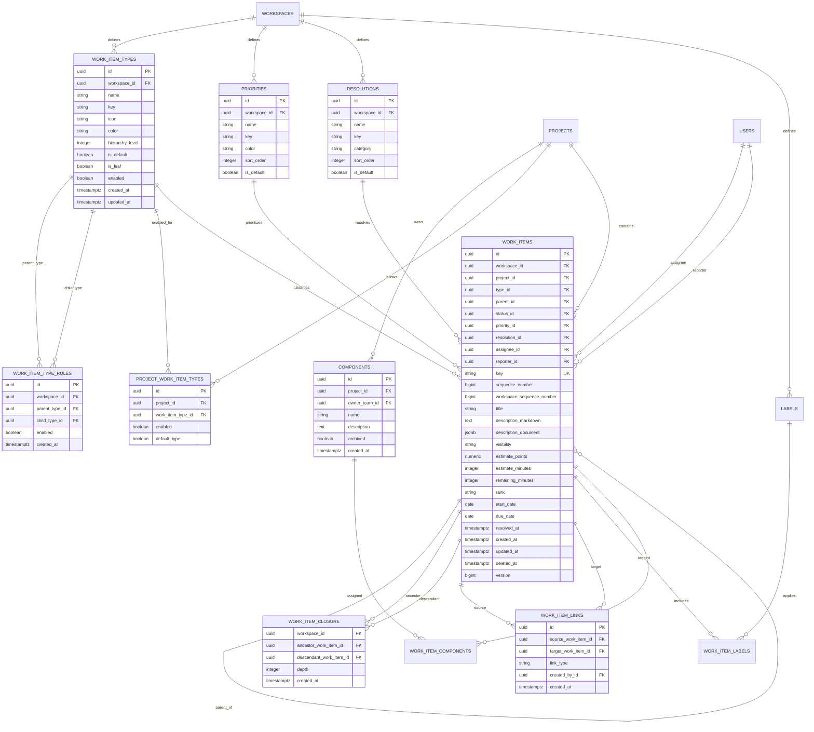
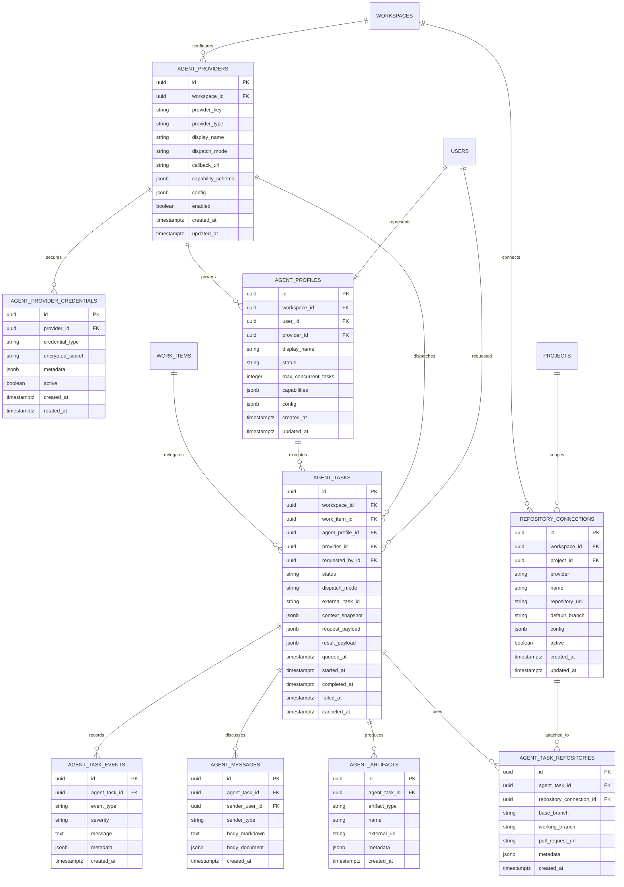

# Trasck Technical Specifications

Last reviewed: 2026-04-18

## Purpose

Trasck is a full-fledged open-source project management platform intended to compete with tools such as Jira and Rally. This document is the backend reference for the product model, database shape, hierarchy decisions, and implementation direction.

This is not an MVP spec. The goal is to design the backend foundation for the complete product from the beginning, even if individual features are implemented over time.

## Core Product Decisions

1. Trasck will separate container hierarchy from work hierarchy.
2. `Organization`, `Workspace`, `Program`, `Project`, and `Team` describe where work lives and who can access it.
3. `WorkItem` is the universal work artifact. Epics, stories, tasks, bugs, subtasks, features, initiatives, and themes are all work items with different configured types.
4. Trasck will not create separate tables such as `epics`, `stories`, `bugs`, or `tasks`.
5. `WorkItemType` and `WorkItemTypeRule` define the configurable work hierarchy.
6. `parent_id` on `work_items` defines the structural hierarchy.
7. `work_item_links` define non-hierarchical relationships such as blocks, duplicates, relates to, depends on, and clones.
8. Workflow, custom fields, screens, boards, notifications, automation, and reporting should be configurable per workspace and optionally overridden per project.
9. The backend should favor strong relational modeling for core concepts and `jsonb` only for configurable rules, field values, external payloads, and view definitions.
10. All important user-visible changes should generate activity events. Security/compliance-sensitive changes should also generate audit log entries.
11. `work_item_closure` should exist alongside `work_items.parent_id` so hierarchy rollups are fast and reliable.
12. Time tracking, resolutions, custom screens, and project-specific type availability are first-class backend concepts, not add-ons.
13. User identity is global, with separate auth identities for password and OAuth providers.
14. Public project visibility must be modeled from the start, with anonymous read disabled unless a workspace/project explicitly allows it.
15. Attachment storage is configurable per workspace.
16. Automation uses hybrid execution: local state changes can run synchronously, while slow or external actions run through queued jobs.
17. AI agents are optional assignable actors. Trasck must remain fully usable as a normal Jira/Rally-style project management tool when agent features are disabled.
18. AI agent integration must be provider-neutral. Codex, Claude Code, local command runners, hosted services, webhook-based workers, and future agents should all plug into the same agent provider contract.
19. Anonymous read access for public project data must be wired into the first security configuration, but every public read must still pass domain-level visibility checks.
20. Work completed by humans or AI agents must pass through a human approval stage before it can transition to Done.
21. `POST /api/v1/setup` is first-run-only. Once any admin/user bootstrap exists, additional organizations and workspaces must be created through authenticated flows.
22. Username/password auth and OAuth should share the global user model. GitHub, Google, GitLab, and Microsoft are the first OAuth providers to support.
23. Work item changes must publish in-process Spring events and persist durable outbox rows in `domain_events`.
24. Work item ordering uses sortable rank strings, not numeric position columns.
25. Work items have both project-local sequence numbers for human keys and workspace-wide sequence numbers for cross-project ordering, imports, exports, and reporting.
26. Workspace Admins may manage agent providers, agent credentials, agent profiles, agent assignment, agent tasks, and repository connections by default.
27. Seeded field/screen configuration should start with core system fields only; custom field expansion can happen later.
28. Browser authentication uses an HTTP-only access-token cookie, while direct API callers may also send the same JWT as a Bearer token.
29. User creation supports both invitation-based registration and direct workspace-admin user creation.
30. OAuth identity linking supports GitHub, Google, GitLab, and Microsoft provider identities. Automatic email matching is allowed only for verified provider emails. The signed provider-neutral endpoint remains available as an internal/trusted callback, and full Spring OAuth redirects/callbacks are wired for the first four providers.
31. Permission enforcement uses a combination of broad security filters, method-level annotations for simple administrative routes, and explicit service-layer checks for domain-heavy operations.
32. Domain events have both immediate in-process publication and durable outbox dispatch. Persisted events remain pending until configured durable consumers record successful per-consumer delivery rows.

## Full Work Hierarchy

Trasck should ship with a full enterprise-ready hierarchy while allowing workspaces to customize it.

Default seeded hierarchy:

```text
Theme
  Initiative
    Capability
      Feature
        Epic
          Story / Task / Bug
            Subtask
```

Important notes:

- `Story`, `Task`, and `Bug` are peer types by default.
- `Subtask` is a child execution detail under story/task/bug.
- `Feature`, `Capability`, `Initiative`, and `Theme` support portfolio and roadmap planning.
- A workspace may disable or rename levels without requiring schema changes.
- A project may restrict the set of work item types it allows.
- Parent-child validity is controlled by `work_item_type_rules`, not only by numeric hierarchy levels.

Seeded hierarchy levels:

| Type | Level | Default Parent |
|---|---:|---|
| Theme | 600 | none |
| Initiative | 500 | Theme |
| Capability | 400 | Initiative |
| Feature | 300 | Capability |
| Epic | 200 | Feature |
| Story | 100 | Epic |
| Task | 100 | Epic |
| Bug | 100 | Epic |
| Subtask | 0 | Story, Task, or Bug |

## Container Hierarchy

Default container model:

```text
Organization
  Workspace
    Program
      Project
        Child Project
    Team
```

Notes:

- `Organization` is the top-level customer/account boundary.
- `Workspace` is the configuration boundary. Work item types, workflows, custom fields, automation, roles, and global settings live here.
- `Program` groups projects for portfolio reporting and planning.
- `Project` is the primary work container and owns project keys such as `TRASCK`.
- Projects may be nested through `parent_project_id`.
- `Team` models delivery teams and capacity separately from project ownership.
- Boards, releases, iterations, and roadmaps can be project-scoped or team-scoped depending on the feature.

## Backend Package Structure

Use domain-oriented packages under `com.strangequark.trasck`:

```text
com.strangequark.trasck.identity
com.strangequark.trasck.organization
com.strangequark.trasck.workspace
com.strangequark.trasck.access
com.strangequark.trasck.project
com.strangequark.trasck.team
com.strangequark.trasck.workitem
com.strangequark.trasck.workflow
com.strangequark.trasck.planning
com.strangequark.trasck.board
com.strangequark.trasck.customfield
com.strangequark.trasck.activity
com.strangequark.trasck.audit
com.strangequark.trasck.event
com.strangequark.trasck.notification
com.strangequark.trasck.automation
com.strangequark.trasck.agent
com.strangequark.trasck.integration
com.strangequark.trasck.reporting
com.strangequark.trasck.search
```

Each package should own its controllers, services, repositories, DTOs, mappers, and domain exceptions unless a shared abstraction is clearly needed.

## Implemented Backend Slice

The first runnable backend slice is intentionally explicit. Local development does not auto-create an organization, workspace, project, or admin user at application startup.

Implemented endpoints:

- `POST /api/v1/setup` creates the initial admin user, organization, workspace, project, workspace membership, project membership, and deterministic default configuration. It is first-run-only and returns conflict after bootstrap.
- `POST /api/v1/auth/login` authenticates username/password users, returns a Bearer JWT, and sets the same token in an HTTP-only cookie.
- `POST /api/v1/auth/register` creates a username/password user from a valid workspace invitation.
- `POST /api/v1/auth/oauth/login` links or logs in a verified OAuth identity for GitHub, Google, GitLab, or Microsoft using a signed provider assertion.
- `GET /api/v1/auth/oauth2/authorization/{registrationId}` starts full Spring OAuth login for GitHub, Google, GitLab, or Microsoft.
- `GET /api/v1/auth/oauth2/callback/{registrationId}` completes Spring OAuth login, links/logs in the verified provider identity, sets the auth cookie, and redirects to the configured frontend callback.
- `GET /api/v1/auth/csrf` returns the CSRF header name and token for browser clients using cookie authentication.
- `POST /api/v1/auth/logout` clears the auth cookie.
- `GET /api/v1/auth/me` returns the authenticated user.
- `POST /api/v1/auth/tokens/personal` creates a revocable personal access token for the current user.
- `DELETE /api/v1/auth/tokens/{tokenId}` revokes one of the current user's personal access tokens.
- `POST /api/v1/workspaces/{workspaceId}/invitations` creates a workspace invitation for callers with `user.manage`.
- `POST /api/v1/workspaces/{workspaceId}/service-tokens` creates a revocable workspace service token backed by a service user and workspace role.
- `DELETE /api/v1/workspaces/{workspaceId}/service-tokens/{tokenId}` revokes a workspace service token.
- `POST /api/v1/workspaces/{workspaceId}/users` lets callers with `user.manage` create a user directly in a workspace.
- `GET /api/v1/public/projects/{projectId}` returns anonymous project metadata only when the workspace has anonymous read enabled, the project is public, and both records are active and not soft-deleted.
- `POST /api/v1/projects/{projectId}/work-items` creates work items in a seeded project.
- `GET /api/v1/projects/{projectId}/work-items` lists active project work items in rank order.
- `GET /api/v1/work-items/{workItemId}` returns an active work item.
- `PATCH /api/v1/work-items/{workItemId}` updates editable work item fields and parentage.
- `POST /api/v1/work-items/{workItemId}/assign` changes assignee and writes assignment history.
- `POST /api/v1/work-items/{workItemId}/rank` changes sortable rank string ordering.
- `POST /api/v1/work-items/{workItemId}/transition` applies an allowed workflow transition and writes status history.
- `DELETE /api/v1/work-items/{workItemId}` soft-archives a work item.

Implemented seed data:

- Default work item hierarchy: Theme, Initiative, Capability, Feature, Epic, Story, Task, Bug, and Subtask.
- Default hierarchy rules from Theme down to Subtask.
- Default priorities, resolutions, workflow statuses, workflow transitions, board columns, roles, project type availability, workflow assignments, project settings, and local filesystem attachment storage configuration.
- Default workflow includes an Approval status and requires human approval before Done for human-completed and agent-completed work.

Security state:

- Setup, auth login/register/OAuth/login/logout, health, and public project reads are explicitly permitted.
- Other API routes require a valid JWT from the `Authorization: Bearer` header, `trasck_access_token` HTTP-only cookie, or a revocable API token sent as `Authorization: Bearer`.
- Browser clients using the auth cookie must send a CSRF token for unsafe methods. Bearer-token API callers are not forced through CSRF.
- Workspace user-management endpoints use method-level permission checks.
- Work item endpoints are no longer anonymously accessible; work item service methods enforce project-scoped permissions before reads or writes.
- The provider-neutral OAuth login endpoint requires `TRASCK_OAUTH_ASSERTION_SECRET` and a signed assertion. Full provider redirects/callbacks are also wired through Spring OAuth client registrations for GitHub, Google, GitLab, and Microsoft.
- Personal and service API tokens store only token hashes, can be revoked, and update `last_used_at` on successful authentication.
- Invitations can grant workspace membership only, or workspace membership plus project-specific membership when `projectId` and `projectRoleId` are included.
- Anonymous public project reads still perform domain-level visibility checks; security configuration alone is not the access-control source of truth.

Work item implementation state:

- Work item create/update validates project activity, workspace type enablement, project type enablement, parent-child type rules, same-project structural parentage, workflow assignment, and workflow status ownership.
- Parent changes rebuild `work_item_closure` transactionally for the project.
- Sequence allocation uses durable project and workspace sequence counter tables.
- Work item rank uses fixed-width sortable strings.
- Work item changes persist rows in `domain_events`, publish in-process Spring events after commit, and remain pending in the durable outbox until configured consumers complete delivery through `domain_event_deliveries`.

## Database Conventions

Use PostgreSQL as the primary database.

Recommended conventions:

- Primary keys: UUID.
- Foreign keys: explicit constraints.
- Timestamps: `created_at`, `updated_at`, and optional `deleted_at`; store UTC.
- Audit columns: `created_by_id`, `updated_by_id`, and optional `deleted_by_id` for user-created business records.
- Soft delete: use `deleted_at` for user-owned data that should be recoverable or auditable.
- Optimistic locking: use a numeric `version` column on heavily edited entities such as work items, projects, workflows, boards, and custom fields.
- Human keys: use project key plus project-local sequence number for work items, for example `TRASCK-123`.
- Cross-project ordering and import/export correlation: use `workspace_sequence_number` as internal metadata.
- Rank ordering: use sortable rank strings so work can be moved between neighbors without rewriting every row.
- JSON: prefer `jsonb` for configurable payloads, rich text document bodies, custom field values, external integration payloads, automation configs, agent provider configs, execution payloads, and dashboard/view configs.
- Money/billing concepts are intentionally excluded from the first backend domain unless billing becomes a product requirement.

## ERD: Identity, Access, And Containers


## ERD: Work Items And Configurable Hierarchy



## ERD: Workflow, Boards, Sprints, Releases, And Roadmaps


## ERD: Custom Fields, Screens, Activity, And Audit


## ERD: Automation, Notifications, Integrations, Reporting, And Views

```mermaid
erDiagram
    WORKSPACES ||--o{ NOTIFICATION_PREFERENCES : configures
    USERS ||--o{ NOTIFICATION_PREFERENCES : owns
    USERS ||--o{ NOTIFICATIONS : receives
    WORKSPACES ||--o{ AUTOMATION_RULES : defines
    AUTOMATION_RULES ||--o{ AUTOMATION_CONDITIONS : has
    AUTOMATION_RULES ||--o{ AUTOMATION_ACTIONS : runs
    AUTOMATION_RULES ||--o{ AUTOMATION_EXECUTION_JOBS : queues
    AUTOMATION_EXECUTION_JOBS ||--o{ AUTOMATION_EXECUTION_LOGS : records
    AUTOMATION_ACTIONS ||--o{ AUTOMATION_EXECUTION_LOGS : executes
    WORKSPACES ||--o{ WEBHOOKS : defines
    WEBHOOKS ||--o{ WEBHOOK_DELIVERIES : attempts
    WORKSPACES ||--o{ EXTERNAL_INTEGRATIONS : connects
    USERS ||--o{ EXTERNAL_IDENTITIES : maps
    EXTERNAL_INTEGRATIONS ||--o{ EXTERNAL_REFERENCES : links
    WORKSPACES ||--o{ IMPORT_JOBS : runs
    IMPORT_JOBS ||--o{ IMPORT_JOB_RECORDS : contains
    WORKSPACES ||--o{ EXPORT_JOBS : runs
    WORK_ITEMS ||--o{ WORK_ITEM_STATUS_HISTORY : records
    ITERATIONS ||--o{ ITERATION_SNAPSHOTS : snapshots
    BOARDS ||--o{ CUMULATIVE_FLOW_SNAPSHOTS : snapshots
    TEAMS ||--o{ VELOCITY_SNAPSHOTS : snapshots
    WORK_ITEMS ||--o{ CYCLE_TIME_RECORDS : measures
    WORKSPACES ||--o{ SAVED_FILTERS : defines
    WORKSPACES ||--o{ DASHBOARDS : defines
    DASHBOARDS ||--o{ DASHBOARD_WIDGETS : contains
    WORKSPACES ||--o{ VIEWS : defines
    USERS ||--o{ FAVORITES : owns
    USERS ||--o{ RECENT_ITEMS : owns
    DOMAIN_EVENTS ||--o{ DOMAIN_EVENT_DELIVERIES : delivered_to

    AUTOMATION_RULES {
        uuid id PK
        uuid workspace_id FK
        uuid project_id FK
        string name
        string trigger_type
        jsonb trigger_config
        boolean enabled
        timestamptz created_at
        timestamptz updated_at
    }

    AUTOMATION_CONDITIONS {
        uuid id PK
        uuid rule_id FK
        string condition_type
        jsonb config
        integer position
    }

    AUTOMATION_ACTIONS {
        uuid id PK
        uuid rule_id FK
        string action_type
        string execution_mode
        jsonb config
        integer position
    }

    AUTOMATION_EXECUTION_JOBS {
        uuid id PK
        uuid rule_id FK
        uuid workspace_id FK
        string source_entity_type
        uuid source_entity_id
        string status
        jsonb payload
        integer attempts
        timestamptz next_attempt_at
        timestamptz started_at
        timestamptz completed_at
        timestamptz failed_at
        string last_error
        timestamptz created_at
    }

    DOMAIN_EVENTS {
        uuid id PK
        uuid workspace_id FK
        string aggregate_type
        uuid aggregate_id
        string event_type
        jsonb payload
        string processing_status
        integer attempts
        text last_error
        timestamptz occurred_at
        timestamptz published_at
    }

    DOMAIN_EVENT_DELIVERIES {
        uuid id PK
        uuid domain_event_id FK
        string consumer_key
        string delivery_status
        integer attempts
        text last_error
        timestamptz next_attempt_at
        timestamptz delivered_at
        timestamptz created_at
        timestamptz updated_at
    }

    AUTOMATION_EXECUTION_LOGS {
        uuid id PK
        uuid job_id FK
        uuid action_id FK
        string status
        string message
        jsonb metadata
        timestamptz created_at
    }

    WEBHOOKS {
        uuid id PK
        uuid workspace_id FK
        string name
        string url
        string secret_hash
        jsonb event_types
        boolean enabled
    }

    EXTERNAL_INTEGRATIONS {
        uuid id PK
        uuid workspace_id FK
        string provider
        string status
        jsonb config
        timestamptz created_at
        timestamptz updated_at
    }

    IMPORT_JOBS {
        uuid id PK
        uuid workspace_id FK
        uuid requested_by_id FK
        string provider
        string status
        jsonb config
        timestamptz started_at
        timestamptz finished_at
    }

    WORK_ITEM_STATUS_HISTORY {
        uuid id PK
        uuid work_item_id FK
        uuid from_status_id FK
        uuid to_status_id FK
        uuid changed_by_id FK
        timestamptz changed_at
    }

    CYCLE_TIME_RECORDS {
        uuid id PK
        uuid work_item_id FK
        timestamptz created_at
        timestamptz started_at
        timestamptz completed_at
        integer lead_time_minutes
        integer cycle_time_minutes
    }

    SAVED_FILTERS {
        uuid id PK
        uuid workspace_id FK
        uuid owner_id FK
        string name
        jsonb query
        string visibility
    }

    DASHBOARDS {
        uuid id PK
        uuid workspace_id FK
        uuid owner_id FK
        string name
        string visibility
        jsonb layout
    }

    VIEWS {
        uuid id PK
        uuid workspace_id FK
        uuid owner_id FK
        string name
        string view_type
        jsonb config
        string visibility
    }
```



## ERD: Provider-Neutral AI Agent Integration

AI agents are modeled as optional assignable actors that execute work items through provider adapters. This keeps the normal project management model intact while allowing work to be dispatched to Codex, Claude Code, local runners, webhook workers, hosted coding agents, or future providers.

Agents should reuse global `users` records with `account_type = AGENT` so assignments, permissions, activity events, audit logs, notifications, and reporting continue to work through existing concepts. Agent-specific execution state belongs in dedicated agent tables.



## Table Catalog

### Identity And Access

| Table | Purpose |
|---|---|
| `organizations` | Top-level customer/account boundary. |
| `workspaces` | Configuration boundary inside an organization. |
| `users` | Global human, agent, or service identity. |
| `user_auth_identities` | Password/OAuth identity mappings for global users. |
| `user_invitations` | Workspace invitations used for invitation-based registration. |
| `workspace_memberships` | User membership and role inside a workspace. |
| `project_memberships` | Optional project-specific access override. |
| `roles` | Named permission bundle scoped to workspace or project. |
| `permissions` | Individual capability keys such as `work_item.create`. |
| `role_permissions` | Join table for roles and permissions. |

### Containers

| Table | Purpose |
|---|---|
| `projects` | Primary work container with human key prefix. |
| `project_settings` | Per-project defaults such as workflow, estimation unit, and default board. |
| `programs` | Portfolio grouping above projects. |
| `program_projects` | Projects included in programs. |
| `teams` | Delivery teams. |
| `team_memberships` | Users assigned to teams with capacity/role metadata. |
| `project_teams` | Teams assigned to projects. |

### Work Items

| Table | Purpose |
|---|---|
| `work_item_types` | Configurable work item definitions such as Theme, Epic, Story, Bug. |
| `work_item_type_rules` | Allowed parent-child type combinations. |
| `project_work_item_types` | Project-specific enablement/defaults for work item types. |
| `work_items` | Universal table for all work artifacts. |
| `workspace_work_item_sequences` | Durable workspace-wide sequence counter for cross-project ordering and import/export correlation. |
| `project_work_item_sequences` | Durable project-local sequence counter for human work item keys. |
| `work_item_closure` | Ancestor/descendant rows for fast hierarchy rollups. |
| `work_item_links` | Non-tree relationships between work items. |
| `priorities` | Workspace-configured priorities. |
| `resolutions` | Workspace-configured resolution reasons such as Done, Duplicate, Won't Do. |
| `labels` | Workspace tags. |
| `work_item_labels` | Join table for tags. |
| `components` | Project-owned product/component areas. |
| `work_item_components` | Join table for components. |

### Workflow

| Table | Purpose |
|---|---|
| `workflows` | Named workflow definitions. |
| `workflow_statuses` | Statuses in a workflow. |
| `workflow_transitions` | Allowed status changes. |
| `workflow_assignments` | Workflow applied to project/type combinations. |
| `workflow_transition_rules` | Validators and guards. |
| `workflow_transition_actions` | Side effects such as setting resolution date or assigning a user. |

### Planning

| Table | Purpose |
|---|---|
| `boards` | Scrum/Kanban board definitions. |
| `board_columns` | Board columns and status mappings. |
| `board_swimlanes` | Board grouping configuration. |
| `iterations` | Sprints or timeboxed iterations. |
| `iteration_work_items` | Work planned into an iteration. |
| `releases` | Versions, releases, or milestones. |
| `release_work_items` | Work targeted to a release. |
| `roadmaps` | Roadmap views. |
| `roadmap_items` | Work shown on a roadmap with planned dates. |

### Customization

| Table | Purpose |
|---|---|
| `custom_fields` | Workspace-defined custom fields. |
| `custom_field_contexts` | Field scope by project and work item type. |
| `custom_field_values` | Field values per work item. |
| `screens` | Create/edit/view screen layouts. |
| `screen_fields` | Fields visible on a screen. |
| `screen_assignments` | Screen selection by project, type, and operation. |
| `field_configurations` | Required/hidden/default behavior. |

### Collaboration And Audit

| Table | Purpose |
|---|---|
| `comments` | Work item discussions. |
| `work_logs` | Time tracking entries on work items. |
| `attachment_storage_configs` | Workspace-configurable attachment storage providers. |
| `attachments` | Uploaded file metadata. |
| `work_item_attachments` | Join table for attachments. |
| `watchers` | Users watching work items. |
| `mentions` | Mentions in descriptions/comments. |
| `activity_events` | User-visible activity feed. |
| `audit_log_entries` | Compliance/security audit log. |
| `domain_events` | Durable outbox events for domain changes and future asynchronous consumers. |
| `domain_event_deliveries` | Per-consumer durable delivery attempts for outbox events. |

### Reporting

| Table | Purpose |
|---|---|
| `work_item_status_history` | Status transition history. |
| `work_item_assignment_history` | Assignment history. |
| `work_item_estimate_history` | Estimate changes. |
| `iteration_snapshots` | Sprint/iteration reporting snapshots. |
| `cumulative_flow_snapshots` | Board status-count snapshots. |
| `velocity_snapshots` | Team velocity snapshots. |
| `cycle_time_records` | Lead time and cycle time measurements. |

### Automation And Notifications

| Table | Purpose |
|---|---|
| `notification_preferences` | User notification settings. |
| `notifications` | In-app notifications. |
| `automation_rules` | Rule definitions. |
| `automation_conditions` | Rule conditions. |
| `automation_actions` | Rule actions. |
| `automation_execution_jobs` | Queued async automation work for hybrid execution. |
| `automation_execution_logs` | Per-job/per-action automation execution history. |
| `webhooks` | Outbound webhook definitions. |
| `webhook_deliveries` | Webhook delivery attempts. |

### AI Agents

| Table | Purpose |
|---|---|
| `agent_providers` | Workspace-level provider adapter configuration for Codex, Claude Code, local runners, webhook workers, custom agents, and future providers. |
| `agent_provider_credentials` | Encrypted provider credentials for dispatching to external or managed agents. |
| `agent_profiles` | Assignable agent identities backed by `users` rows. |
| `repository_connections` | Workspace/project repository connections used by coding agents. |
| `agent_tasks` | Execution records for work delegated to agents. |
| `agent_task_events` | Agent execution timeline, progress, status, and diagnostic events. |
| `agent_messages` | Conversation between humans, Trasck, and agents for a delegated task. |
| `agent_artifacts` | Outputs such as pull requests, branches, patches, logs, screenshots, plans, or generated files. |
| `agent_task_repositories` | Repositories, branches, and pull requests attached to a specific agent task. |

### Integrations, Search, And Views

| Table | Purpose |
|---|---|
| `external_integrations` | GitHub, GitLab, Slack, Jira import, Rally import, etc. |
| `external_identities` | Mapping between Trasck users and provider users. |
| `external_references` | Mapping between Trasck entities and external objects. |
| `import_jobs` | Jira/Rally/CSV import jobs. |
| `import_job_records` | Per-record import results. |
| `export_jobs` | Data export jobs. |
| `saved_filters` | Saved work item queries. |
| `dashboards` | User/team dashboards. |
| `dashboard_widgets` | Widgets on dashboards. |
| `views` | Saved table, board, timeline, list, and roadmap views. |
| `favorites` | Starred entities. |
| `recent_items` | Recently viewed entities. |

## Additional Column Reference

The ERDs show the main entities and the table catalog names every planned table. This section captures the important columns for tables that are not expanded in the diagrams.

### Access Columns

| Table | Important Columns |
|---|---|
| `users` | `id`, `email`, `username`, `display_name`, `account_type`, `avatar_url`, `password_hash`, `email_verified`, `active`, `last_login_at`, `created_at`, `updated_at`, `deleted_at` |
| `user_auth_identities` | `id`, `user_id`, `provider`, `provider_subject`, `provider_username`, `provider_email`, `metadata`, `created_at`, `updated_at` |
| `user_invitations` | `id`, `workspace_id`, `project_id`, `email`, `role_id`, `project_role_id`, `token_hash`, `status`, `invited_by_id`, `accepted_by_id`, `expires_at`, `accepted_at`, `created_at`, `updated_at` |
| `api_tokens` | `id`, `workspace_id`, `user_id`, `token_type`, `name`, `token_prefix`, `token_hash`, `role_id`, `scopes`, `created_by_id`, `expires_at`, `last_used_at`, `revoked_at`, `revoked_by_id`, `created_at`, `updated_at` |
| `roles` | `id`, `workspace_id`, `name`, `key`, `scope`, `description`, `system_role`, `created_at`, `updated_at` |
| `permissions` | `id`, `key`, `name`, `description`, `category` |
| `role_permissions` | `role_id`, `permission_id`, `created_at` |
| `project_memberships` | `id`, `project_id`, `user_id`, `role_id`, `status`, `created_at`, `updated_at` |

### Container Columns

| Table | Important Columns |
|---|---|
| `organizations` | `id`, `name`, `slug`, `status`, `created_by_id`, `created_at`, `updated_at`, `deleted_at`, `version` |
| `workspaces` | `id`, `organization_id`, `name`, `key`, `timezone`, `locale`, `status`, `anonymous_read_enabled`, `created_at`, `updated_at`, `deleted_at`, `version` |
| `projects` | `id`, `workspace_id`, `parent_project_id`, `name`, `key`, `description`, `visibility`, `status`, `lead_user_id`, `created_at`, `updated_at`, `deleted_at`, `version` |
| `project_settings` | `project_id`, `default_workflow_id`, `default_board_id`, `estimation_unit`, `cross_project_linking_policy`, `config`, `updated_at` |
| `program_projects` | `program_id`, `project_id`, `position`, `created_at` |
| `team_memberships` | `id`, `team_id`, `user_id`, `role`, `capacity_percent`, `joined_at`, `left_at` |
| `project_teams` | `project_id`, `team_id`, `role`, `created_at` |

### Work Item Columns

| Table | Important Columns |
|---|---|
| `work_items` | `id`, `workspace_id`, `project_id`, `type_id`, `parent_id`, `status_id`, `priority_id`, `resolution_id`, `assignee_id`, `reporter_id`, `key`, `sequence_number`, `workspace_sequence_number`, `title`, `description_markdown`, `description_document`, `visibility`, `estimate_points`, `estimate_minutes`, `remaining_minutes`, `rank`, `start_date`, `due_date`, `resolved_at`, `created_by_id`, `updated_by_id`, `created_at`, `updated_at`, `deleted_at`, `version` |
| `workspace_work_item_sequences` | `workspace_id`, `next_value`, `updated_at` |
| `project_work_item_sequences` | `project_id`, `workspace_id`, `next_value`, `updated_at` |
| `labels` | `id`, `workspace_id`, `name`, `color`, `created_at` |
| `work_item_labels` | `work_item_id`, `label_id`, `created_at` |
| `work_item_components` | `work_item_id`, `component_id`, `created_at` |
| `work_item_closure` | `workspace_id`, `ancestor_work_item_id`, `descendant_work_item_id`, `depth`, `created_at` |
| `work_item_links` | `id`, `source_work_item_id`, `target_work_item_id`, `link_type`, `created_by_id`, `created_at` |

### Workflow Columns

| Table | Important Columns |
|---|---|
| `workflow_transition_rules` | `id`, `transition_id`, `rule_type`, `config`, `error_message`, `position`, `enabled` |
| `workflow_transition_actions` | `id`, `transition_id`, `action_type`, `config`, `position`, `enabled` |

### Planning Columns

| Table | Important Columns |
|---|---|
| `board_swimlanes` | `id`, `board_id`, `name`, `swimlane_type`, `query`, `position`, `enabled` |
| `iteration_work_items` | `iteration_id`, `work_item_id`, `added_by_id`, `added_at`, `removed_at` |
| `release_work_items` | `release_id`, `work_item_id`, `added_by_id`, `added_at` |
| `roadmap_items` | `id`, `roadmap_id`, `work_item_id`, `start_date`, `end_date`, `position`, `display_config` |

### Customization Columns

| Table | Important Columns |
|---|---|
| `field_configurations` | `id`, `workspace_id`, `custom_field_id`, `project_id`, `work_item_type_id`, `required`, `hidden`, `default_value`, `validation_config` |
| `screen_assignments` | `id`, `screen_id`, `project_id`, `work_item_type_id`, `operation`, `priority` |

### Collaboration Columns

| Table | Important Columns |
|---|---|
| `watchers` | `work_item_id`, `user_id`, `created_at` |
| `mentions` | `id`, `source_type`, `source_id`, `mentioned_user_id`, `created_at` |
| `work_logs` | `id`, `work_item_id`, `user_id`, `minutes_spent`, `work_date`, `started_at`, `description_markdown`, `description_document`, `created_at`, `updated_at`, `deleted_at` |
| `attachment_storage_configs` | `id`, `workspace_id`, `name`, `provider`, `config`, `active`, `default_config`, `created_at`, `updated_at` |
| `domain_events` | `id`, `workspace_id`, `aggregate_type`, `aggregate_id`, `event_type`, `payload`, `processing_status`, `attempts`, `last_error`, `occurred_at`, `published_at` |
| `domain_event_deliveries` | `id`, `domain_event_id`, `consumer_key`, `delivery_status`, `attempts`, `last_error`, `next_attempt_at`, `delivered_at`, `created_at`, `updated_at` |

### Reporting Columns

| Table | Important Columns |
|---|---|
| `work_item_assignment_history` | `id`, `work_item_id`, `from_user_id`, `to_user_id`, `changed_by_id`, `changed_at` |
| `work_item_estimate_history` | `id`, `work_item_id`, `estimate_type`, `old_value`, `new_value`, `changed_by_id`, `changed_at` |
| `iteration_snapshots` | `id`, `iteration_id`, `snapshot_date`, `committed_points`, `completed_points`, `remaining_points`, `scope_added_points`, `scope_removed_points` |
| `cumulative_flow_snapshots` | `id`, `board_id`, `snapshot_date`, `status_id`, `work_item_count`, `total_points` |
| `velocity_snapshots` | `id`, `team_id`, `iteration_id`, `committed_points`, `completed_points`, `carried_over_points` |

### Automation And Notification Columns

| Table | Important Columns |
|---|---|
| `notification_preferences` | `id`, `user_id`, `workspace_id`, `channel`, `event_type`, `enabled`, `config` |
| `notifications` | `id`, `user_id`, `actor_id`, `workspace_id`, `type`, `title`, `body`, `target_type`, `target_id`, `read_at`, `created_at` |
| `automation_execution_jobs` | `id`, `rule_id`, `workspace_id`, `source_entity_type`, `source_entity_id`, `status`, `payload`, `attempts`, `next_attempt_at`, `started_at`, `completed_at`, `failed_at`, `last_error`, `created_at` |
| `automation_execution_logs` | `id`, `job_id`, `action_id`, `status`, `message`, `metadata`, `created_at` |
| `webhook_deliveries` | `id`, `webhook_id`, `event_type`, `payload`, `status`, `response_code`, `response_body`, `attempt_count`, `next_retry_at`, `created_at` |

### AI Agent Columns

| Table | Important Columns |
|---|---|
| `agent_providers` | `id`, `workspace_id`, `provider_key`, `provider_type`, `display_name`, `dispatch_mode`, `callback_url`, `capability_schema`, `config`, `enabled`, `created_at`, `updated_at` |
| `agent_provider_credentials` | `id`, `provider_id`, `credential_type`, `encrypted_secret`, `metadata`, `active`, `created_at`, `rotated_at` |
| `agent_profiles` | `id`, `workspace_id`, `user_id`, `provider_id`, `display_name`, `status`, `max_concurrent_tasks`, `capabilities`, `config`, `created_at`, `updated_at` |
| `repository_connections` | `id`, `workspace_id`, `project_id`, `provider`, `name`, `repository_url`, `default_branch`, `config`, `active`, `created_at`, `updated_at` |
| `agent_tasks` | `id`, `workspace_id`, `work_item_id`, `agent_profile_id`, `provider_id`, `requested_by_id`, `status`, `dispatch_mode`, `external_task_id`, `context_snapshot`, `request_payload`, `result_payload`, `queued_at`, `started_at`, `completed_at`, `failed_at`, `canceled_at` |
| `agent_task_events` | `id`, `agent_task_id`, `event_type`, `severity`, `message`, `metadata`, `created_at` |
| `agent_messages` | `id`, `agent_task_id`, `sender_user_id`, `sender_type`, `body_markdown`, `body_document`, `created_at` |
| `agent_artifacts` | `id`, `agent_task_id`, `artifact_type`, `name`, `external_url`, `metadata`, `created_at` |
| `agent_task_repositories` | `id`, `agent_task_id`, `repository_connection_id`, `base_branch`, `working_branch`, `pull_request_url`, `metadata`, `created_at` |

### Integration And View Columns

| Table | Important Columns |
|---|---|
| `external_identities` | `id`, `user_id`, `provider`, `external_user_id`, `external_username`, `created_at` |
| `external_references` | `id`, `integration_id`, `entity_type`, `entity_id`, `provider`, `external_id`, `external_url`, `metadata` |
| `import_job_records` | `id`, `import_job_id`, `source_type`, `source_id`, `target_type`, `target_id`, `status`, `error_message`, `raw_payload` |
| `export_jobs` | `id`, `workspace_id`, `requested_by_id`, `export_type`, `status`, `file_attachment_id`, `started_at`, `finished_at` |
| `dashboard_widgets` | `id`, `dashboard_id`, `widget_type`, `config`, `position_x`, `position_y`, `width`, `height` |
| `favorites` | `id`, `user_id`, `entity_type`, `entity_id`, `created_at` |
| `recent_items` | `id`, `user_id`, `entity_type`, `entity_id`, `viewed_at` |

## Key Constraints And Validation Rules

Work item rules:

- A work item must belong to exactly one workspace and one project.
- `work_items.workspace_id` must match the workspace of its project.
- `work_items.parent_id`, when present, must point to a work item in the same workspace.
- Cross-project parentage is not allowed; use `work_item_links` for cross-project relationships.
- Parent-child type pairs must exist in `work_item_type_rules`.
- The work item's type must be enabled for its project in `project_work_item_types`, when project-specific type restrictions are configured.
- A work item may have one structural parent but many links.
- Prevent cycles in the `work_items.parent_id` tree.
- Maintain `work_item_closure` transactionally whenever a work item parent changes.
- Work item type changes must not make existing child work items invalid.
- Prevent duplicate `work_item_links` for the same source, target, and type unless the link type explicitly allows duplicates.
- A work item key must be unique within a workspace. Project key plus project-local sequence number should also be unique.
- `workspace_sequence_number` must be unique within a workspace and should be allocated from a durable workspace counter.
- Work item rank values must be sortable strings.
- A completed work item may have a `resolution_id`; unresolved work should not.

Workflow rules:

- A work item's current `status_id` must belong to the assigned workflow for its project/type.
- Status changes should go through `workflow_transitions` unless the user has an administrative override permission.
- Transition rules can require fields, comments, resolution, approvals, or permissions.
- Terminal statuses should set `resolved_at` unless explicitly configured otherwise.

Access rules:

- Workspace membership is required for all workspace data.
- Project membership may further restrict project access when a project is private.
- Permissions are checked through roles and explicit project membership.
- Authenticated API access accepts the HTTP-only `trasck_access_token` cookie, an `Authorization: Bearer` JWT, or a revocable personal/service token.
- Cookie-authenticated unsafe browser requests must include the CSRF token from `/api/v1/auth/csrf`.
- Invitation-based registration must consume a pending, unexpired `user_invitations` row and create workspace membership from the invitation role. If the invitation includes project membership, registration must also create the project membership.
- Workspace-admin direct user creation requires `user.manage`.
- Workspace-admin service token creation requires `user.manage`; created service users authenticate through revocable service tokens and normal workspace roles.
- Work item operations must derive the actor from the authenticated principal, not from client-provided actor fields.
- Automatic OAuth email linking must require a verified provider email. Full provider callbacks rely on Spring OAuth token verification, while the provider-neutral endpoint requires a signed assertion from trusted internal infrastructure.
- Audit log writes should not be user-editable.

Event rules:

- Work item changes must write durable `domain_events` rows in the same transaction as the domain change.
- Work item changes must also publish in-process Spring events after commit for immediate same-service consumers.
- Auth and user-management events should write durable `domain_events` rows for login, registration, invitation, user creation, and OAuth identity linking.
- Durable outbox rows remain pending until each configured `DomainEventConsumer` has a delivered `domain_event_deliveries` row.
- If no durable consumers are configured, events remain pending even though in-process Spring events were already published after commit.
- The persisted event row is the source of truth for future queued automation, webhook delivery, reporting, notification, and integration dispatch.

Customization rules:

- Custom field keys must be unique per workspace.
- Custom field values should validate against the field's type and context.
- Screen configurations must support both system fields and custom fields.

AI agent rules:

- Agents are optional. Workspaces that do not configure agent providers should behave like a normal project management tool.
- An assignable agent must have a global `users` row with `account_type = AGENT` and exactly one active `agent_profiles` row per workspace/provider identity.
- Agent users must use the same workspace/project membership and role checks as human users.
- Agent provider adapters must be selected by `agent_providers.provider_type` and provider-specific `jsonb` config, not hardcoded into work item or workflow tables.
- Provider credentials must be stored as encrypted database values first; secrets must not be copied into work item descriptions, comments, activity events, or agent context snapshots.
- Assigning a work item to an agent creates an `agent_tasks` row. Reassigning the work item to a human does not delete the agent task history.
- Agent task context should be a point-in-time snapshot of the work item, linked requirements, attachments, repository references, and safe metadata needed for execution.
- Agent task callbacks must be authenticated, idempotent, and scoped to the workspace/provider/task they update.
- Agent task status changes must generate activity events. Provider setup, credential changes, permission changes, and privileged agent actions must generate audit log entries.
- Agent completion must request human review and cannot move work directly to Done. Work may transition to Done only after the human approval stage is complete.
- Agent concurrency limits must be enforced per agent profile and optionally per provider.
- Canceled or failed agent tasks should remain visible and auditable.

## Recommended Indexes

Core indexes:

```text
organizations(slug)
workspaces(organization_id, key)
users(email)
users(username)
users(account_type)
api_tokens(user_id, token_type)
api_tokens(workspace_id, token_type)
api_tokens(token_type, revoked_at, expires_at)
workspace_memberships(workspace_id, user_id)
project_memberships(project_id, user_id)
projects(workspace_id, key)
projects(workspace_id, parent_project_id)
work_item_types(workspace_id, key)
work_item_type_rules(workspace_id, parent_type_id, child_type_id)
project_work_item_types(project_id, work_item_type_id)
work_items(workspace_id, key)
work_items(project_id, sequence_number)
work_items(workspace_id, workspace_sequence_number)
work_items(project_id, type_id)
work_items(parent_id)
work_items(resolution_id)
work_items(status_id)
work_items(assignee_id)
work_items(reporter_id)
work_items(rank)
work_items(deleted_at)
work_item_closure(ancestor_work_item_id, descendant_work_item_id)
work_item_closure(descendant_work_item_id, depth)
work_item_links(source_work_item_id, link_type)
work_item_links(target_work_item_id, link_type)
domain_events(workspace_id, occurred_at)
domain_events(aggregate_type, aggregate_id)
domain_events(processing_status, occurred_at)
domain_event_deliveries(domain_event_id, delivery_status)
domain_event_deliveries(consumer_key, delivery_status)
workflow_assignments(project_id, work_item_type_id)
custom_field_values(work_item_id, custom_field_id)
screen_assignments(project_id, work_item_type_id, operation)
work_logs(work_item_id, work_date)
work_logs(user_id, work_date)
activity_events(workspace_id, created_at)
audit_log_entries(workspace_id, created_at)
agent_providers(workspace_id, provider_key)
agent_profiles(workspace_id, user_id)
agent_tasks(workspace_id, status, queued_at)
agent_tasks(work_item_id, queued_at)
agent_task_events(agent_task_id, created_at)
agent_artifacts(agent_task_id, artifact_type)
repository_connections(workspace_id, project_id)
```

Search indexes:

- Full-text index on `work_items.title`.
- Full-text or generated-vector index on searchable work item descriptions.
- GIN indexes for selected `jsonb` fields only after query patterns are known.
- Optional trigram indexes for fuzzy key/title search.

## API Design Direction

Use versioned REST APIs initially:

```text
/api/v1/organizations
/api/v1/auth
/api/v1/workspaces
/api/v1/projects
/api/v1/teams
/api/v1/work-item-types
/api/v1/work-items
/api/v1/workflows
/api/v1/boards
/api/v1/iterations
/api/v1/releases
/api/v1/custom-fields
/api/v1/automation-rules
/api/v1/agents
/api/v1/agent-providers
/api/v1/agent-tasks
/api/v1/repository-connections
/api/v1/reports
```

Guidelines:

- Use DTOs for all API input/output.
- Do not expose JPA entities directly.
- Use pagination for list endpoints.
- Use consistent filtering and sorting conventions.
- Return work item keys and IDs in API responses.
- Prefer explicit command endpoints for workflow transitions, moving/ranking work, and bulk changes.
- Use idempotency keys for imports, webhooks, agent callbacks, and bulk operations where appropriate.

Example auth endpoints:

```text
POST   /api/v1/auth/login
POST   /api/v1/auth/register
POST   /api/v1/auth/oauth/login
GET    /api/v1/auth/oauth2/authorization/{registrationId}
GET    /api/v1/auth/oauth2/callback/{registrationId}
GET    /api/v1/auth/csrf
POST   /api/v1/auth/logout
GET    /api/v1/auth/me
POST   /api/v1/auth/tokens/personal
DELETE /api/v1/auth/tokens/{tokenId}
POST   /api/v1/workspaces/{workspaceId}/invitations
POST   /api/v1/workspaces/{workspaceId}/users
POST   /api/v1/workspaces/{workspaceId}/service-tokens
DELETE /api/v1/workspaces/{workspaceId}/service-tokens/{tokenId}
```

Example work item endpoints:

```text
POST   /api/v1/projects/{projectId}/work-items
GET    /api/v1/projects/{projectId}/work-items
GET    /api/v1/work-items/{id}
PATCH  /api/v1/work-items/{id}
POST   /api/v1/work-items/{id}/assign
POST   /api/v1/work-items/{id}/rank
POST   /api/v1/work-items/{id}/transition
DELETE /api/v1/work-items/{id}
POST   /api/v1/work-items/{id}/links
POST   /api/v1/work-items/{id}/comments
POST   /api/v1/work-items/{id}/attachments
POST   /api/v1/work-items/{id}/assign-agent
POST   /api/v1/work-items/bulk
```

Example agent endpoints:

```text
GET    /api/v1/agent-providers
POST   /api/v1/agent-providers
PATCH  /api/v1/agent-providers/{id}
POST   /api/v1/agent-providers/{id}/credentials
GET    /api/v1/agents
POST   /api/v1/agents
PATCH  /api/v1/agents/{id}
GET    /api/v1/agent-tasks/{id}
POST   /api/v1/agent-tasks/{id}/cancel
POST   /api/v1/agent-tasks/{id}/retry
POST   /api/v1/agent-tasks/{id}/events
POST   /api/v1/agent-tasks/{id}/messages
POST   /api/v1/agent-tasks/{id}/artifacts
POST   /api/v1/agent-callbacks/{providerKey}
```

## Event And Audit Model

Use service-layer events for important changes:

```text
WorkItemCreated
WorkItemUpdated
WorkItemTransitioned
WorkItemLinked
CommentCreated
ProjectCreated
WorkflowChanged
MembershipChanged
AutomationRuleTriggered
IntegrationWebhookReceived
AgentTaskCreated
AgentTaskDispatched
AgentTaskStatusChanged
AgentTaskMessageCreated
AgentTaskArtifactCreated
AgentProviderConfigured
```

Activity events are for product UI. Audit log entries are for security/compliance.

Examples:

- Adding a comment creates an activity event.
- Changing a work item title creates an activity event.
- Changing a role permission creates an audit log entry.
- Deleting a project creates both an activity event and an audit log entry.
- Assigning work to an agent creates activity events on the work item and an auditable agent task record.
- Rotating an agent provider credential creates an audit log entry.

## Reporting Strategy

Reporting should be derived from canonical work item state plus history/snapshot tables.

Required reports:

- Backlog by project, team, type, priority, and assignee.
- Epic/feature progress rollups.
- Roadmap timeline by hierarchy level.
- Sprint burndown.
- Sprint commitment vs completion.
- Team velocity.
- Cumulative flow diagram.
- Cycle time and lead time.
- Aging work in progress.
- Blocked work and dependency graph.
- Release readiness.
- Scope change during iteration.

Implementation notes:

- Store status history and assignment history as facts.
- Store snapshots for expensive time-series reports.
- Recalculate rollups asynchronously where possible.
- Keep reporting data reconstructable from history when feasible.

## Automation Strategy

Automation should be configured with triggers, conditions, and actions.

Example triggers:

- Work item created.
- Work item updated.
- Status changed.
- Comment added.
- Work item assigned to agent.
- Agent task queued.
- Agent task completed.
- Agent task failed.
- Agent requested human input.
- Agent artifact created.
- Due date approaching.
- Sprint started.
- Release completed.
- Webhook received.

Example conditions:

- Type is Bug.
- Priority is Critical.
- Assignee is empty.
- Assignee account type is Agent.
- Agent provider supports capability X.
- Agent task status is X.
- Project equals X.
- Field changed from A to B.
- Linked item is blocked.

Example actions:

- Assign user.
- Change status.
- Add label.
- Add comment.
- Send notification.
- Create linked work item.
- Call webhook.
- Assign agent.
- Create agent task.
- Cancel agent task.
- Request human review.
- Transition work item when agent completes.

## Import And Integration Strategy

Expected integrations:

- GitHub issues and pull requests.
- GitLab issues and merge requests.
- Slack notifications.
- Repository connections for agent execution context.
- Provider-neutral AI agent adapters.
- Jira import.
- Rally import.
- CSV import/export.
- Generic webhooks.

Integration model:

- `external_integrations` stores provider-level configuration.
- `external_identities` maps users.
- `external_references` maps Trasck entities to external objects.
- `import_jobs` and `import_job_records` provide observable import progress and error reporting.
- Imported items should retain external IDs and URLs.

## AI Agent Integration Strategy

Trasck should support AI-assisted execution without becoming dependent on any one agent product. The core domain should know about provider adapters, capabilities, dispatch modes, task state, callbacks, artifacts, and permissions. It should not know Codex-specific or Claude-specific request formats outside adapter implementations.

Provider model:

- `agent_providers.provider_type` selects an adapter such as `codex`, `claude_code`, `webhook`, `local_runner`, `hosted_service`, or `custom`.
- Codex is the first provider adapter to implement, while keeping the adapter contract generic enough for Claude Code, webhook workers, local runners, hosted services, and future agents.
- `agent_providers.dispatch_mode` controls how work reaches the agent. Supported modes should include webhook push, agent polling, managed execution, and manual handoff. Manual handoff is the default dispatch mode.
- Provider-specific options belong in `agent_providers.config`; shared capability declarations belong in `capability_schema`.
- Provider credentials should be encrypted database values first. Secrets must not be embedded directly in provider configs or agent task payloads.

Agent model:

- Each assignable AI agent is represented by a normal `users` row with `account_type = AGENT`.
- `agent_profiles` stores provider-specific capabilities, limits, and runtime options for that assignable agent.
- Agent users participate in workspace/project membership and role checks like human users.
- Agent assignment should use the existing work item assignee model so boards, filters, reports, and notifications stay consistent.

Execution model:

- Assigning a work item to an agent creates an `agent_tasks` row.
- `agent_tasks.context_snapshot` records the safe, point-in-time context sent to the agent.
- `agent_task_events` record progress, status changes, errors, retries, and provider diagnostics.
- `agent_messages` support clarifying questions and human replies.
- `agent_artifacts` capture outputs such as branches, pull requests, patches, logs, generated docs, screenshots, or external task URLs.
- `agent_task_repositories` attaches one or more repositories, base branches, working branches, and pull request URLs to the task.

Provider contract:

```text
AgentProviderAdapter
  validateConfiguration(config)
  describeCapabilities()
  dispatch(agentTask)
  cancel(agentTask)
  retry(agentTask)
  handleCallback(callbackPayload)
```

Provider adapters should translate between Trasck's stable internal model and provider-specific APIs. New agents should be addable by implementing the adapter contract and registering a `provider_type`, without changing work item, workflow, or reporting logic.

Expected provider categories:

- Hosted coding agents with API dispatch.
- CLI-based local or self-hosted agents.
- Webhook-based workers that receive signed payloads and call back to Trasck.
- Polling agents that fetch assigned work from Trasck.
- Manual handoff agents where Trasck records task state and artifacts but execution happens outside the system.

Agent permission keys should include:

```text
agent.provider.manage
agent.provider.credential.manage
agent.profile.manage
agent.assign
agent.task.view
agent.task.cancel
agent.task.retry
agent.task.view_logs
agent.task.accept_result
repository_connection.manage
```

Human review:

- Agent completion should normally move a task to a review state or create a review request rather than closing the work item.
- Workflows must require human approval before Done for human-implemented and agent-implemented work.
- Humans must be able to cancel, retry, reassign, or request changes on an agent task.

## Initial Seed Data

Every new workspace should receive:

Default work item types:

```text
Theme
Initiative
Capability
Feature
Epic
Story
Task
Bug
Subtask
```

Default type rules:

```text
Theme -> Initiative
Initiative -> Capability
Capability -> Feature
Feature -> Epic
Epic -> Story
Epic -> Task
Epic -> Bug
Story -> Subtask
Task -> Subtask
Bug -> Subtask
```

Default priorities:

```text
Lowest
Low
Medium
High
Critical
```

Default resolutions:

```text
Done
Duplicate
Won't Do
Cannot Reproduce
Moved
```

Default workflow:

```text
Open
Ready
In Progress
In Review
Approval
Blocked
Done
```

Default board columns:

```text
Backlog: Open
Ready: Ready
In Progress: In Progress, Blocked
Review: In Review
Approval: Approval
Done: Done
```

Default roles:

```text
Workspace Owner
Workspace Admin
Project Admin
Agent Manager
Member
Viewer
```

## Implementation Order

Although this is not an MVP schema, implementation should still be sequenced so each layer has working tests and migrations.

Recommended order:

1. Add migration framework and database conventions.
2. Implement identity, authentication, organizations, workspaces, users, roles, invitations, and memberships.
3. Implement projects, teams, and project/team memberships.
4. Implement work item types, type rules, project type availability, priorities, resolutions, and workspace seed data.
5. Implement workflows, statuses, transitions, and workflow assignments.
6. Implement work items, hierarchy validation, closure-table maintenance, ranking, transitions, assignment, archived state, and domain events.
7. Implement comments, watchers, work logs, attachments, activity events, and audit logs.
8. Implement boards, columns, iterations, releases, and roadmaps.
9. Implement custom fields, screens, screen assignments, and field configurations.
10. Implement reporting history and snapshots.
11. Implement notifications, automation, webhooks, and integrations.
12. Implement provider-neutral AI agent foundations: provider adapters, agent profiles, repository connections, agent tasks, callbacks, messages, artifacts, permissions, and audit events.
13. Implement saved filters, dashboards, views, favorites, and recent items.

## Testing Requirements

Current backend coverage includes PostgreSQL/Testcontainers verification for Flyway/JPA persistence, richer core JPA associations, the first setup flow, deterministic seed data, anonymous public project visibility, first-run-only setup enforcement, username/password login, cookie and Bearer-token auth, cookie CSRF enforcement, personal API token creation/authentication, service token creation/authentication, workspace and project-specific invitation registration, workspace-admin user creation, full OAuth redirect startup, signed OAuth identity linking, per-consumer domain event delivery publication, permission denial, and the initial authenticated work item API flow with hierarchy validation, ranking, transitions, assignment history, closure rows, and domain events.

Required backend tests:

- Entity/repository tests for core constraints.
- Service tests for work item hierarchy validation.
- Service tests for workflow transitions.
- Service and integration tests for permission checks.
- Integration tests for create/update/list APIs.
- Migration tests when schema grows.
- Import job tests for idempotency and partial failure handling.
- Reporting calculation tests for cycle time, velocity, and cumulative flow.
- Codex provider adapter contract tests with controlled stubs.
- Agent task lifecycle tests for dispatch, callback, progress, completion, failure, cancellation, retry, and artifact creation.
- Agent permission tests proving agents cannot exceed their workspace/project roles.

High-risk cases to test early:

- Preventing parent cycles.
- Maintaining correct `work_item_closure` rows when parents change.
- Rejecting invalid parent-child work item type pairs.
- Rejecting project-disabled work item types.
- Ensuring work item status belongs to the assigned workflow.
- Preserving audit logs on sensitive changes.
- Enforcing workspace/project access.
- Keeping project and workspace sequence numbers unique under concurrent creation.
- Preventing unauthenticated or replayed agent callbacks.
- Preventing secrets from leaking into agent task context snapshots, comments, or activity events.
- Keeping agent assignment and task history intact when work is reassigned to a human.

## Reference Summary

This spec intentionally blends proven Jira-style and Rally-style concepts:

- Jira-like configurable work item types, workflows, boards, custom fields, screens, and links.
- Rally-like workspace/project separation, portfolio hierarchy, teams, iterations, and roadmap planning.
- Trasck-specific decision: use one universal `work_items` table with data-driven hierarchy and rules.
- Provider-neutral AI agent integration: agents are optional assignable users backed by provider adapters, execution records, callbacks, messages, and artifacts.

The most important thing to preserve while implementing is flexibility:

```text
WorkItem + WorkItemType + WorkItemTypeRule + WorkflowAssignment
```

Those four concepts are the core that allow Trasck to grow into a full project management platform without rewriting the schema every time the product adds a new planning level or work type.
