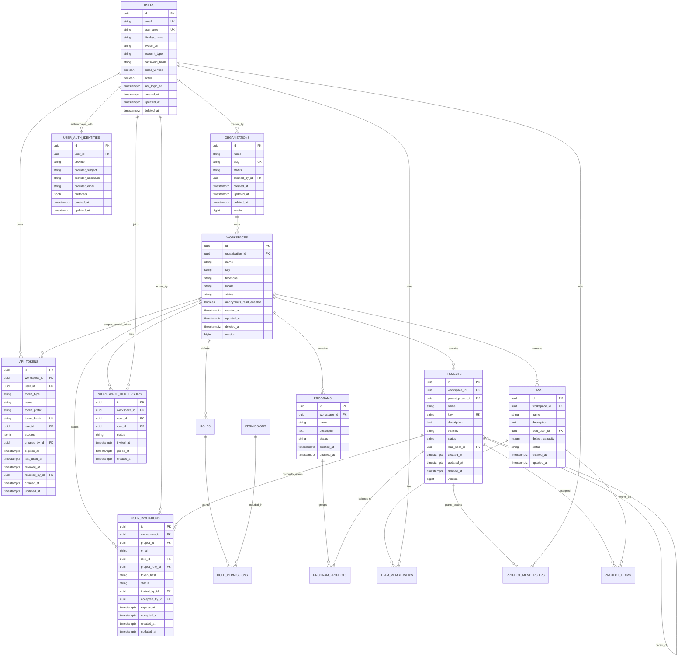
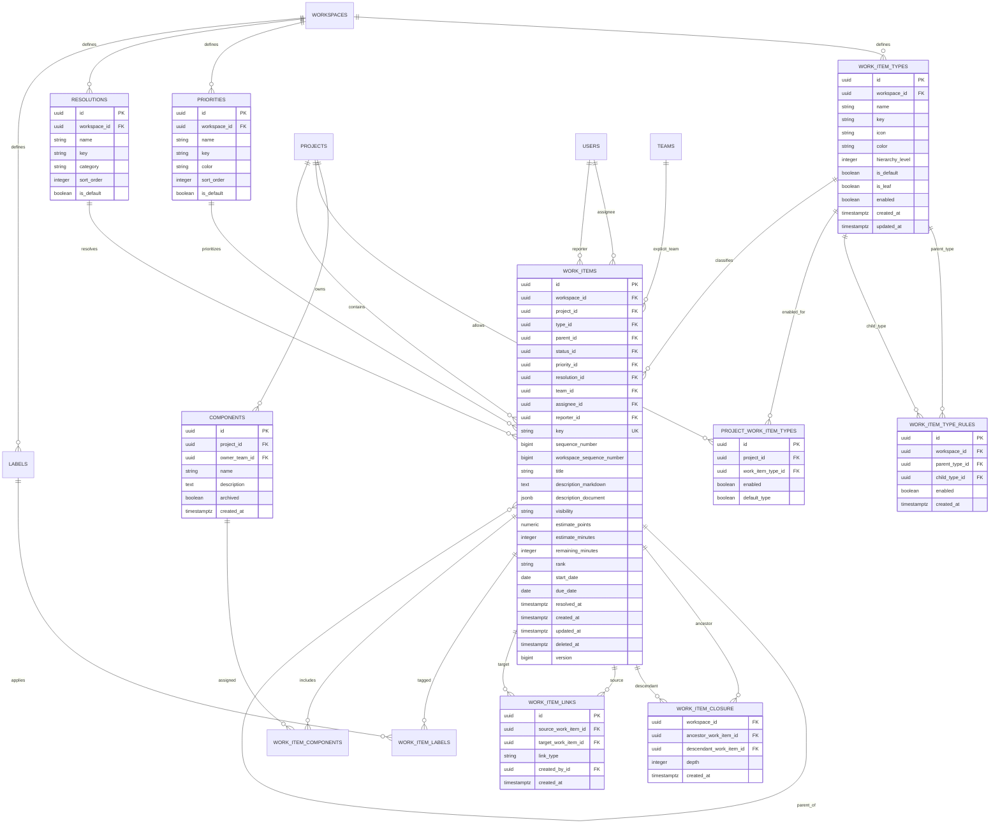
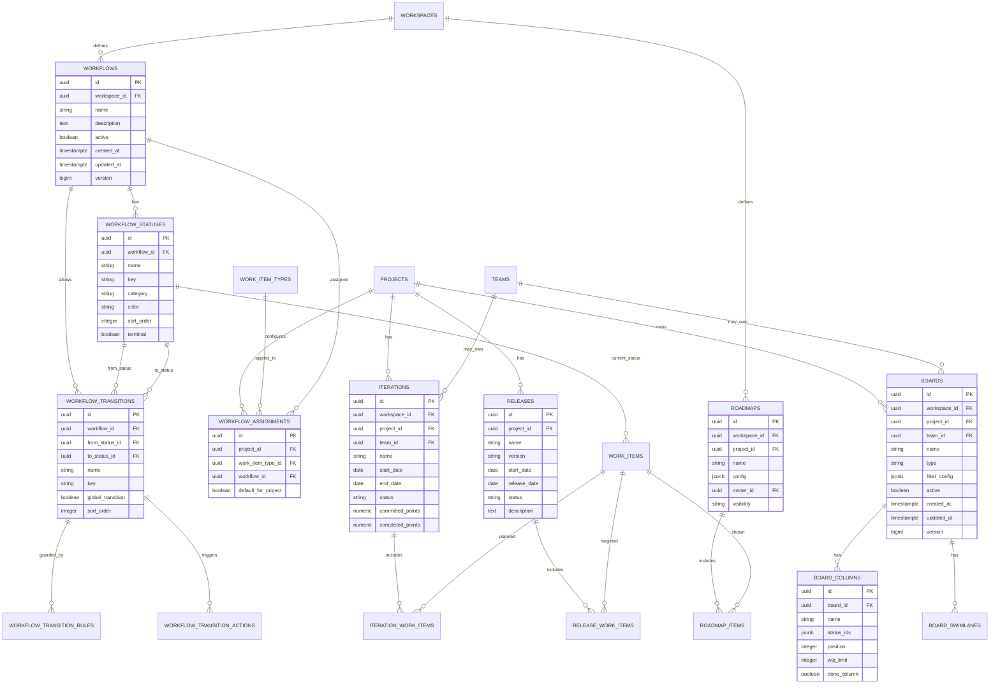
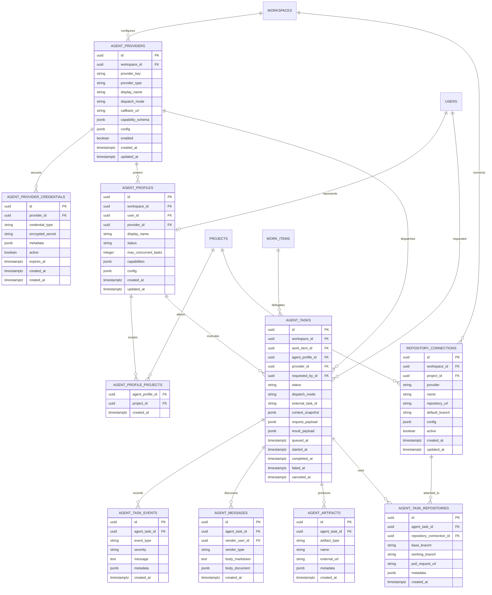

# Trasck Technical Specifications

Last reviewed: 2026-04-20

## Purpose

Trasck is a full-fledged open-source project management platform intended to compete with tools such as Jira and Rally. This document is the backend reference for the product model, database shape, hierarchy decisions, and implementation direction.

This is not an MVP spec. The goal is to design the backend foundation for the complete product from the beginning, even if individual features are implemented over time.

## Core Product Decisions

1. Trasck will separate container hierarchy from work hierarchy.
2. `Organization`, `Workspace`, `Program`, `Project`, and `Team` describe where work lives and who can access it.
3. `WorkItem` is the universal work artifact. Epics, stories, tasks, bugs, subtasks, features, initiatives, and themes are all work items with different configured types.
4. Trasck will not create separate tables such as `epics`, `stories`, `bugs`, or `tasks`.
5. `WorkItemType` and `WorkItemTypeRule` define the configurable work hierarchy.
6. `parent_id` on `work_items` defines the structural hierarchy.
7. `work_item_links` define non-hierarchical relationships such as blocks, duplicates, relates to, depends on, and clones.
8. Workflow, custom fields, screens, boards, notifications, automation, and reporting should be configurable per workspace and optionally overridden per project.
9. The backend should favor strong relational modeling for core concepts and `jsonb` only for configurable rules, field values, external payloads, and view definitions.
10. All important user-visible changes should generate activity events. Security/compliance-sensitive changes should also generate audit log entries.
11. `work_item_closure` should exist alongside `work_items.parent_id` so hierarchy rollups are fast and reliable.
12. Time tracking, resolutions, custom screens, and project-specific type availability are first-class backend concepts, not add-ons.
13. User identity is global, with separate auth identities for password and OAuth providers.
14. Public project visibility must be modeled from the start, with anonymous read disabled unless a workspace/project explicitly allows it.
15. Attachment storage is configurable per workspace.
16. Automation uses hybrid execution: local state changes can run synchronously, while slow or external actions run through queued jobs.
17. AI agents are optional assignable actors. Trasck must remain fully usable as a normal Jira/Rally-style project management tool when agent features are disabled.
18. AI agent integration must be provider-neutral. Codex, Claude Code, local command runners, hosted services, webhook-based workers, and future agents should all plug into the same agent provider contract.
19. Anonymous read access for public project data must be wired into the first security configuration, but every public read must still pass domain-level visibility checks.
20. Work completed by humans or AI agents must pass through a human approval stage before it can transition to Done.
21. `POST /api/v1/setup` is first-run-only. Once any admin/user bootstrap exists, additional organizations and workspaces must be created through authenticated flows.
22. Username/password auth and OAuth should share the global user model. GitHub, Google, GitLab, and Microsoft are the first OAuth providers to support.
23. Work item changes must publish in-process Spring events and persist durable outbox rows in `domain_events`.
24. Work item ordering uses sortable rank strings, not numeric position columns.
25. Work items have both project-local sequence numbers for human keys and workspace-wide sequence numbers for cross-project ordering, imports, exports, and reporting.
26. Workspace Admins may manage agent providers, agent credentials, agent profiles, agent assignment, agent tasks, and repository connections by default.
27. Seeded field/screen configuration starts with core system fields, and user-defined custom fields/screens now layer on top through workspace configuration APIs.
28. Browser authentication uses an HTTP-only access-token cookie plus CSRF for unsafe requests. The browser frontend does not persist access tokens in local storage; direct API callers may still send JWTs, personal tokens, or service tokens as Bearer tokens.
29. User creation supports both invitation-based registration and direct workspace-admin user creation.
30. OAuth identity linking supports GitHub, Google, GitLab, and Microsoft provider identities. Automatic email matching is allowed only for verified provider emails. The signed provider-neutral endpoint remains available as an internal/trusted callback, full Spring OAuth redirects/callbacks are wired for the first four providers, and production provider callbacks use provider-specific verified-email resolution before automatic email linking.
31. Permission enforcement uses a combination of broad security filters, method-level annotations for simple administrative routes, and explicit service-layer checks for domain-heavy operations.
32. Domain events have both immediate in-process publication and durable outbox dispatch. Persisted events remain pending until static or database-configured durable consumers record successful per-consumer delivery rows.
33. Personal and service API token scopes are enforced in addition to role permissions. A token can reduce access but cannot grant permissions beyond the backing user's workspace/project roles.
34. Service-token-backed `service` users should be managed through dedicated service-token/admin surfaces by default, not mixed into normal human user/member lists.
35. Work item attachment bytes use a provider-neutral storage interface. Local filesystem storage is the default development provider; S3-compatible object storage is selected through workspace storage configuration.
36. AI provider adapters start with non-external stubs for `simulated`, `codex`, `claude_code`, and `generic_worker` so the provider-neutral lifecycle, callback security, profile scoping, worker protocol, and tests are stable before any real hosted or local agent execution is enabled.
37. Dashboard/report aggregate date filters use exact UTC instants. Work-log rows with `started_at` are filtered by that instant; date-only work logs fall back to UTC date bounds. Soft-deleted work logs are excluded from report aggregates.
38. Team/iteration reporting resolves explicit `work_items.team_id` first and falls back to team membership overlap snapshots when a work item has no explicit team assignment. Explicit team assignment changes use dedicated command/history/event shapes.
39. Agent callback key rotation immediately invalidates callback JWTs signed by older provider keys. Generic worker authentication uses one active, unexpired `worker_token` credential per worker identity, with `metadata.workerId` required.
40. Generic-worker webhook dispatch is durable outbox work through configured domain-event consumers, not a synchronous call inside work item or agent command handling.
41. Saved dashboards support private, project-shared, workspace-shared, and team-shared visibility. Shared dashboard writes require `report.manage`; dashboard reads and reporting endpoints require `report.read` at the matching project or workspace scope.
42. Dashboard widgets use flexible reporting-API-backed query config. Widgets may reference governed report query catalog entries and saved filters, but must not expose raw SQL or direct table access. Governed report query `parameters_schema` is runtime-enforced when widgets render.
43. Cross-project dashboard summaries expose project, team, and work item type dimensions together in the first response shape.
44. Generic-worker webhook consumers use provider-level max-attempt/dead-letter settings before non-test external webhook workers are enabled.
45. The first team/planning API slice is admin-managed: workspace admins manage teams and memberships, project admins assign teams to projects, and board admins manage project-scoped iterations.
46. Team membership changes are immediate active/left changes in the first API pass, and project-team assignments update the existing single `project_teams.role` value in place.
47. Iteration commitment can be calculated from the current iteration scope, and closing an iteration can carry incomplete work into another compatible project/team iteration.
48. Saved filters use the same private, team, project, workspace, and public visibility model as dashboards. Project/team navigation has direct scoped list endpoints for dashboards, saved filters, and report query catalog entries, while persisted records still carry explicit `project_id`, `team_id`, visibility, and query scope.
49. Persisted reporting snapshots should expose both raw snapshot records and report-shaped time-series DTOs so dashboards and future exports can choose the right level of detail.
50. Iteration reports support live canonical state, persisted snapshot/velocity state, or both in one response.
51. Audit retention has admin export/prune APIs and scheduled pruning. Export APIs write durable JSON artifacts through the configured attachment/object storage provider and create `export_jobs`; pruning writes an export artifact before deleting eligible rows.
52. Reporting snapshot retention favors long-lived dashboards: configurable workspace policies define raw/weekly/monthly/archive windows, dedicated aggregate tables store core snapshot family rollups, a generic JSON-backed rollup shape is reserved for experimental/custom report families, manual rollup/backfill writes archive-run metadata, and destructive snapshot pruning remains disabled until manual rollup behavior is reviewed.
53. High-volume REST lists return a cursor-page envelope with `items`, `nextCursor`, `hasMore`, and `limit`; small configuration/detail lists can remain arrays until usage proves they need pagination.
54. OpenAPI is generated by SpringDoc and exposed at `/v3/api-docs` with Swagger UI at `/swagger-ui.html`; the Vite React repo has checked-in generation tooling and a generated TypeScript client that should be regenerated only when the backend contract changes.
55. Audit/export administration uses generic export-job endpoints for listing, metadata lookup, and file download, so retention exports are recoverable without depending on work-item attachment routes.
56. Project work-item lists support typed custom-field search for searchable fields: exact/not-equal text matches, contains/not-contains text matches, numeric/date/datetime comparisons and ranges, boolean equality, multi-select array membership, and JSON equality.
57. Saved views, favorites, and recent items share a single personalization API package. Saved views use the same private, team, project, workspace, and public visibility model as dashboards and saved filters.
58. Screen required-field enforcement runs fully on work item create/update, and command endpoints that can invalidate required system fields run targeted checks for the field they changed.
59. Frontend components should use feature-specific API services and hooks around the generated `TrasckApiClient`; the generated TypeScript client and `openapi.json` stay committed as the reviewed contract snapshot while the API is moving quickly. The Vite frontend uses route-based navigation rather than a single tabbed console shell.
60. Notification preferences support both current-user self-service rows and workspace-admin default policy rows. Default policy rows use `notification_preferences.user_id = null`; user rows remain separate overrides.
61. Automation rule execution creates queued jobs first. Admin worker endpoints process queued or retryable failed jobs, and webhook delivery worker endpoints process queued or retryable delivery rows with bounded attempts and `dead_letter` terminal state.
62. Email automation actions create durable email delivery rows using workspace-level email provider settings. Maildev remains available for local development and dry-run/manual testing outside production profiles; SMTP settings are workspace-scoped, SMTP passwords are encrypted at rest through the current database-backed secret-cipher path, and the design keeps room to move SMTP and agent credentials behind external secret management later.
63. Import jobs support CSV, Jira JSON, and Rally JSON parsing into reviewable import records. Import mapping templates can materialize parsed records into work items through the same service path as normal work item creation/update, with reusable workspace transform presets, template-local transformation overrides, legacy transformation functions, argument-based transformation pipelines, value lookup rules, and type/status translation rules applied before materialization.
64. Boards expose per-column work item card data from configured status mappings plus configured backend swimlane groupings backed by the saved-filter/query-builder predicate engine. Board-scoped rank and transition commands validate board membership before using the normal work item command paths; transition commands can use explicit `transitionKey` or derive an allowed workflow transition from `targetColumnId` and/or `targetStatusId`.
65. Manual worker endpoints remain available, and scheduled automation/webhook/email workers are enabled per workspace through `automation_worker_settings`; defaults keep all scheduled workers off. Worker executions write dedicated run-history and health rows for automation, webhook, and email workers. Worker run retention settings, manual retention export, manual retention pruning, and optional automatic scheduled pruning are implemented.
66. Webhook and email deliveries are operable rows: admins can inspect, retry, cancel, dry-run process, and dead-letter delivery attempts without direct database access.

## Full Work Hierarchy

Trasck should ship with a full enterprise-ready hierarchy while allowing workspaces to customize it.

Default seeded hierarchy:

```text
Theme
  Initiative
    Capability
      Feature
        Epic
          Story / Task / Bug
            Subtask
```

Important notes:

- `Story`, `Task`, and `Bug` are peer types by default.
- `Subtask` is a child execution detail under story/task/bug.
- `Feature`, `Capability`, `Initiative`, and `Theme` support portfolio and roadmap planning.
- A workspace may disable or rename levels without requiring schema changes.
- A project may restrict the set of work item types it allows.
- Parent-child validity is controlled by `work_item_type_rules`, not only by numeric hierarchy levels.

Seeded hierarchy levels:

| Type | Level | Default Parent |
|---|---:|---|
| Theme | 600 | none |
| Initiative | 500 | Theme |
| Capability | 400 | Initiative |
| Feature | 300 | Capability |
| Epic | 200 | Feature |
| Story | 100 | Epic |
| Task | 100 | Epic |
| Bug | 100 | Epic |
| Subtask | 0 | Story, Task, or Bug |

## Container Hierarchy

Default container model:

```text
Organization
  Workspace
    Program
      Project
        Child Project
    Team
```

Notes:

- `Organization` is the top-level customer/account boundary.
- `Workspace` is the configuration boundary. Work item types, workflows, custom fields, automation, roles, and global settings live here.
- `Program` groups projects for portfolio reporting and planning.
- `Project` is the primary work container and owns project keys such as `TRASCK`.
- Projects may be nested through `parent_project_id`.
- `Team` models delivery teams and capacity separately from project ownership.
- Boards, releases, iterations, and roadmaps can be project-scoped or team-scoped depending on the feature.

## Backend Package Structure

Use domain-oriented packages under `com.strangequark.trasck`:

```text
com.strangequark.trasck.identity
com.strangequark.trasck.organization
com.strangequark.trasck.workspace
com.strangequark.trasck.access
com.strangequark.trasck.project
com.strangequark.trasck.team
com.strangequark.trasck.workitem
com.strangequark.trasck.workflow
com.strangequark.trasck.planning
com.strangequark.trasck.board
com.strangequark.trasck.customfield
com.strangequark.trasck.activity
com.strangequark.trasck.audit
com.strangequark.trasck.event
com.strangequark.trasck.notification
com.strangequark.trasck.automation
com.strangequark.trasck.agent
com.strangequark.trasck.integration
com.strangequark.trasck.reporting
com.strangequark.trasck.search
```

Each package should own its controllers, services, repositories, DTOs, mappers, and domain exceptions unless a shared abstraction is clearly needed.

## Implemented Backend Slice

The first runnable backend slice is intentionally explicit. Local development does not auto-create an organization, workspace, project, or admin user at application startup.

Implemented endpoints:

- `POST /api/v1/setup` creates the initial admin user, organization, workspace, project, workspace membership, project membership, and deterministic default configuration. It is first-run-only and returns conflict after bootstrap.
- `POST /api/v1/auth/login` authenticates username/password users, returns a Bearer JWT, and sets the same token in an HTTP-only cookie.
- `POST /api/v1/auth/register` creates a username/password user from a valid workspace invitation.
- `POST /api/v1/auth/oauth/login` links or logs in a verified OAuth identity for GitHub, Google, GitLab, or Microsoft using a signed provider assertion.
- `GET /api/v1/auth/oauth2/authorization/{registrationId}` starts full Spring OAuth login for GitHub, Google, GitLab, or Microsoft.
- `GET /api/v1/auth/oauth2/callback/{registrationId}` completes Spring OAuth login, links/logs in the verified provider identity, sets the auth cookie, and redirects to the configured frontend callback.
- `GET /api/v1/auth/csrf` returns the CSRF header name and token for browser clients using cookie authentication.
- `POST /api/v1/auth/logout` clears the auth cookie.
- `GET /api/v1/auth/me` returns the authenticated user.
- `POST /api/v1/auth/tokens/personal` creates a revocable personal access token for the current user.
- `GET /api/v1/auth/tokens/personal` lists the current user's personal access tokens without exposing raw token values or token hashes.
- `DELETE /api/v1/auth/tokens/{tokenId}` revokes one of the current user's personal access tokens.
- `POST /api/v1/workspaces/{workspaceId}/invitations` creates a workspace invitation for callers with `user.manage`.
- `POST /api/v1/workspaces/{workspaceId}/service-tokens` creates a revocable workspace service token backed by a service user and workspace role.
- `GET /api/v1/workspaces/{workspaceId}/service-tokens` lists workspace service tokens without exposing raw token values or token hashes.
- `DELETE /api/v1/workspaces/{workspaceId}/service-tokens/{tokenId}` revokes a workspace service token.
- `POST /api/v1/workspaces/{workspaceId}/users` lets callers with `user.manage` create a user directly in a workspace.
- `GET /api/v1/public/projects/{projectId}` returns anonymous project metadata only when the workspace has anonymous read enabled, the project is public, and both records are active and not soft-deleted.
- `POST /api/v1/projects/{projectId}/work-items` creates work items in a seeded project, accepts an optional `customFields` object keyed by custom field key or ID, and enforces required create-screen system/custom fields when a create screen assignment applies.
- `GET /api/v1/projects/{projectId}/work-items` lists active project work items in rank order through the cursor-page envelope. Optional `customFieldKey`, `customFieldOperator`, `customFieldValue`, and `customFieldValueTo` filter by a searchable custom field that applies to the project.
- `GET /api/v1/work-items/{workItemId}` returns an active work item.
- `PATCH /api/v1/work-items/{workItemId}` updates editable work item fields, parentage, and optional keyed `customFields`, then enforces required edit-screen system/custom fields when an edit screen assignment applies.
- `POST /api/v1/work-items/{workItemId}/assign` changes assignee, runs targeted edit-screen required-assignee enforcement when applicable, and writes assignment history.
- `POST /api/v1/work-items/{workItemId}/team` changes explicit team assignment, runs targeted edit-screen required-team enforcement when applicable, and writes team history.
- `POST /api/v1/work-items/{workItemId}/rank` changes sortable rank string ordering.
- `POST /api/v1/work-items/{workItemId}/transition` applies an allowed workflow transition and writes status history.
- `DELETE /api/v1/work-items/{workItemId}` soft-archives a work item.
- `GET /api/v1/workspaces/{workspaceId}/teams`, `POST /api/v1/workspaces/{workspaceId}/teams`, `GET /api/v1/teams/{teamId}`, `PATCH /api/v1/teams/{teamId}`, and `DELETE /api/v1/teams/{teamId}` list, create, update, and archive teams.
- `GET /api/v1/teams/{teamId}/memberships`, `POST /api/v1/teams/{teamId}/memberships`, and `DELETE /api/v1/teams/{teamId}/memberships/{userId}` manage immediate team membership joins/leaves and capacity metadata.
- `GET /api/v1/projects/{projectId}/teams`, `PUT /api/v1/projects/{projectId}/teams/{teamId}`, and `DELETE /api/v1/projects/{projectId}/teams/{teamId}` manage the current project-team role assignment.
- `GET /api/v1/projects/{projectId}/iterations`, `POST /api/v1/projects/{projectId}/iterations`, `GET /api/v1/iterations/{iterationId}`, `PATCH /api/v1/iterations/{iterationId}`, and `DELETE /api/v1/iterations/{iterationId}` manage project-scoped iterations.
- `GET /api/v1/iterations/{iterationId}/work-items`, `POST /api/v1/iterations/{iterationId}/work-items`, `DELETE /api/v1/iterations/{iterationId}/work-items/{workItemId}`, `POST /api/v1/iterations/{iterationId}/commit`, and `POST /api/v1/iterations/{iterationId}/close` manage iteration scope, commitment, close, and incomplete-work carryover.
- `GET /api/v1/projects/{projectId}/boards`, `POST /api/v1/projects/{projectId}/boards`, `GET /api/v1/boards/{boardId}`, `PATCH /api/v1/boards/{boardId}`, and `DELETE /api/v1/boards/{boardId}` manage active project boards.
- `GET /api/v1/boards/{boardId}/columns`, `POST /api/v1/boards/{boardId}/columns`, `PATCH /api/v1/boards/{boardId}/columns/{columnId}`, and `DELETE /api/v1/boards/{boardId}/columns/{columnId}` manage board columns and mapped statuses.
- `GET /api/v1/boards/{boardId}/work-items` returns per-column work item cards using configured column status mappings and a bounded `limitPerColumn`, plus configured swimlane groupings over those columns. Swimlane query JSON reuses the saved-filter/query-builder predicate shape.
- `POST /api/v1/boards/{boardId}/work-items/{workItemId}/rank` and `POST /api/v1/boards/{boardId}/work-items/{workItemId}/transition` provide board-scoped rank and transition commands that validate the work item belongs to the board project before delegating to the normal work item command paths. Transition requests can send `transitionKey` directly, or send `targetColumnId` and/or `targetStatusId` so drag/drop flows can derive the allowed workflow transition from board column status mappings.
- `GET /api/v1/boards/{boardId}/swimlanes`, `POST /api/v1/boards/{boardId}/swimlanes`, `PATCH /api/v1/boards/{boardId}/swimlanes/{swimlaneId}`, and `DELETE /api/v1/boards/{boardId}/swimlanes/{swimlaneId}` manage board swimlane configuration.
- `GET /api/v1/projects/{projectId}/releases`, `POST /api/v1/projects/{projectId}/releases`, `GET /api/v1/releases/{releaseId}`, `PATCH /api/v1/releases/{releaseId}`, and `DELETE /api/v1/releases/{releaseId}` manage project releases.
- `GET /api/v1/releases/{releaseId}/work-items`, `POST /api/v1/releases/{releaseId}/work-items`, and `DELETE /api/v1/releases/{releaseId}/work-items/{workItemId}` manage release scope.
- `GET /api/v1/workspaces/{workspaceId}/roadmaps`, `GET /api/v1/projects/{projectId}/roadmaps`, `POST /api/v1/workspaces/{workspaceId}/roadmaps`, `GET /api/v1/roadmaps/{roadmapId}`, `PATCH /api/v1/roadmaps/{roadmapId}`, and `DELETE /api/v1/roadmaps/{roadmapId}` manage workspace and project roadmap views.
- `GET /api/v1/roadmaps/{roadmapId}/items`, `POST /api/v1/roadmaps/{roadmapId}/items`, `PATCH /api/v1/roadmaps/{roadmapId}/items/{roadmapItemId}`, and `DELETE /api/v1/roadmaps/{roadmapId}/items/{roadmapItemId}` manage roadmap items.
- `GET /api/v1/work-items/{workItemId}/comments`, `POST /api/v1/work-items/{workItemId}/comments`, `PATCH /api/v1/work-items/{workItemId}/comments/{commentId}`, and `DELETE /api/v1/work-items/{workItemId}/comments/{commentId}` manage work item comments.
- `GET /api/v1/work-items/{workItemId}/links`, `POST /api/v1/work-items/{workItemId}/links`, and `DELETE /api/v1/work-items/{workItemId}/links/{linkId}` manage non-hierarchical work item links.
- `GET /api/v1/work-items/{workItemId}/watchers`, `POST /api/v1/work-items/{workItemId}/watchers`, and `DELETE /api/v1/work-items/{workItemId}/watchers/{userId}` manage work item watchers.
- `GET /api/v1/work-items/{workItemId}/work-logs`, `POST /api/v1/work-items/{workItemId}/work-logs`, `PATCH /api/v1/work-items/{workItemId}/work-logs/{workLogId}`, and `DELETE /api/v1/work-items/{workItemId}/work-logs/{workLogId}` manage time tracking entries with rich description payloads and soft delete.
- `GET /api/v1/workspaces/{workspaceId}/labels`, `POST /api/v1/workspaces/{workspaceId}/labels`, `GET /api/v1/work-items/{workItemId}/labels`, `POST /api/v1/work-items/{workItemId}/labels`, and `DELETE /api/v1/work-items/{workItemId}/labels/{labelId}` manage workspace labels and work item label assignments.
- `GET /api/v1/work-items/{workItemId}/attachments`, `POST /api/v1/work-items/{workItemId}/attachments`, `POST /api/v1/work-items/{workItemId}/attachments/files`, `GET /api/v1/work-items/{workItemId}/attachments/{attachmentId}/download`, and `DELETE /api/v1/work-items/{workItemId}/attachments/{attachmentId}` manage attachment metadata and file bytes for work items.
- `GET /api/v1/workspaces/{workspaceId}/custom-fields`, `POST /api/v1/workspaces/{workspaceId}/custom-fields`, `GET /api/v1/custom-fields/{customFieldId}`, `PATCH /api/v1/custom-fields/{customFieldId}`, and `DELETE /api/v1/custom-fields/{customFieldId}` manage workspace custom field definitions. Deleting a custom field archives it.
- `GET /api/v1/custom-fields/{customFieldId}/contexts`, `POST /api/v1/custom-fields/{customFieldId}/contexts`, `PATCH /api/v1/custom-fields/{customFieldId}/contexts/{contextId}`, and `DELETE /api/v1/custom-fields/{customFieldId}/contexts/{contextId}` manage custom field scope and required/default metadata by project and work item type.
- `GET /api/v1/workspaces/{workspaceId}/field-configurations`, `POST /api/v1/workspaces/{workspaceId}/field-configurations`, `GET /api/v1/custom-fields/{customFieldId}/field-configurations`, `GET /api/v1/field-configurations/{fieldConfigurationId}`, `PATCH /api/v1/field-configurations/{fieldConfigurationId}`, and `DELETE /api/v1/field-configurations/{fieldConfigurationId}` manage field configuration overrides by workspace, project, and work item type.
- `GET /api/v1/work-items/{workItemId}/custom-fields`, `PUT /api/v1/work-items/{workItemId}/custom-fields/{customFieldId}`, and `DELETE /api/v1/work-items/{workItemId}/custom-fields/{customFieldId}` manage custom field values on work items with type validation and context checks.
- `GET /api/v1/workspaces/{workspaceId}/screens`, `POST /api/v1/workspaces/{workspaceId}/screens`, `GET /api/v1/screens/{screenId}`, `PATCH /api/v1/screens/{screenId}`, and `DELETE /api/v1/screens/{screenId}` manage screen metadata.
- `GET /api/v1/screens/{screenId}/fields`, `POST /api/v1/screens/{screenId}/fields`, `PATCH /api/v1/screens/{screenId}/fields/{screenFieldId}`, and `DELETE /api/v1/screens/{screenId}/fields/{screenFieldId}` manage system/custom fields displayed on a screen.
- `GET /api/v1/screens/{screenId}/assignments`, `POST /api/v1/screens/{screenId}/assignments`, `PATCH /api/v1/screens/{screenId}/assignments/{assignmentId}`, and `DELETE /api/v1/screens/{screenId}/assignments/{assignmentId}` manage screen selection metadata by project, work item type, and create/edit/view operation. Create/edit assignments drive required field enforcement for work item create/update, and targeted command enforcement for commands that mutate required system fields.
- `GET /api/v1/work-items/{workItemId}/activity`, `GET /api/v1/workspaces/{workspaceId}/projects/{projectId}/activity`, and `GET /api/v1/workspaces/{workspaceId}/activity` expose durable activity projections for work-item, project, and workspace streams through the cursor-page envelope.
- `GET /api/v1/workspaces/{workspaceId}/audit-log` exposes admin-only audit log entries for a workspace through the cursor-page envelope.
- `GET /api/v1/workspaces/{workspaceId}/audit-retention-policy`, `PUT /api/v1/workspaces/{workspaceId}/audit-retention-policy`, `POST /api/v1/workspaces/{workspaceId}/audit-retention-policy/export`, and `POST /api/v1/workspaces/{workspaceId}/audit-retention-policy/prune` manage configurable workspace audit retention policy metadata, export retention candidates to configured attachment/object storage, create `export_jobs`, and prune eligible audit rows only after an export artifact is written.
- `GET /api/v1/workspaces/{workspaceId}/export-jobs`, `GET /api/v1/workspaces/{workspaceId}/export-jobs/{exportJobId}`, and `GET /api/v1/workspaces/{workspaceId}/export-jobs/{exportJobId}/download` list stored export jobs, return export metadata, and download export artifacts through workspace-admin-only APIs.
- `POST /api/v1/workspaces/{workspaceId}/domain-events/replay` lets workspace admins replay selected domain events through selected durable consumers, defaulting to the activity and audit projection consumers.
- `GET /api/v1/workspaces/{workspaceId}/agent-providers`, `POST /api/v1/workspaces/{workspaceId}/agent-providers`, `PATCH /api/v1/agent-providers/{providerId}`, `POST /api/v1/agent-providers/{providerId}/credentials`, `GET /api/v1/agent-providers/{providerId}/credentials`, `POST /api/v1/agent-providers/{providerId}/credentials/{credentialId}/deactivate`, `POST /api/v1/agent-providers/{providerId}/credentials/reencrypt`, and `POST /api/v1/agent-providers/{providerId}/callback-keys/rotate` manage provider-neutral agent providers, encrypted credentials, and callback signing keys.
- `GET /api/v1/workspaces/{workspaceId}/agents`, `POST /api/v1/workspaces/{workspaceId}/agents`, and `PATCH /api/v1/agents/{profileId}` manage assignable agent profiles backed by `users.account_type = agent`.
- `GET /api/v1/workspaces/{workspaceId}/repository-connections` and `POST /api/v1/workspaces/{workspaceId}/repository-connections` manage generic Git, GitHub, and GitLab repository connections with provider metadata.
- `POST /api/v1/work-items/{workItemId}/assign-agent` assigns a work item to a configured agent and creates an agent task.
- `GET /api/v1/agent-tasks/{taskId}`, `POST /api/v1/agent-tasks/{taskId}/messages`, `POST /api/v1/agent-tasks/{taskId}/request-changes`, `POST /api/v1/agent-tasks/{taskId}/cancel`, `POST /api/v1/agent-tasks/{taskId}/retry`, `POST /api/v1/agent-tasks/{taskId}/accept-result`, and `POST /api/v1/agent-tasks/{taskId}/worker-dispatch` expose agent task review, collaboration, and lifecycle commands.
- `POST /api/v1/agent-callbacks/{providerKey}` accepts provider-neutral signed JWT callback assertions for agent task status, messages, artifacts, and review requests.
- `POST /api/v1/workspaces/{workspaceId}/agent-workers/{providerKey}/tasks/claim`, `/tasks/{taskId}/heartbeat`, `/logs`, `/messages`, `/artifacts`, `/cancel`, and `/retry` expose the first generic-worker protocol endpoints. These routes are open at the HTTP security layer but require a valid `X-Trasck-Worker-Token` matching an active encrypted provider `worker_token` credential.
- `GET /api/v1/reports/work-items/{workItemId}/status-history`, `/assignment-history`, `/team-history`, `/estimate-history`, and `/work-log-summary` expose first reporting/history read APIs for a work item.
- `GET /api/v1/reports/projects/{projectId}/dashboard-summary` exposes an on-demand project dashboard aggregate. Optional `from`, `to`, `teamId`, and `iterationId` filters support project, team, and iteration report scopes through the same query model.
- `GET /api/v1/reports/workspaces/{workspaceId}/dashboard-summary` exposes a workspace or project-set dashboard aggregate. Optional `projectIds`, `from`, and `to` filters support cross-project comparisons.
- `GET /api/v1/reports/programs/{programId}/dashboard-summary` exposes a program dashboard aggregate for projects assigned to a program.
- `POST /api/v1/reports/workspaces/{workspaceId}/snapshots/run`, `POST /api/v1/reports/workspaces/{workspaceId}/snapshots/backfill`, and `POST /api/v1/reports/workspaces/{workspaceId}/snapshots/reconcile` manually run, backfill, and reconcile reporting snapshots for cycle time, iteration scope, velocity, and cumulative flow for a workspace.
- `GET /api/v1/reports/workspaces/{workspaceId}/snapshot-retention-policy` and `PUT /api/v1/reports/workspaces/{workspaceId}/snapshot-retention-policy` read and update workspace snapshot retention windows for raw rows, weekly rollups, monthly rollups, archive windows, and future destructive pruning.
- `POST /api/v1/reports/workspaces/{workspaceId}/snapshots/rollups/run` and `POST /api/v1/reports/workspaces/{workspaceId}/snapshots/rollups/backfill` manually materialize daily/weekly/monthly rollups for cycle time, iteration scope, velocity, and cumulative flow and record archive-run metadata.
- `GET /api/v1/reports/projects/{projectId}/snapshots` returns raw persisted cycle-time, iteration, velocity, and cumulative-flow snapshot records plus report-shaped raw and rollup-backed time-series points.
- `GET /api/v1/reports/iterations/{iterationId}/report` returns live iteration metrics, persisted snapshot/velocity metrics, or both.
- `GET /api/v1/workspaces/{workspaceId}/dashboards`, `GET /api/v1/projects/{projectId}/dashboards`, `GET /api/v1/teams/{teamId}/dashboards`, `POST /api/v1/workspaces/{workspaceId}/dashboards`, `GET /api/v1/dashboards/{dashboardId}`, `PATCH /api/v1/dashboards/{dashboardId}`, `DELETE /api/v1/dashboards/{dashboardId}`, and `GET /api/v1/dashboards/{dashboardId}/render` manage and render saved dashboards with private, team, project, workspace, and public visibility.
- `POST /api/v1/dashboards/{dashboardId}/widgets`, `PATCH /api/v1/dashboards/{dashboardId}/widgets/{widgetId}`, and `DELETE /api/v1/dashboards/{dashboardId}/widgets/{widgetId}` manage saved dashboard widgets.
- `GET /api/v1/workspaces/{workspaceId}/saved-filters`, `GET /api/v1/projects/{projectId}/saved-filters`, `GET /api/v1/teams/{teamId}/saved-filters`, `POST /api/v1/workspaces/{workspaceId}/saved-filters`, `GET /api/v1/saved-filters/{savedFilterId}`, `GET /api/v1/saved-filters/{savedFilterId}/work-items`, `PATCH /api/v1/saved-filters/{savedFilterId}`, and `DELETE /api/v1/saved-filters/{savedFilterId}` manage saved filters with dashboard-style visibility, optional project/team query scoping, and governed work item execution.
- `GET /api/v1/workspaces/{workspaceId}/report-query-catalog`, `GET /api/v1/projects/{projectId}/report-query-catalog`, `GET /api/v1/teams/{teamId}/report-query-catalog`, `POST /api/v1/workspaces/{workspaceId}/report-query-catalog`, `GET /api/v1/report-query-catalog/{queryId}`, `PATCH /api/v1/report-query-catalog/{queryId}`, and `DELETE /api/v1/report-query-catalog/{queryId}` manage governed reusable reporting queries for dashboard widgets. `parametersSchema` supports `string`, `uuid`, `integer`, `number`, `boolean`, `date`, `datetime`, `array`, and `object` runtime validation.
- `GET /api/v1/workspaces/{workspaceId}/personalization/views`, `GET /api/v1/projects/{projectId}/personalization/views`, `GET /api/v1/teams/{teamId}/personalization/views`, `POST /api/v1/workspaces/{workspaceId}/personalization/views`, `GET /api/v1/personalization/views/{viewId}`, `PATCH /api/v1/personalization/views/{viewId}`, and `DELETE /api/v1/personalization/views/{viewId}` manage saved user views with private, team, project, workspace, and public visibility.
- `GET /api/v1/workspaces/{workspaceId}/personalization/favorites`, `POST /api/v1/workspaces/{workspaceId}/personalization/favorites`, and `DELETE /api/v1/personalization/favorites/{favoriteId}` manage user favorites for supported workspace entities.
- `GET /api/v1/workspaces/{workspaceId}/personalization/recent-items`, `POST /api/v1/workspaces/{workspaceId}/personalization/recent-items`, and `DELETE /api/v1/personalization/recent-items/{recentItemId}` manage recently viewed items.
- `GET /api/v1/workspaces/{workspaceId}/notifications`, `PATCH /api/v1/notifications/{notificationId}/read`, `GET /api/v1/workspaces/{workspaceId}/notification-preferences`, `POST /api/v1/workspaces/{workspaceId}/notification-preferences`, `PATCH /api/v1/notification-preferences/{preferenceId}`, and `DELETE /api/v1/notification-preferences/{preferenceId}` expose current-user notifications and notification preferences.
- `GET /api/v1/workspaces/{workspaceId}/notification-defaults`, `POST /api/v1/workspaces/{workspaceId}/notification-defaults`, `PATCH /api/v1/notification-defaults/{preferenceId}`, and `DELETE /api/v1/notification-defaults/{preferenceId}` manage workspace-admin default notification policies.
- `GET /api/v1/workspaces/{workspaceId}/automation-rules`, `POST /api/v1/workspaces/{workspaceId}/automation-rules`, `GET /api/v1/automation-rules/{ruleId}`, `PATCH /api/v1/automation-rules/{ruleId}`, `DELETE /api/v1/automation-rules/{ruleId}`, condition/action child routes, `POST /api/v1/automation-rules/{ruleId}/execute`, `GET /api/v1/automation-rules/{ruleId}/jobs`, `GET /api/v1/automation-jobs/{jobId}`, `POST /api/v1/automation-jobs/{jobId}/run`, `POST /api/v1/workspaces/{workspaceId}/automation-jobs/run-queued`, `GET /api/v1/workspaces/{workspaceId}/automation-worker-settings`, `PATCH /api/v1/workspaces/{workspaceId}/automation-worker-settings`, `GET /api/v1/workspaces/{workspaceId}/automation-worker-runs`, `POST /api/v1/workspaces/{workspaceId}/automation-worker-runs/export`, `POST /api/v1/workspaces/{workspaceId}/automation-worker-runs/prune`, and `GET /api/v1/workspaces/{workspaceId}/automation-worker-health` manage automation rules, queued worker execution, workspace-level scheduled worker settings, worker run history, manual worker-run retention export/prune, optional automatic worker-run pruning, and worker health.
- `GET /api/v1/workspaces/{workspaceId}/webhooks`, `POST /api/v1/workspaces/{workspaceId}/webhooks`, `PATCH /api/v1/webhooks/{webhookId}`, `DELETE /api/v1/webhooks/{webhookId}`, `GET /api/v1/webhooks/{webhookId}/deliveries`, `GET /api/v1/webhook-deliveries/{deliveryId}`, `POST /api/v1/webhook-deliveries/{deliveryId}/retry`, `POST /api/v1/webhook-deliveries/{deliveryId}/cancel`, and `POST /api/v1/workspaces/{workspaceId}/webhook-deliveries/process` manage webhook configuration, queued delivery records, inspection, retry/cancel administration, dry-run or real HTTP processing, and dead-letter state.
- `GET /api/v1/workspaces/{workspaceId}/email-provider-settings` and `PUT /api/v1/workspaces/{workspaceId}/email-provider-settings` manage workspace-level Maildev/SMTP provider settings. SMTP passwords are accepted on write, encrypted, and never returned by the API.
- `GET /api/v1/workspaces/{workspaceId}/email-deliveries`, `GET /api/v1/email-deliveries/{deliveryId}`, `POST /api/v1/email-deliveries/{deliveryId}/retry`, `POST /api/v1/email-deliveries/{deliveryId}/cancel`, and `POST /api/v1/workspaces/{workspaceId}/email-deliveries/process` manage workspace-provider-backed email delivery rows, dry-run processing, retry/cancel administration, SMTP processing, and dead-letter state.
- `GET /api/v1/workspaces/{workspaceId}/import-jobs`, `POST /api/v1/workspaces/{workspaceId}/import-jobs`, `GET /api/v1/import-jobs/{importJobId}`, `POST /api/v1/import-jobs/{importJobId}/parse`, `POST /api/v1/import-jobs/{importJobId}/materialize`, `POST /api/v1/import-jobs/{importJobId}/start`, `POST /api/v1/import-jobs/{importJobId}/complete`, `POST /api/v1/import-jobs/{importJobId}/fail`, `POST /api/v1/import-jobs/{importJobId}/cancel`, `GET /api/v1/import-jobs/{importJobId}/records`, `POST /api/v1/import-jobs/{importJobId}/records`, `GET /api/v1/workspaces/{workspaceId}/import-transform-presets`, `POST /api/v1/workspaces/{workspaceId}/import-transform-presets`, `GET /api/v1/import-transform-presets/{presetId}`, `PATCH /api/v1/import-transform-presets/{presetId}`, `DELETE /api/v1/import-transform-presets/{presetId}`, `GET /api/v1/workspaces/{workspaceId}/import-mapping-templates`, `POST /api/v1/workspaces/{workspaceId}/import-mapping-templates`, `PATCH /api/v1/import-mapping-templates/{mappingTemplateId}`, `DELETE /api/v1/import-mapping-templates/{mappingTemplateId}`, and mapping-template child endpoints for value lookups, type translations, and status translations manage import lifecycle, CSV/Jira/Rally parsing, per-source records, reusable transform presets, mapping templates, mapping rules, and work item materialization.
- `GET /v3/api-docs` exposes generated OpenAPI JSON and `/swagger-ui.html` exposes Swagger UI for local/backend contract inspection.

Implemented seed data:

- Default work item hierarchy: Theme, Initiative, Capability, Feature, Epic, Story, Task, Bug, and Subtask.
- Default hierarchy rules from Theme down to Subtask.
- Default priorities, resolutions, workflow statuses, workflow transitions, board columns, roles, project type availability, workflow assignments, project settings, and local filesystem attachment storage configuration.
- Default workflow includes an Approval status and requires human approval before Done for human-completed and agent-completed work.

Security state:

- Setup, auth login/register/OAuth/login/logout, health, and public project reads are explicitly permitted.
- OpenAPI docs and Swagger UI are read-only and permitted without authentication for local contract discovery.
- Other API routes require a valid JWT from the `Authorization: Bearer` header, `trasck_access_token` HTTP-only cookie, or a revocable API token sent as `Authorization: Bearer`.
- Browser clients using the auth cookie must send a CSRF token for unsafe methods. Bearer-token API callers are not forced through CSRF.
- Workspace user-management endpoints use method-level permission checks.
- Work item endpoints are no longer anonymously accessible; work item service methods enforce project-scoped permissions before reads or writes.
- High-volume list endpoints for project work items, activity streams, audit logs, and export jobs enforce the same domain permissions while returning cursor-page envelopes instead of unbounded arrays.
- The provider-neutral OAuth login endpoint requires `TRASCK_OAUTH_ASSERTION_SECRET` and a signed assertion. Full provider redirects/callbacks are also wired through Spring OAuth client registrations for GitHub, Google, GitLab, and Microsoft.
- Full OAuth callbacks use provider-specific verified-email checks where providers expose that data. Google uses `email_verified`; GitHub and GitLab use verified/confirmed email sources; Microsoft is treated as unverified unless an explicit verified-email signal exists.
- Personal and service API tokens store only token hashes, can be revoked, update `last_used_at` on successful authentication, and enforce token scopes in addition to role permissions.
- Service token records can be listed through dedicated admin/token APIs without exposing hashes or raw token values. Service users remain implementation identities behind those token-management surfaces by default.
- Invitations can grant workspace membership only, or workspace membership plus project-specific membership when `projectId` and `projectRoleId` are included.
- Anonymous public project reads still perform domain-level visibility checks; security configuration alone is not the access-control source of truth.
- Comment edits/deletes are author-or-admin shaped: authors need `work_item.comment`; users editing/deleting someone else's comment need `work_item.update`. Watcher self-service add/remove requires `work_item.read`; managing watchers for other users requires `work_item.update`. Work-log self-service uses dedicated `work_log.create_own`, `work_log.update_own`, and `work_log.delete_own` permissions for a user's own time entries; logging or mutating time for another user requires `work_item.update`.
- Team reads require `workspace.read`, team and membership mutations require `workspace.admin`, project-team reads require `project.read`, project-team mutations require `project.admin`, iteration reads require `project.read`, and iteration scope/commit/close mutations require `board.admin`.
- Board and release reads require project `project.read`; board, board column, swimlane, board-scoped rank/transition, release, and release-scope mutations require project `board.admin` plus the underlying work item command permission checks. Board swimlane execution reuses saved-filter/query-builder permission checks against the resolved project scope. Project roadmap reads require project `project.read`; workspace roadmap reads require workspace `workspace.read`; project-scoped roadmap mutations require project `board.admin`; workspace roadmap mutations require workspace `workspace.admin`.
- Reporting/history read APIs require `report.read` on the work item's project. Workspace/program dashboard summary reads and manual workspace snapshot execution require `report.read` on the workspace. Snapshot retention policy reads/updates and manual rollup run/backfill controls require workspace `report.manage`. Project dashboard, saved-filter, and report-query reads use project `report.read`; workspace/team/shared reads use workspace `report.read` plus the visibility rules. Creating shared workspace/team dashboards and filters requires workspace `report.manage`; creating project dashboards, filters, and catalog entries requires project `report.manage`; private dashboard/filter owners can manage their own records with workspace `report.read`.
- Custom field and screen definition reads require workspace `workspace.read`; definition/context/screen/assignment mutations require workspace `workspace.admin`. Work item custom field value reads use project `work_item.read`, and value writes/deletes use project `work_item.update`. Screen-driven required field enforcement runs inside authorized work item create/update operations, while field-mutating command endpoints perform targeted required-system-field checks.
- Field configuration reads require workspace `workspace.read`; field configuration create/update/delete requires workspace `workspace.admin`.
- Saved view reads require visibility-aware access: private owner views use workspace read access, project views use project `report.read`, team views use workspace `report.read` plus active team membership, and workspace/public views use workspace read access. Project shared view writes require project `report.manage`; team/workspace/public shared view writes require workspace `report.manage`; private saved view owners can edit/delete their own views with workspace read access. Favorites and recent items are per-user and require workspace read access plus a target entity that belongs to that workspace.
- Current-user notification and notification preference APIs require workspace `workspace.read` and only expose or mutate rows owned by the current user.
- Automation rule, automation child configuration, manual execution, queued worker execution, scheduled worker settings, worker run/health reads, worker retention export/prune, automatic worker-run pruning, workspace email provider settings, webhook configuration, webhook delivery reads/admin, email delivery reads/admin, and delivery processing APIs require workspace `automation.admin`. Rule execution queues jobs first. Worker execution creates in-app notifications synchronously, creates workspace-provider-backed email delivery rows, writes queued webhook delivery rows, and records run-history/health rows. Webhook and email delivery processing support dry-run or real delivery, bounded retries, cancel/retry administration, and `dead_letter`.
- Import job list/detail/lifecycle/parse/record/template/preset/materialization APIs require workspace `workspace.admin`. CSV, Jira JSON, and Rally JSON parsers create reviewable import records; mapping templates can create or update work items through the existing work item service after applying transform presets, template-local transformation config, value lookups, type translations, and status translations, preserving project permissions, sequence allocation, workflow defaults, screen/custom-field validation, history writes, and domain events.
- Activity streams use service-layer permission checks for the requested workspace, project, or work item.
- Audit log, audit retention, and domain event replay APIs are workspace-admin-only through method-level permission checks.
- Agent management uses explicit service-layer permission checks. Workspace Admins and the seeded Agent Manager role can manage providers, credentials, profiles, assignments, tasks, and repository connections according to their role grants.
- Agent callback endpoints are open at the HTTP security layer but require a valid signed callback JWT in `X-Trasck-Agent-Callback-Jwt`. Callback JWTs use per-provider RS256 keys. Provider config stores JWKS-style public key material only; private signing keys are encrypted in `agent_provider_credentials` through the secret-cipher abstraction. Rotating callback keys replaces the public key set and immediately invalidates older callback JWTs. The assertion is scoped to the workspace, provider, provider key, agent profile, and agent task before any state change is accepted. Generic worker endpoints are also open at the HTTP security layer and authenticate with `X-Trasck-Worker-Token` against active encrypted per-worker provider credentials.
- Agent profiles can be workspace-wide or project-scoped through `agent_profile_projects`; scoped profiles cannot be assigned outside their allowed projects.

Work item implementation state:

- Work item create/update validates project activity, workspace type enablement, project type enablement, parent-child type rules, same-project structural parentage, workflow assignment, workflow status ownership, optional keyed custom fields, and create/edit screen required fields.
- Work item create/update can set or clear an explicit team assignment through `work_items.team_id`. The dedicated `POST /api/v1/work-items/{workItemId}/team` command is the preferred mutation path and writes `work_item_team_history` plus `work_item.team_changed`. The team must be active, belong to the same workspace, and be assigned to the work item's project through `project_teams`. Team and assignee command endpoints reject clears when the applicable edit screen marks that system field required.
- Team and planning APIs expose the core configuration that reporting and work item assignment depend on. Workspace admins can create/update/archive teams and manage immediate membership joins/leaves. Project admins can assign active teams to projects and update the current project-team role. Board admins can manage boards, columns, saved-filter/query-backed swimlanes, releases, release scope, project-scoped roadmaps, roadmap items, project-scoped iterations, iteration scope, commitments, closes, and incomplete-work carryover. Workspace admins can manage workspace-scoped roadmaps. Board work item queries return real cards grouped by configured column status mappings and configured swimlanes; board-scoped rank/transition endpoints validate board membership before applying work item commands, and board transition requests can derive the workflow transition from target board column/status mappings.
- Parent changes rebuild `work_item_closure` transactionally for the project.
- Sequence allocation uses durable project and workspace sequence counter tables.
- Work item rank uses fixed-width sortable strings.
- Work item project lists use keyset cursor pagination over rank and ID so frontend list screens do not depend on unbounded arrays.
- Work item custom field values are stored in `custom_field_values` after custom field context/type validation. Project work-item lists can filter by one searchable custom field with type-aware operators: `eq`, `ne`, `contains`, `not_contains`, `in`, `gt`, `gte`, `lt`, `lte`, and `between` where supported by the field type. The direct project list filter remains intentionally single-field. Saved-filter execution now supports governed multi-predicate work item filtering with boolean groups, system-field predicates, searchable custom-field predicates, and cursor pagination.
- Saved-filter work item execution uses `GET /api/v1/saved-filters/{savedFilterId}/work-items?limit=&cursor=` and returns the standard cursor-page envelope. Query JSON supports `entityType: "work_item"`, top-level `projectId`, `projectIds`, optional `teamId`, optional `sort`, and either `where` or `filters`. `where` can be a predicate or a boolean group such as `{ "op": "and", "conditions": [...] }`; `filters` is an implicit `and` group. System predicates use `{ "field": "title", "operator": "contains", "value": "api" }`; custom-field predicates use `{ "customFieldKey": "customer", "operator": "eq", "value": "Acme" }` or `customFieldId`. Supported system operators are `eq`, `ne`, `contains`, `not_contains`, `in`, `gt`, `gte`, `lt`, `lte`, `between`, `is_null`, and `is_not_null` where compatible with the field type. Custom fields reuse the typed searchable custom-field operator set and also support null/not-null checks. Sort support is `workspaceSequenceNumber`, `createdAt`, `updatedAt`, `dueDate`, and `priority` for work item scopes, plus `rank` when the saved filter resolves to one project.
- Work item collaboration APIs cover comments, links, watchers, work logs, labels, attachment metadata, and attachment byte upload/download/delete. They validate active work items, permissions, linked/target records, rich JSON document request/response payloads, storage configuration, checksums, and common bad inputs before database constraints are hit.
- Work log APIs write `work_logs` rows with positive minutes, work dates, optional start timestamps, Markdown/body-document descriptions, soft delete, dedicated own-entry permissions, and durable `work_item.work_logged`, `work_item.work_log_updated`, and `work_item.work_log_deleted` events.
- Work item create/update writes reporting history for status, assignment, explicit team assignment, and estimate changes. Estimate history records `points`, `minutes`, and `remaining_minutes` changes in `work_item_estimate_history`.
- Reporting read APIs expose status history, assignment history, team history, estimate history, non-deleted work-log totals, on-demand project dashboard summaries, workspace/program cross-project dashboard summaries, raw persisted snapshot records, report-shaped raw and rollup snapshot series, and live/snapshot iteration reports. Project summaries return work counts, throughput, estimate/time totals, aging WIP, cycle-time inputs, status/type/priority groupings, and widget-shaped payloads for project, team, and iteration scopes. Workspace/program summaries expose project, team, and work item type dimensions together and order project comparisons by earliest `workspace_sequence_number`. Snapshot jobs populate `cycle_time_records`, `iteration_snapshots`, `velocity_snapshots`, and `cumulative_flow_snapshots`; manual run, backfill, and reconcile controls are implemented. Snapshot retention policy APIs, dedicated daily/weekly/monthly rollup tables, manual rollup/backfill controls, and archive-run metadata are implemented; destructive raw snapshot pruning remains future work. Direct project/team list endpoints exist for dashboards, saved filters, and governed report query catalog entries. Governed report query catalog entries validate widget runtime parameters against `parameters_schema` before reporting services execute.

### Import And Worker Operations

- Import transform presets are reusable workspace records that store named `transformation_config` pipelines. Import mapping templates may reference one preset through `transform_preset_id` and may still define template-local transformation config. During materialization, preset transforms are merged first and template-local transforms override matching target fields.
- Import mapping templates store `field_mapping`, `defaults`, optional `transform_preset_id`, and optional local `transformation_config`. Transformation config is a target-field keyed JSON object whose values can be a legacy function name, an ordered array of function names, a single transform step object, or an object with a `pipeline` array. Supported steps include `trim`, `lower`/`lowercase`, `upper`/`uppercase`, `collapse_whitespace`, `replace`, `prefix`/`prepend`, `suffix`/`append`, `truncate`, and `substring`; step arguments can be placed at the top level or under `args`.
- Import value lookups run before mapped/default field values. A lookup matches a raw source field path and source value, then supplies a JSON target value for a target field. This supports common conversions such as source security/visibility flags.
- Type and status translations run after text extraction/transformation and before work item create/update. They translate external type/status labels into Trasck work item type keys and workflow status keys.
- Mapping materialization still uses `WorkItemService`, so imports preserve normal validation, workflow defaults, screen/custom-field checks, history writes, domain events, and permissions instead of bypassing core work item behavior.
- Automation, webhook, and email worker endpoints write `automation_worker_runs` rows for both manual and scheduled executions. Runs record trigger type, dry-run flag, requested limits, max attempts, processed/success/failure/dead-letter counts, actor metadata for manual runs, and start/finish times.
- Worker run retention settings live in `automation_worker_settings`. Admins can export retention candidates to configured attachment/object storage, create `export_jobs`, and manually prune eligible worker run rows after optional export. Workspaces may also opt into automatic scheduled pruning through `worker_run_pruning_automatic_enabled`; automatic pruning uses the same export-before-prune safeguards and records system-authored prune events.
- Workspace email provider settings choose Maildev or SMTP per workspace. Maildev is available only outside production profiles; SMTP settings require host and port, encrypt passwords at rest through the database-backed secret-cipher path, and return only a password-configured flag. The storage path intentionally mirrors current agent credential handling so both can move to external secret management later.
- `automation_worker_health` stores the latest run status by workspace and worker type plus consecutive failure counts, giving the frontend an operations summary without scanning every delivery/job row.
- Attachment byte storage is behind a provider-neutral storage interface. The first providers are local filesystem storage for development and S3-compatible object storage selected by workspace attachment storage configuration. Local filesystem roots default from `trasck.attachments.local-root`; uploaded files receive generated storage keys and SHA-256 checksums.
- Work item and collaboration changes persist rows in `domain_events`, publish in-process Spring events after commit, and remain pending in the durable outbox until static or database-configured consumers complete delivery through `domain_event_deliveries`.
- Static activity and audit projection consumers are implemented. Activity projection writes idempotent work-item, project, team, iteration, and workspace streams for important product events. Audit projection writes idempotent workspace audit entries for auth, token, user-management, team/planning, retention-policy, and replay events, with redaction applied before values reach API responses.
- Workspace audit retention policy metadata is configurable through admin APIs. Retention candidates are exported as JSON artifacts through configured attachment/object storage and linked from `export_jobs`; manual and scheduled pruning write a stored export before deleting eligible rows. Workspace admins can list export jobs, inspect export metadata, and download stored export artifacts. A single prune run refuses to delete more than the configured safe export batch limit.
- Admin replay can reset and dispatch selected domain event deliveries for the activity/audit projection consumers without invoking paid or external systems.

AI agent implementation state:

- The first provider-neutral agent service slice is implemented around the existing schema/JPA model.
- `AgentProviderAdapter` is the adapter contract used by provider-specific implementations. Current non-external implementations are `simulated`, `codex`, `claude_code`, and `generic_worker`, which prove dispatch, retry, cancel, callback, review artifact, and projection behavior without shelling out or calling paid/external AI systems. Contract tests cover the first dispatch, retry, cancel, and generic-worker payload guarantees.
- Provider keys, provider types, dispatch modes, callback statuses, repository providers, and artifact types are normalized before storage or comparison.
- Agent providers currently accept `simulated`, `codex`, `claude_code`, and `generic_worker` provider types. The Codex and Claude Code adapters are lifecycle stubs only. The generic worker adapter establishes a provider-neutral protocol payload (`trasck.worker.v1`) and now supports both pull polling and durable outbound webhook push through database-configured domain-event consumers without coupling work item code to a vendor.
- Provider credentials and callback private keys are stored as AES-GCM encrypted database secrets through `SecretCipherService`. Admin APIs can list redacted credentials, deactivate non-callback credentials, re-encrypt provider credentials with the current cipher, and rotate per-provider callback signing keys. Agent provider credentials support optional `expires_at`, and expired worker tokens are rejected. The first implementation is database-backed and intentionally abstracted so Vault/KMS/Secrets Manager can replace the cipher/storage path later without changing agent callback logic.
- Agent profile creation creates an agent-backed `users` row and workspace membership, so assignment, permissions, reporting, and activity continue to use the existing user/role model. Optional `projectIds` on agent profiles create project-scoped availability rows without changing the underlying user model.
- Agent assignment and callback-authored comments verify the agent user's project permissions, so callbacks do not bypass the role model.
- Generic worker protocol endpoints authenticate with active, unexpired encrypted `worker_token` credentials and support task claim, heartbeat, progress logs, agent messages, artifacts, cancel acknowledgement, retry, manual dispatch payload generation, and durable webhook push dispatch for providers configured with `dispatchMode = webhook_push` and `callbackUrl`. Webhook push providers sync a configured outbox consumer with provider-level `maxAttempts` and `deadLetterOnExhaustion` settings. Each worker token credential must include `metadata.workerId`; rotating a worker's token only deactivates that worker's previous active token, not other workers for the same provider.
- Repository connections support `generic_git`, `github`, and `gitlab`; GitHub/GitLab-specific metadata is stored inside provider-neutral `repository_connections.config.providerMetadata`.
- Assigning a work item to an agent sets the work item assignee to the agent user, writes assignment history, creates a queued `agent_tasks` row, links repository context, records durable domain events, dispatches the adapter, and moves the task to `running`.
- Agent callbacks support `running`, `waiting_for_input`, `failed`, and `completed`. A completed callback moves the task to `review_requested`, stores callback messages/artifacts, creates an `Agent Review Request` artifact, creates a work item comment authored by the agent user, and does not transition the work item to Done. Human messages and request-changes commands let users resume or redirect tasks that are running, waiting for input, or awaiting review without accepting or canceling the task.
- Human acceptance of the review result marks the agent task `completed`. If the accepting user can transition the work item and the assigned workflow has a direct transition from the current status to `Approval`, acceptance also performs that transition, writes status history, and records `work_item.agent_acceptance_transitioned`. It never moves work directly to Done.
- Activity and audit projection consumers include agent provider setup, credential rotation, profile setup, assignment, task review/completion, and agent-created work item comments.

## Database Conventions

Use PostgreSQL as the primary database.

Recommended conventions:

- Primary keys: UUID.
- Foreign keys: explicit constraints.
- Timestamps: `created_at`, `updated_at`, and optional `deleted_at`; store UTC.
- Audit columns: `created_by_id`, `updated_by_id`, and optional `deleted_by_id` for user-created business records.
- Soft delete: use `deleted_at` for user-owned data that should be recoverable or auditable.
- Optimistic locking: use a numeric `version` column on heavily edited entities such as work items, projects, workflows, boards, and custom fields.
- Human keys: use project key plus project-local sequence number for work items, for example `TRASCK-123`.
- Cross-project ordering and import/export correlation: use `workspace_sequence_number` as internal metadata.
- Rank ordering: use sortable rank strings so work can be moved between neighbors without rewriting every row.
- JSON: prefer `jsonb` for configurable payloads, rich text document bodies, custom field values, external integration payloads, automation configs, agent provider configs, execution payloads, and dashboard/view configs.
- Money/billing concepts are intentionally excluded from the first backend domain unless billing becomes a product requirement.

## ERD: Identity, Access, And Containers



## ERD: Work Items And Configurable Hierarchy



## ERD: Workflow, Boards, Sprints, Releases, And Roadmaps



## ERD: Custom Fields, Screens, Activity, And Audit

```mermaid
erDiagram
    WORKSPACES ||--o{ CUSTOM_FIELDS : defines
    CUSTOM_FIELDS ||--o{ CUSTOM_FIELD_CONTEXTS : scoped_by
    PROJECTS ||--o{ CUSTOM_FIELD_CONTEXTS : scope_project
    WORK_ITEM_TYPES ||--o{ CUSTOM_FIELD_CONTEXTS : scope_type
    WORK_ITEMS ||--o{ CUSTOM_FIELD_VALUES : has
    CUSTOM_FIELDS ||--o{ CUSTOM_FIELD_VALUES : stores
    WORKSPACES ||--o{ SCREENS : defines
    SCREENS ||--o{ SCREEN_FIELDS : contains
    SCREENS ||--o{ SCREEN_ASSIGNMENTS : assigned
    PROJECTS ||--o{ SCREEN_ASSIGNMENTS : scope_project
    WORK_ITEM_TYPES ||--o{ SCREEN_ASSIGNMENTS : scope_type
    CUSTOM_FIELDS ||--o{ SCREEN_FIELDS : displayed
    WORKSPACES ||--o{ FIELD_CONFIGURATIONS : defines
    CUSTOM_FIELDS ||--o{ FIELD_CONFIGURATIONS : configures

    WORK_ITEMS ||--o{ COMMENTS : discussed_by
    USERS ||--o{ COMMENTS : authors
    WORK_ITEMS ||--o{ WORK_LOGS : tracked_by
    USERS ||--o{ WORK_LOGS : logs
    WORKSPACES ||--o{ ATTACHMENTS : stores
    WORKSPACES ||--o{ ATTACHMENT_STORAGE_CONFIGS : configures_storage
    ATTACHMENT_STORAGE_CONFIGS ||--o{ ATTACHMENTS : stores
    WORK_ITEMS ||--o{ WORK_ITEM_ATTACHMENTS : has
    ATTACHMENTS ||--o{ WORK_ITEM_ATTACHMENTS : attached
    WORK_ITEMS ||--o{ WATCHERS : watched
    USERS ||--o{ WATCHERS : watches
    WORKSPACES ||--o{ ACTIVITY_EVENTS : records
    WORKSPACES ||--o{ AUDIT_LOG_ENTRIES : audits
    WORKSPACES ||--o{ AUDIT_RETENTION_POLICIES : configures
    DOMAIN_EVENTS ||--o{ ACTIVITY_EVENTS : projects_to
    DOMAIN_EVENTS ||--o{ AUDIT_LOG_ENTRIES : projects_to
    USERS ||--o{ ACTIVITY_EVENTS : actor
    USERS ||--o{ AUDIT_LOG_ENTRIES : actor
    USERS ||--o{ AUDIT_RETENTION_POLICIES : updated_by

    CUSTOM_FIELDS {
        uuid id PK
        uuid workspace_id FK
        string name
        string key
        string field_type
        jsonb options
        boolean searchable
        boolean archived
        timestamptz created_at
        timestamptz updated_at
        bigint version
    }

    CUSTOM_FIELD_CONTEXTS {
        uuid id PK
        uuid custom_field_id FK
        uuid project_id FK
        uuid work_item_type_id FK
        boolean required
        jsonb default_value
        jsonb validation_config
    }

    CUSTOM_FIELD_VALUES {
        uuid id PK
        uuid work_item_id FK
        uuid custom_field_id FK
        jsonb value
        timestamptz updated_at
    }

    SCREENS {
        uuid id PK
        uuid workspace_id FK
        string name
        string screen_type
        jsonb config
    }

    SCREEN_FIELDS {
        uuid id PK
        uuid screen_id FK
        uuid custom_field_id FK
        string system_field_key
        integer position
        boolean required
    }

    SCREEN_ASSIGNMENTS {
        uuid id PK
        uuid screen_id FK
        uuid project_id FK
        uuid work_item_type_id FK
        string operation
        integer priority
    }

    COMMENTS {
        uuid id PK
        uuid work_item_id FK
        uuid author_id FK
        text body_markdown
        jsonb body_document
        string visibility
        timestamptz created_at
        timestamptz updated_at
        timestamptz deleted_at
    }

    WORK_LOGS {
        uuid id PK
        uuid work_item_id FK
        uuid user_id FK
        integer minutes_spent
        date work_date
        timestamptz started_at
        text description_markdown
        jsonb description_document
        timestamptz created_at
        timestamptz updated_at
        timestamptz deleted_at
    }

    ATTACHMENTS {
        uuid id PK
        uuid workspace_id FK
        uuid storage_config_id FK
        uuid uploader_id FK
        string filename
        string content_type
        string storage_key
        bigint size_bytes
        string checksum
        string visibility
        timestamptz created_at
    }

    ATTACHMENT_STORAGE_CONFIGS {
        uuid id PK
        uuid workspace_id FK
        string name
        string provider
        jsonb config
        boolean active
        boolean default_config
        timestamptz created_at
        timestamptz updated_at
    }

    ACTIVITY_EVENTS {
        uuid id PK
        uuid domain_event_id
        uuid workspace_id FK
        uuid actor_id FK
        string entity_type
        uuid entity_id
        string event_type
        jsonb metadata
        timestamptz created_at
    }

    AUDIT_LOG_ENTRIES {
        uuid id PK
        uuid domain_event_id
        uuid workspace_id FK
        uuid actor_id FK
        string action
        string target_type
        uuid target_id
        jsonb before_value
        jsonb after_value
        string ip_address
        string user_agent
        timestamptz created_at
    }

    AUDIT_RETENTION_POLICIES {
        uuid id PK
        uuid workspace_id FK
        boolean retention_enabled
        integer retention_days
        uuid updated_by_id FK
        timestamptz created_at
        timestamptz updated_at
    }
```



## ERD: Automation, Notifications, Integrations, Reporting, And Views

```mermaid
erDiagram
    WORKSPACES ||--o{ NOTIFICATION_PREFERENCES : configures
    USERS ||--o{ NOTIFICATION_PREFERENCES : owns
    USERS ||--o{ NOTIFICATIONS : receives
    WORKSPACES ||--o{ AUTOMATION_RULES : defines
    AUTOMATION_RULES ||--o{ AUTOMATION_CONDITIONS : has
    AUTOMATION_RULES ||--o{ AUTOMATION_ACTIONS : runs
    AUTOMATION_RULES ||--o{ AUTOMATION_EXECUTION_JOBS : queues
    AUTOMATION_EXECUTION_JOBS ||--o{ AUTOMATION_EXECUTION_LOGS : records
    AUTOMATION_ACTIONS ||--o{ AUTOMATION_EXECUTION_LOGS : executes
    WORKSPACES ||--o{ WEBHOOKS : defines
    WEBHOOKS ||--o{ WEBHOOK_DELIVERIES : attempts
    WORKSPACES ||--o{ EXTERNAL_INTEGRATIONS : connects
    USERS ||--o{ EXTERNAL_IDENTITIES : maps
    EXTERNAL_INTEGRATIONS ||--o{ EXTERNAL_REFERENCES : links
    WORKSPACES ||--o{ IMPORT_JOBS : runs
    WORKSPACES ||--o{ IMPORT_TRANSFORM_PRESETS : defines
    WORKSPACES ||--o{ IMPORT_MAPPING_TEMPLATES : defines
    IMPORT_TRANSFORM_PRESETS ||--o{ IMPORT_MAPPING_TEMPLATES : reused_by
    IMPORT_MAPPING_TEMPLATES ||--o{ IMPORT_MAPPING_VALUE_LOOKUPS : maps
    IMPORT_MAPPING_TEMPLATES ||--o{ IMPORT_MAPPING_TYPE_TRANSLATIONS : translates
    IMPORT_MAPPING_TEMPLATES ||--o{ IMPORT_MAPPING_STATUS_TRANSLATIONS : translates
    IMPORT_JOBS ||--o{ IMPORT_JOB_RECORDS : contains
    WORKSPACES ||--o{ EXPORT_JOBS : runs
    WORK_ITEMS ||--o{ WORK_ITEM_STATUS_HISTORY : records
    WORK_ITEMS ||--o{ WORK_ITEM_ASSIGNMENT_HISTORY : records
    WORK_ITEMS ||--o{ WORK_ITEM_TEAM_HISTORY : records
    WORK_ITEMS ||--o{ WORK_ITEM_ESTIMATE_HISTORY : records
    ITERATIONS ||--o{ ITERATION_SNAPSHOTS : snapshots
    BOARDS ||--o{ CUMULATIVE_FLOW_SNAPSHOTS : snapshots
    TEAMS ||--o{ VELOCITY_SNAPSHOTS : snapshots
    WORK_ITEMS ||--o{ CYCLE_TIME_RECORDS : measures
    WORKSPACES ||--o{ REPORTING_RETENTION_POLICIES : configures
    WORKSPACES ||--o{ REPORTING_SNAPSHOT_ARCHIVE_RUNS : records
    PROJECTS ||--o{ REPORTING_CYCLE_TIME_ROLLUPS : aggregates
    PROJECTS ||--o{ REPORTING_ITERATION_ROLLUPS : aggregates
    TEAMS ||--o{ REPORTING_ITERATION_ROLLUPS : scopes
    TEAMS ||--o{ REPORTING_VELOCITY_ROLLUPS : aggregates
    BOARDS ||--o{ REPORTING_CUMULATIVE_FLOW_ROLLUPS : aggregates
    WORKSPACES ||--o{ REPORTING_ROLLUPS : stores
    WORKSPACES ||--o{ SAVED_FILTERS : defines
    WORKSPACES ||--o{ DASHBOARDS : defines
    DASHBOARDS ||--o{ DASHBOARD_WIDGETS : contains
    WORKSPACES ||--o{ REPORT_QUERY_CATALOG : governs
    WORKSPACES ||--o{ VIEWS : defines
    USERS ||--o{ FAVORITES : owns
    USERS ||--o{ RECENT_ITEMS : owns
    DOMAIN_EVENTS ||--o{ DOMAIN_EVENT_DELIVERIES : delivered_to
    WORKSPACES ||--o{ EVENT_CONSUMER_CONFIGS : configures

    AUTOMATION_RULES {
        uuid id PK
        uuid workspace_id FK
        uuid project_id FK
        string name
        string trigger_type
        jsonb trigger_config
        boolean enabled
        timestamptz created_at
        timestamptz updated_at
    }

    AUTOMATION_CONDITIONS {
        uuid id PK
        uuid rule_id FK
        string condition_type
        jsonb config
        integer position
    }

    AUTOMATION_ACTIONS {
        uuid id PK
        uuid rule_id FK
        string action_type
        string execution_mode
        jsonb config
        integer position
    }

    AUTOMATION_EXECUTION_JOBS {
        uuid id PK
        uuid rule_id FK
        uuid workspace_id FK
        string source_entity_type
        uuid source_entity_id
        string status
        jsonb payload
        integer attempts
        timestamptz next_attempt_at
        timestamptz started_at
        timestamptz completed_at
        timestamptz failed_at
        string last_error
        timestamptz created_at
    }

    DOMAIN_EVENTS {
        uuid id PK
        uuid workspace_id FK
        string aggregate_type
        uuid aggregate_id
        string event_type
        jsonb payload
        string processing_status
        integer attempts
        text last_error
        timestamptz occurred_at
        timestamptz published_at
    }

    DOMAIN_EVENT_DELIVERIES {
        uuid id PK
        uuid domain_event_id FK
        string consumer_key
        string delivery_status
        integer attempts
        text last_error
        timestamptz next_attempt_at
        timestamptz delivered_at
        timestamptz created_at
        timestamptz updated_at
    }

    EVENT_CONSUMER_CONFIGS {
        uuid id PK
        uuid workspace_id FK
        string consumer_key
        string consumer_type
        string display_name
        jsonb event_types
        jsonb config
        boolean enabled
        timestamptz created_at
        timestamptz updated_at
    }

    AUTOMATION_EXECUTION_LOGS {
        uuid id PK
        uuid job_id FK
        uuid action_id FK
        string status
        string message
        jsonb metadata
        timestamptz created_at
    }

    WEBHOOKS {
        uuid id PK
        uuid workspace_id FK
        string name
        string url
        string secret_hash
        jsonb event_types
        boolean enabled
    }

    EXTERNAL_INTEGRATIONS {
        uuid id PK
        uuid workspace_id FK
        string provider
        string status
        jsonb config
        timestamptz created_at
        timestamptz updated_at
    }

    IMPORT_JOBS {
        uuid id PK
        uuid workspace_id FK
        uuid requested_by_id FK
        string provider
        string status
        jsonb config
        timestamptz started_at
        timestamptz finished_at
    }

    IMPORT_TRANSFORM_PRESETS {
        uuid id PK
        uuid workspace_id FK
        string name
        text description
        jsonb transformation_config
        boolean enabled
        timestamptz created_at
        timestamptz updated_at
    }

    IMPORT_MAPPING_TEMPLATES {
        uuid id PK
        uuid workspace_id FK
        uuid project_id FK
        uuid transform_preset_id FK
        string provider
        string source_type
        string target_type
        jsonb field_mapping
        jsonb defaults
        jsonb transformation_config
        boolean enabled
        timestamptz created_at
        timestamptz updated_at
    }

    IMPORT_MAPPING_VALUE_LOOKUPS {
        uuid id PK
        uuid mapping_template_id FK
        string source_field
        string source_value
        string target_field
        jsonb target_value
        integer sort_order
        boolean enabled
    }

    IMPORT_MAPPING_TYPE_TRANSLATIONS {
        uuid id PK
        uuid mapping_template_id FK
        string source_type_key
        string target_type_key
        boolean enabled
    }

    IMPORT_MAPPING_STATUS_TRANSLATIONS {
        uuid id PK
        uuid mapping_template_id FK
        string source_status_key
        string target_status_key
        boolean enabled
    }

    IMPORT_JOB_RECORDS {
        uuid id PK
        uuid import_job_id FK
        string source_type
        string source_id
        string target_type
        uuid target_id
        string status
        text error_message
        jsonb raw_payload
    }

    WORK_ITEM_STATUS_HISTORY {
        uuid id PK
        uuid work_item_id FK
        uuid from_status_id FK
        uuid to_status_id FK
        uuid changed_by_id FK
        timestamptz changed_at
    }

    WORK_ITEM_ASSIGNMENT_HISTORY {
        uuid id PK
        uuid work_item_id FK
        uuid from_user_id FK
        uuid to_user_id FK
        uuid changed_by_id FK
        timestamptz changed_at
    }

    WORK_ITEM_TEAM_HISTORY {
        uuid id PK
        uuid work_item_id FK
        uuid from_team_id FK
        uuid to_team_id FK
        uuid changed_by_id FK
        timestamptz changed_at
    }

    WORK_ITEM_ESTIMATE_HISTORY {
        uuid id PK
        uuid work_item_id FK
        string estimate_type
        numeric old_value
        numeric new_value
        uuid changed_by_id FK
        timestamptz changed_at
    }

    CYCLE_TIME_RECORDS {
        uuid id PK
        uuid work_item_id FK
        timestamptz created_at
        timestamptz started_at
        timestamptz completed_at
        integer lead_time_minutes
        integer cycle_time_minutes
    }

    REPORTING_RETENTION_POLICIES {
        uuid id PK
        uuid workspace_id FK
        integer raw_retention_days
        integer weekly_rollup_after_days
        integer monthly_rollup_after_days
        integer archive_after_days
        boolean destructive_pruning_enabled
    }

    REPORTING_SNAPSHOT_ARCHIVE_RUNS {
        uuid id PK
        uuid workspace_id FK
        uuid retention_policy_id FK
        string action
        string granularity
        date from_date
        date to_date
        jsonb policy_snapshot
        string status
    }

    REPORTING_CYCLE_TIME_ROLLUPS {
        uuid id PK
        uuid workspace_id FK
        uuid project_id FK
        string granularity
        date bucket_start_date
        date bucket_end_date
        integer work_item_count
        numeric lead_time_minutes_avg
        numeric cycle_time_minutes_avg
    }

    REPORTING_ITERATION_ROLLUPS {
        uuid id PK
        uuid workspace_id FK
        uuid project_id FK
        uuid team_id FK
        string granularity
        date bucket_start_date
        date bucket_end_date
        integer iteration_count
        numeric committed_points
        numeric completed_points
        numeric remaining_points
    }

    REPORTING_VELOCITY_ROLLUPS {
        uuid id PK
        uuid workspace_id FK
        uuid project_id FK
        uuid team_id FK
        string granularity
        date bucket_start_date
        date bucket_end_date
        numeric committed_points
        numeric completed_points
        numeric carried_over_points
    }

    REPORTING_CUMULATIVE_FLOW_ROLLUPS {
        uuid id PK
        uuid workspace_id FK
        uuid project_id FK
        uuid board_id FK
        uuid status_id FK
        string granularity
        date bucket_start_date
        date bucket_end_date
        numeric work_item_count_avg
        numeric total_points_avg
    }

    REPORTING_ROLLUPS {
        uuid id PK
        uuid workspace_id FK
        string rollup_family
        string source
        string granularity
        date bucket_start_date
        date bucket_end_date
        string dimension_type
        uuid dimension_id
        jsonb metrics
    }

    SAVED_FILTERS {
        uuid id PK
        uuid workspace_id FK
        uuid owner_id FK
        uuid project_id FK
        uuid team_id FK
        string name
        jsonb query
        string visibility
        timestamptz created_at
        timestamptz updated_at
    }

    DASHBOARDS {
        uuid id PK
        uuid workspace_id FK
        uuid owner_id FK
        uuid project_id FK
        uuid team_id FK
        string name
        string visibility
        jsonb layout
        timestamptz created_at
        timestamptz updated_at
    }

    DASHBOARD_WIDGETS {
        uuid id PK
        uuid dashboard_id FK
        string widget_type
        string title
        jsonb config
        integer position_x
        integer position_y
        integer width
        integer height
        timestamptz created_at
        timestamptz updated_at
    }

    REPORT_QUERY_CATALOG {
        uuid id PK
        uuid workspace_id FK
        uuid owner_id FK
        uuid project_id FK
        uuid team_id FK
        string query_key
        string name
        string query_type
        jsonb query_config
        jsonb parameters_schema
        string visibility
        boolean enabled
        timestamptz created_at
        timestamptz updated_at
    }

    VIEWS {
        uuid id PK
        uuid workspace_id FK
        uuid owner_id FK
        string name
        string view_type
        jsonb config
        string visibility
    }
```



## ERD: Provider-Neutral AI Agent Integration

AI agents are modeled as optional assignable actors that execute work items through provider adapters. This keeps the normal project management model intact while allowing work to be dispatched to Codex, Claude Code, local runners, webhook workers, hosted coding agents, or future providers.

Agents should reuse global `users` records with `account_type = AGENT` so assignments, permissions, activity events, audit logs, notifications, and reporting continue to work through existing concepts. Agent-specific execution state belongs in dedicated agent tables.



## Table Catalog

### Identity And Access

| Table | Purpose |
|---|---|
| `organizations` | Top-level customer/account boundary. |
| `workspaces` | Configuration boundary inside an organization. |
| `users` | Global human, agent, or service identity. |
| `user_auth_identities` | Password/OAuth identity mappings for global users. |
| `api_tokens` | Revocable personal and service API tokens stored as hashes with enforceable scopes. |
| `user_invitations` | Workspace invitations used for invitation-based registration. |
| `workspace_memberships` | User membership and role inside a workspace. |
| `project_memberships` | Optional project-specific access override. |
| `roles` | Named permission bundle scoped to workspace or project. |
| `permissions` | Individual capability keys such as `work_item.create`. |
| `role_permissions` | Join table for roles and permissions. |

### Containers

| Table | Purpose |
|---|---|
| `projects` | Primary work container with human key prefix. |
| `project_settings` | Per-project defaults such as workflow, estimation unit, and default board. |
| `programs` | Portfolio grouping above projects. |
| `program_projects` | Projects included in programs. |
| `teams` | Delivery teams. |
| `team_memberships` | Users assigned to teams with capacity/role metadata. |
| `project_teams` | Teams assigned to projects. |

### Work Items

| Table | Purpose |
|---|---|
| `work_item_types` | Configurable work item definitions such as Theme, Epic, Story, Bug. |
| `work_item_type_rules` | Allowed parent-child type combinations. |
| `project_work_item_types` | Project-specific enablement/defaults for work item types. |
| `work_items` | Universal table for all work artifacts. |
| `workspace_work_item_sequences` | Durable workspace-wide sequence counter for cross-project ordering and import/export correlation. |
| `project_work_item_sequences` | Durable project-local sequence counter for human work item keys. |
| `work_item_closure` | Ancestor/descendant rows for fast hierarchy rollups. |
| `work_item_links` | Non-tree relationships between work items. |
| `priorities` | Workspace-configured priorities. |
| `resolutions` | Workspace-configured resolution reasons such as Done, Duplicate, Won't Do. |
| `labels` | Workspace tags. |
| `work_item_labels` | Join table for tags. |
| `components` | Project-owned product/component areas. |
| `work_item_components` | Join table for components. |

### Workflow

| Table | Purpose |
|---|---|
| `workflows` | Named workflow definitions. |
| `workflow_statuses` | Statuses in a workflow. |
| `workflow_transitions` | Allowed status changes. |
| `workflow_assignments` | Workflow applied to project/type combinations. |
| `workflow_transition_rules` | Validators and guards. |
| `workflow_transition_actions` | Side effects such as setting resolution date or assigning a user. |

### Planning

| Table | Purpose |
|---|---|
| `boards` | Scrum/Kanban board definitions. |
| `board_columns` | Board columns and status mappings. |
| `board_swimlanes` | Board grouping configuration. |
| `iterations` | Sprints or timeboxed iterations. |
| `iteration_work_items` | Work planned into an iteration. |
| `releases` | Versions, releases, or milestones. |
| `release_work_items` | Work targeted to a release. |
| `roadmaps` | Roadmap views. |
| `roadmap_items` | Work shown on a roadmap with planned dates. |

### Customization

| Table | Purpose |
|---|---|
| `custom_fields` | Workspace-defined custom fields. |
| `custom_field_contexts` | Field scope by project and work item type. |
| `custom_field_values` | Field values per work item. |
| `screens` | Create/edit/view screen layouts. |
| `screen_fields` | Fields visible on a screen. |
| `screen_assignments` | Screen selection by project, type, and operation. |
| `field_configurations` | Required/hidden/default behavior. |

### Collaboration And Audit

| Table | Purpose |
|---|---|
| `comments` | Work item discussions. |
| `work_logs` | Time tracking entries on work items. |
| `attachment_storage_configs` | Workspace-configurable attachment storage providers. |
| `attachments` | Uploaded file metadata. |
| `work_item_attachments` | Join table for attachments. |
| `watchers` | Users watching work items. |
| `mentions` | Mentions in descriptions/comments. |
| `activity_events` | User-visible activity feed. |
| `audit_log_entries` | Compliance/security audit log. |
| `audit_retention_policies` | Workspace-level audit retention policy metadata. |
| `domain_events` | Durable outbox events for domain changes and future asynchronous consumers. |
| `domain_event_deliveries` | Per-consumer durable delivery attempts for outbox events, including failed and dead-lettered deliveries. |
| `event_consumer_configs` | Database-configured durable event consumers resolved by `consumer_type`. |

### Reporting

| Table | Purpose |
|---|---|
| `work_item_status_history` | Status transition history. |
| `work_item_assignment_history` | Assignment history. |
| `work_item_team_history` | Explicit team assignment history. |
| `work_item_estimate_history` | Estimate changes. |
| `iteration_snapshots` | Sprint/iteration reporting snapshots. |
| `cumulative_flow_snapshots` | Board status-count snapshots. |
| `velocity_snapshots` | Team velocity snapshots. |
| `cycle_time_records` | Lead time and cycle time measurements. |
| `reporting_retention_policies` | Workspace snapshot retention and rollup window settings. |
| `reporting_snapshot_archive_runs` | Manual rollup/backfill/prune run metadata and policy snapshots. |
| `reporting_cycle_time_rollups` | Daily/weekly/monthly cycle-time aggregate buckets. |
| `reporting_iteration_rollups` | Daily/weekly/monthly iteration scope aggregate buckets. |
| `reporting_velocity_rollups` | Daily/weekly/monthly team velocity aggregate buckets. |
| `reporting_cumulative_flow_rollups` | Daily/weekly/monthly cumulative-flow aggregate buckets. |
| `reporting_rollups` | Generic JSON-backed experimental/custom reporting rollup buckets. |

### Automation And Notifications

| Table | Purpose |
|---|---|
| `notification_preferences` | User notification settings and workspace default notification policies. |
| `notifications` | In-app notifications. |
| `automation_rules` | Rule definitions. |
| `automation_conditions` | Rule conditions. |
| `automation_actions` | Rule actions. |
| `automation_execution_jobs` | Queued async automation work for hybrid execution. |
| `automation_execution_logs` | Per-job/per-action automation execution history. |
| `automation_worker_settings` | Per-workspace switches and limits for scheduled automation, webhook, and email workers. |
| `automation_worker_runs` | Per-run history for manual and scheduled automation, webhook, and email worker processing. |
| `automation_worker_health` | Latest worker status, last run, and consecutive failure summary by workspace and worker type. |
| `email_provider_settings` | Workspace-level Maildev/SMTP provider settings for email automation. |
| `webhooks` | Outbound webhook definitions. |
| `webhook_deliveries` | Webhook delivery attempts with retry and dead-letter state. |
| `email_deliveries` | Workspace-provider-backed email delivery attempts with retry and dead-letter state. |

### AI Agents

| Table | Purpose |
|---|---|
| `agent_providers` | Workspace-level provider adapter configuration for Codex, Claude Code, local runners, webhook workers, custom agents, and future providers. |
| `agent_provider_credentials` | Encrypted provider credentials for dispatching to external or managed agents. |
| `agent_profiles` | Assignable agent identities backed by `users` rows. |
| `agent_profile_projects` | Optional project availability scope for agent profiles. Absence means workspace-wide availability. |
| `repository_connections` | Workspace/project repository connections used by coding agents. |
| `agent_tasks` | Execution records for work delegated to agents. |
| `agent_task_events` | Agent execution timeline, progress, status, and diagnostic events. |
| `agent_messages` | Conversation between humans, Trasck, and agents for a delegated task. |
| `agent_artifacts` | Outputs such as pull requests, branches, patches, logs, screenshots, plans, or generated files. |
| `agent_task_repositories` | Repositories, branches, and pull requests attached to a specific agent task. |

### Integrations, Search, And Views

| Table | Purpose |
|---|---|
| `external_integrations` | GitHub, GitLab, Slack, Jira import, Rally import, etc. |
| `external_identities` | Mapping between Trasck users and provider users. |
| `external_references` | Mapping between Trasck entities and external objects. |
| `import_jobs` | Jira/Rally/CSV import jobs. |
| `import_transform_presets` | Named reusable workspace transformation pipelines for import mappings. |
| `import_mapping_templates` | Reusable path/default/transformation mappings from imported records into Trasck work item fields. |
| `import_mapping_value_lookups` | Reusable source-field/source-value to target-field/target-value mapping rules. |
| `import_mapping_type_translations` | Source work item type translations into Trasck work item type keys. |
| `import_mapping_status_translations` | Source status translations into Trasck workflow status keys. |
| `import_job_records` | Per-record import results. |
| `export_jobs` | Data export jobs. |
| `saved_filters` | Saved work item/report queries with private/team/project/workspace/public visibility. |
| `dashboards` | Private, team-shared, project-shared, workspace-shared, and public dashboards. |
| `dashboard_widgets` | Flexible reporting-API-backed widgets on dashboards. |
| `report_query_catalog` | Governed reusable reporting query definitions for dashboards and power users. |
| `views` | Saved table, board, timeline, list, and roadmap views. |
| `favorites` | Starred entities. |
| `recent_items` | Recently viewed entities. |

## Additional Column Reference

The ERDs show the main entities and the table catalog names every planned table. This section captures the important columns for tables that are not expanded in the diagrams.

### Access Columns

| Table | Important Columns |
|---|---|
| `users` | `id`, `email`, `username`, `display_name`, `account_type`, `avatar_url`, `password_hash`, `email_verified`, `active`, `last_login_at`, `created_at`, `updated_at`, `deleted_at` |
| `user_auth_identities` | `id`, `user_id`, `provider`, `provider_subject`, `provider_username`, `provider_email`, `metadata`, `created_at`, `updated_at` |
| `user_invitations` | `id`, `workspace_id`, `project_id`, `email`, `role_id`, `project_role_id`, `token_hash`, `status`, `invited_by_id`, `accepted_by_id`, `expires_at`, `accepted_at`, `created_at`, `updated_at` |
| `api_tokens` | `id`, `workspace_id`, `user_id`, `token_type`, `name`, `token_prefix`, `token_hash`, `role_id`, `scopes`, `created_by_id`, `expires_at`, `last_used_at`, `revoked_at`, `revoked_by_id`, `created_at`, `updated_at` |
| `roles` | `id`, `workspace_id`, `name`, `key`, `scope`, `description`, `system_role`, `created_at`, `updated_at` |
| `permissions` | `id`, `key`, `name`, `description`, `category` |
| `role_permissions` | `role_id`, `permission_id`, `created_at` |
| `project_memberships` | `id`, `project_id`, `user_id`, `role_id`, `status`, `created_at`, `updated_at` |

### Container Columns

| Table | Important Columns |
|---|---|
| `organizations` | `id`, `name`, `slug`, `status`, `created_by_id`, `created_at`, `updated_at`, `deleted_at`, `version` |
| `workspaces` | `id`, `organization_id`, `name`, `key`, `timezone`, `locale`, `status`, `anonymous_read_enabled`, `created_at`, `updated_at`, `deleted_at`, `version` |
| `projects` | `id`, `workspace_id`, `parent_project_id`, `name`, `key`, `description`, `visibility`, `status`, `lead_user_id`, `created_at`, `updated_at`, `deleted_at`, `version` |
| `project_settings` | `project_id`, `default_workflow_id`, `default_board_id`, `estimation_unit`, `cross_project_linking_policy`, `config`, `updated_at` |
| `program_projects` | `program_id`, `project_id`, `position`, `created_at` |
| `team_memberships` | `id`, `team_id`, `user_id`, `role`, `capacity_percent`, `joined_at`, `left_at` |
| `project_teams` | `project_id`, `team_id`, `role`, `created_at` |

### Work Item Columns

| Table | Important Columns |
|---|---|
| `work_items` | `id`, `workspace_id`, `project_id`, `type_id`, `parent_id`, `status_id`, `priority_id`, `resolution_id`, `team_id`, `assignee_id`, `reporter_id`, `key`, `sequence_number`, `workspace_sequence_number`, `title`, `description_markdown`, `description_document`, `visibility`, `estimate_points`, `estimate_minutes`, `remaining_minutes`, `rank`, `start_date`, `due_date`, `resolved_at`, `created_by_id`, `updated_by_id`, `created_at`, `updated_at`, `deleted_at`, `version` |
| `workspace_work_item_sequences` | `workspace_id`, `next_value`, `updated_at` |
| `project_work_item_sequences` | `project_id`, `workspace_id`, `next_value`, `updated_at` |
| `labels` | `id`, `workspace_id`, `name`, `color`, `created_at` |
| `work_item_labels` | `work_item_id`, `label_id`, `created_at` |
| `work_item_components` | `work_item_id`, `component_id`, `created_at` |
| `work_item_closure` | `workspace_id`, `ancestor_work_item_id`, `descendant_work_item_id`, `depth`, `created_at` |
| `work_item_links` | `id`, `source_work_item_id`, `target_work_item_id`, `link_type`, `created_by_id`, `created_at` |

### Workflow Columns

| Table | Important Columns |
|---|---|
| `workflow_transition_rules` | `id`, `transition_id`, `rule_type`, `config`, `error_message`, `position`, `enabled` |
| `workflow_transition_actions` | `id`, `transition_id`, `action_type`, `config`, `position`, `enabled` |

### Planning Columns

| Table | Important Columns |
|---|---|
| `board_swimlanes` | `id`, `board_id`, `name`, `swimlane_type`, `query`, `position`, `enabled` |
| `iteration_work_items` | `iteration_id`, `work_item_id`, `added_by_id`, `added_at`, `removed_at` |
| `release_work_items` | `release_id`, `work_item_id`, `added_by_id`, `added_at` |
| `roadmap_items` | `id`, `roadmap_id`, `work_item_id`, `start_date`, `end_date`, `position`, `display_config` |

### Customization Columns

| Table | Important Columns |
|---|---|
| `field_configurations` | `id`, `workspace_id`, `custom_field_id`, `project_id`, `work_item_type_id`, `required`, `hidden`, `default_value`, `validation_config` |
| `screen_assignments` | `id`, `screen_id`, `project_id`, `work_item_type_id`, `operation`, `priority` |

### Collaboration Columns

| Table | Important Columns |
|---|---|
| `watchers` | `work_item_id`, `user_id`, `created_at` |
| `mentions` | `id`, `source_type`, `source_id`, `mentioned_user_id`, `created_at` |
| `work_logs` | `id`, `work_item_id`, `user_id`, `minutes_spent`, `work_date`, `started_at`, `description_markdown`, `description_document`, `created_at`, `updated_at`, `deleted_at` |
| `attachment_storage_configs` | `id`, `workspace_id`, `name`, `provider`, `config`, `active`, `default_config`, `created_at`, `updated_at` |
| `activity_events` | `id`, `domain_event_id`, `workspace_id`, `actor_id`, `entity_type`, `entity_id`, `event_type`, `metadata`, `created_at` |
| `audit_log_entries` | `id`, `domain_event_id`, `workspace_id`, `actor_id`, `action`, `target_type`, `target_id`, `before_value`, `after_value`, `ip_address`, `user_agent`, `created_at` |
| `audit_retention_policies` | `id`, `workspace_id`, `retention_enabled`, `retention_days`, `updated_by_id`, `created_at`, `updated_at` |
| `domain_events` | `id`, `workspace_id`, `aggregate_type`, `aggregate_id`, `event_type`, `payload`, `processing_status`, `attempts`, `last_error`, `occurred_at`, `published_at` |
| `domain_event_deliveries` | `id`, `domain_event_id`, `consumer_key`, `delivery_status`, `attempts`, `last_error`, `next_attempt_at`, `delivered_at`, `created_at`, `updated_at` |
| `event_consumer_configs` | `id`, `workspace_id`, `consumer_key`, `consumer_type`, `display_name`, `event_types`, `config`, `enabled`, `created_at`, `updated_at` |

### Reporting Columns

| Table | Important Columns |
|---|---|
| `work_item_status_history` | `id`, `work_item_id`, `from_status_id`, `to_status_id`, `changed_by_id`, `changed_at` |
| `work_item_assignment_history` | `id`, `work_item_id`, `from_user_id`, `to_user_id`, `changed_by_id`, `changed_at` |
| `work_item_team_history` | `id`, `work_item_id`, `from_team_id`, `to_team_id`, `changed_by_id`, `changed_at` |
| `work_item_estimate_history` | `id`, `work_item_id`, `estimate_type`, `old_value`, `new_value`, `changed_by_id`, `changed_at` |
| `iteration_snapshots` | `id`, `iteration_id`, `snapshot_date`, `committed_points`, `completed_points`, `remaining_points`, `scope_added_points`, `scope_removed_points` |
| `cumulative_flow_snapshots` | `id`, `board_id`, `snapshot_date`, `status_id`, `work_item_count`, `total_points` |
| `velocity_snapshots` | `id`, `team_id`, `iteration_id`, `committed_points`, `completed_points`, `carried_over_points` |
| `cycle_time_records` | `id`, `work_item_id`, `created_at`, `started_at`, `completed_at`, `lead_time_minutes`, `cycle_time_minutes` |
| `reporting_retention_policies` | `id`, `workspace_id`, `raw_retention_days`, `weekly_rollup_after_days`, `monthly_rollup_after_days`, `archive_after_days`, `destructive_pruning_enabled`, `created_by_id`, `updated_by_id`, `created_at`, `updated_at` |
| `reporting_snapshot_archive_runs` | `id`, `workspace_id`, `retention_policy_id`, `requested_by_id`, `action`, `granularity`, `from_date`, `to_date`, `policy_snapshot`, rollup counts, `raw_rows_pruned`, `status`, `error_message`, `started_at`, `completed_at` |
| `reporting_cycle_time_rollups` | `id`, `workspace_id`, `project_id`, `granularity`, `bucket_start_date`, `bucket_end_date`, `work_item_count`, `lead_time_minutes_sum`, `cycle_time_minutes_sum`, `lead_time_minutes_avg`, `cycle_time_minutes_avg`, `created_at`, `updated_at` |
| `reporting_iteration_rollups` | `id`, `workspace_id`, `project_id`, `team_id`, `team_scope_key`, `granularity`, `bucket_start_date`, `bucket_end_date`, `iteration_count`, `committed_points`, `completed_points`, `remaining_points`, `scope_added_points`, `scope_removed_points`, `created_at`, `updated_at` |
| `reporting_velocity_rollups` | `id`, `workspace_id`, `project_id`, `team_id`, `granularity`, `bucket_start_date`, `bucket_end_date`, `iteration_count`, `committed_points`, `completed_points`, `carried_over_points`, `created_at`, `updated_at` |
| `reporting_cumulative_flow_rollups` | `id`, `workspace_id`, `project_id`, `board_id`, `status_id`, `granularity`, `bucket_start_date`, `bucket_end_date`, `snapshot_count`, `work_item_count_avg`, `work_item_count_max`, `total_points_avg`, `total_points_max`, `created_at`, `updated_at` |
| `reporting_rollups` | `id`, `workspace_id`, `rollup_family`, `source`, `granularity`, `bucket_start_date`, `bucket_end_date`, `dimension_type`, `dimension_id`, `metrics`, `created_at`, `updated_at` |

### Automation And Notification Columns

| Table | Important Columns |
|---|---|
| `notification_preferences` | `id`, `user_id`, `workspace_id`, `channel`, `event_type`, `enabled`, `config` |
| `notifications` | `id`, `user_id`, `actor_id`, `workspace_id`, `type`, `title`, `body`, `target_type`, `target_id`, `read_at`, `created_at` |
| `automation_execution_jobs` | `id`, `rule_id`, `workspace_id`, `source_entity_type`, `source_entity_id`, `status`, `payload`, `attempts`, `next_attempt_at`, `started_at`, `completed_at`, `failed_at`, `last_error`, `created_at` |
| `automation_execution_logs` | `id`, `job_id`, `action_id`, `status`, `message`, `metadata`, `created_at` |
| `automation_worker_settings` | `workspace_id`, `automation_jobs_enabled`, `webhook_deliveries_enabled`, `email_deliveries_enabled`, worker limits, max attempts, dry-run switches, worker run retention settings, `worker_run_pruning_automatic_enabled`, `updated_at` |
| `automation_worker_runs` | `id`, `workspace_id`, `worker_type`, `trigger_type`, `status`, `dry_run`, `requested_limit`, `max_attempts`, processed/success/failure/dead-letter counts, `error_message`, `metadata`, `started_at`, `finished_at` |
| `automation_worker_health` | `workspace_id`, `worker_type`, `last_run_id`, `last_status`, `last_started_at`, `last_finished_at`, `consecutive_failures`, `last_error`, `updated_at` |
| `email_provider_settings` | `workspace_id`, `provider`, `from_email`, `smtp_host`, `smtp_port`, `smtp_username`, `smtp_password_encrypted`, `smtp_start_tls_enabled`, `smtp_auth_enabled`, `active`, `created_at`, `updated_at` |
| `webhook_deliveries` | `id`, `webhook_id`, `event_type`, `payload`, `status`, `response_code`, `response_body`, `attempt_count`, `next_retry_at`, `created_at` |
| `email_deliveries` | `id`, `workspace_id`, `automation_job_id`, `action_id`, `provider`, `from_email`, `recipient_email`, `subject`, `body`, `status`, `attempt_count`, `response_body`, `next_retry_at`, `created_at`, `sent_at` |

### AI Agent Columns

| Table | Important Columns |
|---|---|
| `agent_providers` | `id`, `workspace_id`, `provider_key`, `provider_type`, `display_name`, `dispatch_mode`, `callback_url`, `capability_schema`, `config`, `enabled`, `created_at`, `updated_at` |
| `agent_provider_credentials` | `id`, `provider_id`, `credential_type`, `encrypted_secret`, `metadata`, `active`, `expires_at`, `created_at`, `rotated_at` |
| `agent_profiles` | `id`, `workspace_id`, `user_id`, `provider_id`, `display_name`, `status`, `max_concurrent_tasks`, `capabilities`, `config`, `created_at`, `updated_at` |
| `agent_profile_projects` | `agent_profile_id`, `project_id`, `created_at` |
| `repository_connections` | `id`, `workspace_id`, `project_id`, `provider`, `name`, `repository_url`, `default_branch`, `config`, `active`, `created_at`, `updated_at` |
| `agent_tasks` | `id`, `workspace_id`, `work_item_id`, `agent_profile_id`, `provider_id`, `requested_by_id`, `status`, `dispatch_mode`, `external_task_id`, `context_snapshot`, `request_payload`, `result_payload`, `queued_at`, `started_at`, `completed_at`, `failed_at`, `canceled_at` |
| `agent_task_events` | `id`, `agent_task_id`, `event_type`, `severity`, `message`, `metadata`, `created_at` |
| `agent_messages` | `id`, `agent_task_id`, `sender_user_id`, `sender_type`, `body_markdown`, `body_document`, `created_at` |
| `agent_artifacts` | `id`, `agent_task_id`, `artifact_type`, `name`, `external_url`, `metadata`, `created_at` |
| `agent_task_repositories` | `id`, `agent_task_id`, `repository_connection_id`, `base_branch`, `working_branch`, `pull_request_url`, `metadata`, `created_at` |

### Integration And View Columns

| Table | Important Columns |
|---|---|
| `external_identities` | `id`, `user_id`, `provider`, `external_user_id`, `external_username`, `created_at` |
| `external_references` | `id`, `integration_id`, `entity_type`, `entity_id`, `provider`, `external_id`, `external_url`, `metadata` |
| `import_transform_presets` | `id`, `workspace_id`, `name`, `description`, `transformation_config`, `enabled`, `created_at`, `updated_at` |
| `import_mapping_templates` | `id`, `workspace_id`, `project_id`, `provider`, `source_type`, `target_type`, `transform_preset_id`, `field_mapping`, `defaults`, `transformation_config`, `enabled`, `created_at`, `updated_at` |
| `import_mapping_value_lookups` | `id`, `mapping_template_id`, `source_field`, `source_value`, `target_field`, `target_value`, `sort_order`, `enabled`, `created_at`, `updated_at` |
| `import_mapping_type_translations` | `id`, `mapping_template_id`, `source_type_key`, `target_type_key`, `enabled`, `created_at`, `updated_at` |
| `import_mapping_status_translations` | `id`, `mapping_template_id`, `source_status_key`, `target_status_key`, `enabled`, `created_at`, `updated_at` |
| `import_job_records` | `id`, `import_job_id`, `source_type`, `source_id`, `target_type`, `target_id`, `status`, `error_message`, `raw_payload` |
| `export_jobs` | `id`, `workspace_id`, `requested_by_id`, `export_type`, `status`, `file_attachment_id`, `started_at`, `finished_at` |
| `saved_filters` | `id`, `workspace_id`, `owner_id`, `project_id`, `team_id`, `name`, `query`, `visibility`, `created_at`, `updated_at` |
| `dashboards` | `id`, `workspace_id`, `owner_id`, `project_id`, `team_id`, `name`, `visibility`, `layout`, `created_at`, `updated_at` |
| `dashboard_widgets` | `id`, `dashboard_id`, `widget_type`, `title`, `config`, `position_x`, `position_y`, `width`, `height`, `created_at`, `updated_at` |
| `report_query_catalog` | `id`, `workspace_id`, `owner_id`, `project_id`, `team_id`, `query_key`, `name`, `description`, `query_type`, `query_config`, `parameters_schema`, `visibility`, `enabled`, `created_at`, `updated_at` |
| `views` | `id`, `workspace_id`, `owner_id`, `project_id`, `team_id`, `name`, `view_type`, `config`, `visibility` |
| `favorites` | `id`, `user_id`, `entity_type`, `entity_id`, `created_at` |
| `recent_items` | `id`, `user_id`, `entity_type`, `entity_id`, `viewed_at` |

## Key Constraints And Validation Rules

Work item rules:

- A work item must belong to exactly one workspace and one project.
- `work_items.workspace_id` must match the workspace of its project.
- `work_items.parent_id`, when present, must point to a work item in the same workspace.
- Cross-project parentage is not allowed; use `work_item_links` for cross-project relationships.
- Parent-child type pairs must exist in `work_item_type_rules`.
- The work item's type must be enabled for its project in `project_work_item_types`, when project-specific type restrictions are configured.
- A work item may have one structural parent but many links.
- Prevent cycles in the `work_items.parent_id` tree.
- Maintain `work_item_closure` transactionally whenever a work item parent changes.
- Work item type changes must not make existing child work items invalid.
- Prevent duplicate `work_item_links` for the same source, target, and type unless the link type explicitly allows duplicates.
- A work item key must be unique within a workspace. Project key plus project-local sequence number should also be unique.
- `workspace_sequence_number` must be unique within a workspace and should be allocated from a durable workspace counter.
- Work item rank values must be sortable strings.
- A completed work item may have a `resolution_id`; unresolved work should not.

Workflow rules:

- A work item's current `status_id` must belong to the assigned workflow for its project/type.
- Status changes should go through `workflow_transitions` unless the user has an administrative override permission.
- Transition rules can require fields, comments, resolution, approvals, or permissions.
- Terminal statuses should set `resolved_at` unless explicitly configured otherwise.

Access rules:

- Workspace membership is required for all workspace data.
- Project membership may further restrict project access when a project is private.
- Permissions are checked through roles and explicit project membership.
- Authenticated API access accepts the HTTP-only `trasck_access_token` cookie, an `Authorization: Bearer` JWT, or a revocable personal/service token.
- Cookie-authenticated unsafe browser requests must include the CSRF token from `/api/v1/auth/csrf`.
- Invitation-based registration must consume a pending, unexpired `user_invitations` row and create workspace membership from the invitation role. If the invitation includes project membership, registration must also create the project membership.
- Workspace-admin direct user creation requires `user.manage`.
- Workspace-admin service token creation requires `user.manage`; created service users authenticate through revocable service tokens and normal workspace roles.
- Personal/service token scopes must be checked before role permission checks succeed. `*` grants the token all permissions already held by the backing user, exact scope keys grant one permission, and prefix scopes such as `work_item.*` grant all matching work item permissions already held by the backing user.
- Work item operations must derive the actor from the authenticated principal, not from client-provided actor fields.
- Automatic OAuth email linking must require a verified provider email. Full provider callbacks rely on Spring OAuth token verification plus provider-specific verified-email resolution, while the provider-neutral endpoint requires a signed assertion from trusted internal infrastructure.
- Audit log writes should not be user-editable.

Event rules:

- Work item changes must write durable `domain_events` rows in the same transaction as the domain change.
- Work item changes must also publish in-process Spring events after commit for immediate same-service consumers.
- Auth and user-management events should write durable `domain_events` rows for login, registration, invitation, user creation, and OAuth identity linking.
- Durable outbox rows remain pending until each static `DomainEventConsumer` and each matching enabled `event_consumer_configs` record has a delivered `domain_event_deliveries` row.
- Database-configured consumers are resolved by `consumer_type` to a `ConfiguredDomainEventConsumer` handler. Empty `event_types` or `*` means all events; otherwise event types filter delivery creation.
- If no durable consumers are configured, events remain pending even though in-process Spring events were already published after commit.
- The persisted event row is the source of truth for future queued automation, webhook delivery, reporting, notification, and integration dispatch.
- Activity and audit projections are static durable consumers with stable keys `activity-projection` and `audit-projection`.
- Projection consumers must be idempotent using `domain_event_id` and their natural stream target keys.
- Domain event replay is an admin operation that resets selected delivery rows and redispatches matching consumers. It must not execute external paid/provider-specific work unless a future consumer is explicitly selected and authorized for replay.
- Activity and audit payloads must pass through shared redaction before becoming user-visible.

Customization rules:

- Custom field keys must be unique per workspace.
- Custom field values should validate against the field's type and context.
- Screen configurations must support both system fields and custom fields.

AI agent rules:

- Agents are optional. Workspaces that do not configure agent providers should behave like a normal project management tool.
- An assignable agent must have a global `users` row with `account_type = AGENT` and exactly one active `agent_profiles` row per workspace/provider identity.
- Agent users must use the same workspace/project membership and role checks as human users.
- Agent provider adapters must be selected by `agent_providers.provider_type` and provider-specific `jsonb` config, not hardcoded into work item or workflow tables.
- Provider credentials and callback private keys must be encrypted at rest before real external dispatch is enabled; secrets must not be copied into work item descriptions, comments, activity events, audit entries, or agent context snapshots. Provider config may expose public JWKS-style callback keys, but not private signing material.
- Assigning a work item to an agent creates an `agent_tasks` row. Reassigning the work item to a human does not delete the agent task history.
- Agent profile project scopes are availability controls. They decide where an agent can be assigned, while actual task/comment access still comes from the backing agent user's role permissions.
- Agent task context should be a point-in-time snapshot of the work item, linked requirements, attachments, repository references, and safe metadata needed for execution.
- Agent task callbacks must be authenticated, idempotent, and scoped to the workspace/provider/task they update.
- Agent task status changes must generate activity events. Provider setup, credential changes, permission changes, and privileged agent actions must generate audit log entries.
- Agent completion must request human review and cannot move work directly to Done. Work may transition to Done only after the human approval stage is complete.
- Agent concurrency limits must be enforced per agent profile and optionally per provider.
- Canceled or failed agent tasks should remain visible and auditable.

## Recommended Indexes

Core indexes:

```text
organizations(slug)
workspaces(organization_id, key)
users(email)
users(username)
users(account_type)
api_tokens(user_id, token_type)
api_tokens(workspace_id, token_type)
api_tokens(token_type, revoked_at, expires_at)
workspace_memberships(workspace_id, user_id)
project_memberships(project_id, user_id)
projects(workspace_id, key)
projects(workspace_id, parent_project_id)
work_item_types(workspace_id, key)
work_item_type_rules(workspace_id, parent_type_id, child_type_id)
project_work_item_types(project_id, work_item_type_id)
work_items(workspace_id, key)
work_items(project_id, sequence_number)
work_items(workspace_id, workspace_sequence_number)
work_items(project_id, type_id)
work_items(parent_id)
work_items(resolution_id)
work_items(team_id)
work_items(status_id)
work_items(assignee_id)
work_items(reporter_id)
work_items(rank)
work_items(deleted_at)
work_item_closure(ancestor_work_item_id, descendant_work_item_id)
work_item_closure(descendant_work_item_id, depth)
work_item_links(source_work_item_id, link_type)
work_item_links(target_work_item_id, link_type)
domain_events(workspace_id, occurred_at)
domain_events(aggregate_type, aggregate_id)
domain_events(processing_status, occurred_at)
domain_event_deliveries(domain_event_id, delivery_status)
domain_event_deliveries(consumer_key, delivery_status)
event_consumer_configs(workspace_id, consumer_type)
event_consumer_configs(enabled)
workflow_assignments(project_id, work_item_type_id)
custom_field_values(work_item_id, custom_field_id)
screen_assignments(project_id, work_item_type_id, operation)
work_logs(work_item_id, work_date)
work_logs(user_id, work_date)
activity_events(workspace_id, created_at)
activity_events(entity_type, entity_id, created_at)
audit_log_entries(workspace_id, created_at)
agent_providers(workspace_id, provider_key)
agent_profiles(workspace_id, user_id)
agent_profile_projects(project_id)
agent_tasks(workspace_id, status, queued_at)
agent_tasks(work_item_id, queued_at)
agent_task_events(agent_task_id, created_at)
agent_artifacts(agent_task_id, artifact_type)
repository_connections(workspace_id, project_id)
```

Search indexes:

- Full-text index on `work_items.title`.
- Full-text or generated-vector index on searchable work item descriptions.
- GIN indexes for selected `jsonb` fields only after query patterns are known.
- Optional trigram indexes for fuzzy key/title search.

## API Design Direction

Use versioned REST APIs initially:

```text
/api/v1/organizations
/api/v1/auth
/api/v1/workspaces
/api/v1/projects
/api/v1/teams
/api/v1/work-item-types
/api/v1/work-items
/api/v1/workflows
/api/v1/boards
/api/v1/iterations
/api/v1/releases
/api/v1/roadmaps
/api/v1/custom-fields
/api/v1/field-configurations
/api/v1/notifications
/api/v1/notification-preferences
/api/v1/notification-defaults
/api/v1/automation-rules
/api/v1/automation-jobs
/api/v1/webhooks
/api/v1/webhook-deliveries
/api/v1/import-jobs
/api/v1/import-transform-presets
/api/v1/agents
/api/v1/agent-providers
/api/v1/agent-tasks
/api/v1/repository-connections
/api/v1/reports
```

Guidelines:

- Use DTOs for all API input/output.
- Do not expose JPA entities directly.
- Use cursor-page envelopes for high-volume list endpoints; keep small configuration/detail lists as arrays until they need pagination.
- Use consistent filtering and sorting conventions.
- Return work item keys and IDs in API responses.
- Prefer explicit command endpoints for workflow transitions, moving/ranking work, and bulk changes.
- Use idempotency keys for imports, webhooks, agent callbacks, and bulk operations where appropriate.
- Keep generated OpenAPI available through SpringDoc so frontend clients and API review tooling can use the live backend contract.

Example auth endpoints:

```text
POST   /api/v1/auth/login
POST   /api/v1/auth/register
POST   /api/v1/auth/oauth/login
GET    /api/v1/auth/oauth2/authorization/{registrationId}
GET    /api/v1/auth/oauth2/callback/{registrationId}
GET    /api/v1/auth/csrf
POST   /api/v1/auth/logout
GET    /api/v1/auth/me
POST   /api/v1/auth/tokens/personal
DELETE /api/v1/auth/tokens/{tokenId}
POST   /api/v1/workspaces/{workspaceId}/invitations
POST   /api/v1/workspaces/{workspaceId}/users
POST   /api/v1/workspaces/{workspaceId}/service-tokens
DELETE /api/v1/workspaces/{workspaceId}/service-tokens/{tokenId}
```

Example work item endpoints:

```text
POST   /api/v1/projects/{projectId}/work-items
GET    /api/v1/projects/{projectId}/work-items
GET    /api/v1/work-items/{id}
PATCH  /api/v1/work-items/{id}
POST   /api/v1/work-items/{id}/assign
POST   /api/v1/work-items/{id}/rank
POST   /api/v1/work-items/{id}/transition
DELETE /api/v1/work-items/{id}
GET    /api/v1/work-items/{id}/comments
POST   /api/v1/work-items/{id}/comments
PATCH  /api/v1/work-items/{id}/comments/{commentId}
DELETE /api/v1/work-items/{id}/comments/{commentId}
GET    /api/v1/work-items/{id}/links
POST   /api/v1/work-items/{id}/links
DELETE /api/v1/work-items/{id}/links/{linkId}
GET    /api/v1/work-items/{id}/watchers
POST   /api/v1/work-items/{id}/watchers
DELETE /api/v1/work-items/{id}/watchers/{userId}
GET    /api/v1/work-items/{id}/work-logs
POST   /api/v1/work-items/{id}/work-logs
PATCH  /api/v1/work-items/{id}/work-logs/{workLogId}
DELETE /api/v1/work-items/{id}/work-logs/{workLogId}
GET    /api/v1/work-items/{id}/labels
POST   /api/v1/work-items/{id}/labels
DELETE /api/v1/work-items/{id}/labels/{labelId}
GET    /api/v1/work-items/{id}/attachments
POST   /api/v1/work-items/{id}/attachments
POST   /api/v1/work-items/{id}/attachments/files
GET    /api/v1/work-items/{id}/attachments/{attachmentId}/download
DELETE /api/v1/work-items/{id}/attachments/{attachmentId}
POST   /api/v1/work-items/{id}/assign-agent
POST   /api/v1/work-items/bulk
```

Example activity, audit, and event-admin endpoints:

```text
GET    /api/v1/work-items/{id}/activity
GET    /api/v1/workspaces/{workspaceId}/projects/{projectId}/activity
GET    /api/v1/workspaces/{workspaceId}/activity
GET    /api/v1/workspaces/{workspaceId}/audit-log
GET    /api/v1/workspaces/{workspaceId}/audit-retention-policy
PUT    /api/v1/workspaces/{workspaceId}/audit-retention-policy
POST   /api/v1/workspaces/{workspaceId}/audit-retention-policy/export
POST   /api/v1/workspaces/{workspaceId}/audit-retention-policy/prune
GET    /api/v1/workspaces/{workspaceId}/export-jobs
GET    /api/v1/workspaces/{workspaceId}/export-jobs/{exportJobId}
GET    /api/v1/workspaces/{workspaceId}/export-jobs/{exportJobId}/download
POST   /api/v1/workspaces/{workspaceId}/domain-events/replay
```

Example agent endpoints:

```text
GET    /api/v1/workspaces/{workspaceId}/agent-providers
POST   /api/v1/workspaces/{workspaceId}/agent-providers
PATCH  /api/v1/agent-providers/{providerId}
POST   /api/v1/agent-providers/{providerId}/credentials
GET    /api/v1/agent-providers/{providerId}/credentials
POST   /api/v1/agent-providers/{providerId}/credentials/{credentialId}/deactivate
POST   /api/v1/agent-providers/{providerId}/credentials/reencrypt
POST   /api/v1/agent-providers/{providerId}/callback-keys/rotate
GET    /api/v1/workspaces/{workspaceId}/agents
POST   /api/v1/workspaces/{workspaceId}/agents
PATCH  /api/v1/agents/{profileId}
GET    /api/v1/workspaces/{workspaceId}/repository-connections
POST   /api/v1/workspaces/{workspaceId}/repository-connections
GET    /api/v1/agent-tasks/{id}
POST   /api/v1/agent-tasks/{id}/messages
POST   /api/v1/agent-tasks/{id}/request-changes
POST   /api/v1/agent-tasks/{id}/cancel
POST   /api/v1/agent-tasks/{id}/retry
POST   /api/v1/agent-tasks/{id}/accept-result
POST   /api/v1/agent-tasks/{id}/worker-dispatch
POST   /api/v1/agent-callbacks/{providerKey}
POST   /api/v1/workspaces/{workspaceId}/agent-workers/{providerKey}/tasks/claim
POST   /api/v1/workspaces/{workspaceId}/agent-workers/{providerKey}/tasks/{taskId}/heartbeat
POST   /api/v1/workspaces/{workspaceId}/agent-workers/{providerKey}/tasks/{taskId}/logs
POST   /api/v1/workspaces/{workspaceId}/agent-workers/{providerKey}/tasks/{taskId}/messages
POST   /api/v1/workspaces/{workspaceId}/agent-workers/{providerKey}/tasks/{taskId}/artifacts
POST   /api/v1/workspaces/{workspaceId}/agent-workers/{providerKey}/tasks/{taskId}/cancel
POST   /api/v1/workspaces/{workspaceId}/agent-workers/{providerKey}/tasks/{taskId}/retry
```

## Event And Audit Model

Use service-layer events for important changes:

```text
WorkItemCreated
WorkItemUpdated
WorkItemTransitioned
WorkItemLinked
CommentCreated
ProjectCreated
WorkflowChanged
MembershipChanged
AutomationRuleTriggered
IntegrationWebhookReceived
AgentTaskCreated
AgentTaskDispatched
AgentTaskStatusChanged
AgentTaskMessageCreated
AgentTaskArtifactCreated
AgentProviderConfigured
```

Activity events are for product UI. Audit log entries are for security/compliance.

Activity and audit rows should be written by durable event consumers fed from `domain_events`, not by duplicating ad hoc writes throughout every command service. Consumers must be idempotent and should record delivery attempts in `domain_event_deliveries`.

Implemented projection consumers:

- `activity-projection` creates work-item, project, and workspace activity rows for work item and selected collaboration/user/security events.
- `audit-projection` creates workspace audit rows for auth, token, user-management, retention-policy, and replay events.
- Shared redaction removes secrets, raw tokens, password-like fields, credential fields, assertions, authorization headers, cookies, and hashes before activity/audit values are exposed.
- Workspace admins can replay selected events for selected consumers through the domain event replay API.
- Workspace admins can export retention candidates and prune eligible audit rows through retention-policy APIs; scheduled pruning runs through `trasck.audit.retention.cron`.

Examples:

- Adding a comment creates an activity event.
- Changing a work item title creates an activity event.
- Changing a role permission creates an audit log entry.
- Deleting a project creates both an activity event and an audit log entry.
- Assigning work to an agent creates activity events on the work item and an auditable agent task record.
- Rotating an agent provider credential creates an audit log entry.

## Reporting Strategy

Reporting should be derived from canonical work item state plus history/snapshot tables.

Required reports:

- Backlog by project, team, type, priority, and assignee.
- Epic/feature progress rollups.
- Roadmap timeline by hierarchy level.
- Sprint burndown.
- Sprint commitment vs completion.
- Team velocity.
- Cumulative flow diagram.
- Cycle time and lead time.
- Aging work in progress.
- Blocked work and dependency graph.
- Release readiness.
- Scope change during iteration.

Implementation notes:

- Store status history, assignment history, explicit team history, and estimate history as facts.
- Dashboard summaries are calculated on demand from canonical work item state, status history, iteration membership, team membership, team assignment, snapshots, and non-deleted work logs.
- The project dashboard endpoint supports project, team, and iteration scopes. Workspace/project-set and program dashboard endpoints support cross-project comparison and expose project, team, and work item type dimensions together.
- Saved dashboards, saved filters, and saved views support private, team-shared, project-shared, workspace-shared, and public visibility. Dashboards, saved filters, report query catalog entries, and saved views have direct workspace/project/team list endpoints where scoped UI screens need navigation IDs directly. Favorites and recent items share the personalization API.
- Governed report query catalog entries let power users define reusable reporting query config without raw SQL. Widgets can reference catalog entries through `reportQueryId`, saved filters through `savedFilterId`, or direct reporting query config. Catalog `parameters_schema` is enforced at dashboard-render time so invalid or missing widget inputs fail before a report query executes.
- Team/iteration reporting uses explicit `work_items.team_id` first, then falls back to assignee team-membership overlap for work without an explicit team. Explicit team assignment changes are recorded in `work_item_team_history`.
- Snapshot jobs populate `cycle_time_records`, `iteration_snapshots`, `velocity_snapshots`, and `cumulative_flow_snapshots`; cycle-time dashboard output uses `cycle_time_records` when available and falls back to live history-derived lead-time inputs otherwise.
- Store snapshots for expensive time-series reports, with manual run/backfill/reconcile controls available through workspace reporting APIs and scheduled execution available through `trasck.reporting.snapshots.cron`.
- Long-lived dashboards use configurable retention policies plus daily/weekly/monthly rollups before destructive retention: raw rows remain stable for the configured window, core snapshot families materialize into dedicated rollup tables, archive-run metadata records the policy/window/action used, and a generic JSON-backed rollup table is reserved for experimental/custom report families.
- Persisted snapshot reads expose raw cycle-time, iteration, velocity, and cumulative-flow rows plus report-shaped raw and rollup-backed time-series points. Iteration reports can return live metrics, persisted snapshot metrics, or both.
- Recalculate rollups asynchronously where possible.
- Keep reporting data reconstructable from history when feasible.

## Automation Strategy

Automation should be configured with triggers, conditions, and actions.

Example triggers:

- Work item created.
- Work item updated.
- Status changed.
- Comment added.
- Work item assigned to agent.
- Agent task queued.
- Agent task completed.
- Agent task failed.
- Agent requested human input.
- Agent artifact created.
- Due date approaching.
- Sprint started.
- Release completed.
- Webhook received.

Example conditions:

- Type is Bug.
- Priority is Critical.
- Assignee is empty.
- Assignee account type is Agent.
- Agent provider supports capability X.
- Agent task status is X.
- Project equals X.
- Field changed from A to B.
- Linked item is blocked.

Example actions:

- Assign user.
- Change status.
- Add label.
- Add comment.
- Send notification.
- Create linked work item.
- Call webhook.
- Assign agent.
- Create agent task.
- Cancel agent task.
- Request human review.
- Transition work item when agent completes.

## Import And Integration Strategy

Expected integrations:

- GitHub issues and pull requests.
- GitLab issues and merge requests.
- Slack notifications.
- Repository connections for agent execution context.
- Provider-neutral AI agent adapters.
- Jira import.
- Rally import.
- CSV import/export.
- Generic webhooks.

Integration model:

- `external_integrations` stores provider-level configuration.
- `external_identities` maps users.
- `external_references` maps Trasck entities to external objects.
- `import_jobs`, `import_transform_presets`, `import_mapping_templates`, import mapping rule tables, and `import_job_records` provide observable import progress, reusable source mappings, reusable transformation pipelines, transformation/translation rules, materialization output, and error reporting.
- Imported items should retain external IDs and URLs.

## AI Agent Integration Strategy

Trasck should support AI-assisted execution without becoming dependent on any one agent product. The core domain should know about provider adapters, capabilities, dispatch modes, task state, callbacks, artifacts, and permissions. It should not know Codex-specific or Claude-specific request formats outside adapter implementations.

Provider model:

- `agent_providers.provider_type` selects an adapter such as `codex`, `claude_code`, `webhook`, `local_runner`, `hosted_service`, or `custom`.
- The first provider adapters are non-external `simulated`, `codex`, `claude_code`, and `generic_worker` adapters. They prove the provider-neutral lifecycle without paid, shell, or vendor-specific execution. The generic worker protocol supports polling, manual push-payload generation, and durable webhook push through configured domain-event consumers; real Codex/Claude dispatch, hosted services, and hardened local runners should plug into the same contract later.
- `agent_providers.dispatch_mode` controls how work reaches the agent. Supported modes should include webhook push, agent polling, managed execution, and manual handoff. Manual handoff is the default dispatch mode.
- Provider-specific options belong in `agent_providers.config`; shared capability declarations belong in `capability_schema`.
- Provider credentials are encrypted database values today, support optional expiration for worker tokens, and should be movable to external secret management before production external dispatch. Secrets must not be embedded directly in agent task payloads, comments, activity, or audit output.

Agent model:

- Each assignable AI agent is represented by a normal `users` row with `account_type = AGENT`.
- `agent_profiles` stores provider-specific capabilities, limits, and runtime options for that assignable agent.
- `agent_profile_projects` optionally restricts an agent profile to specific projects. No rows means the profile is workspace-wide.
- Agent users participate in workspace/project membership and role checks like human users.
- Agent assignment should use the existing work item assignee model so boards, filters, reports, and notifications stay consistent.

Execution model:

- Assigning a work item to an agent creates an `agent_tasks` row.
- `agent_tasks.context_snapshot` records the safe, point-in-time context sent to the agent.
- `agent_task_events` record progress, status changes, errors, retries, and provider diagnostics.
- `agent_messages` support clarifying questions and human replies.
- `agent_artifacts` capture outputs such as branches, pull requests, patches, logs, generated docs, screenshots, or external task URLs.
- `agent_task_repositories` attaches one or more repositories, base branches, working branches, and pull request URLs to the task.
- Signed callback assertions are issued when Trasck dispatches or retries an agent task. Callbacks must present `X-Trasck-Agent-Callback-Jwt`; the RS256 token is verified with the provider's public JWK set and then checked against the provider key, provider ID, workspace ID, agent profile ID, and task ID before state changes are accepted.
- Generic worker endpoints use `X-Trasck-Worker-Token` for worker-to-Trasck protocol calls. Worker tokens are stored as active encrypted provider credentials, require `metadata.workerId`, are revocable per worker, and are separate from signed callback JWTs.

Provider contract:

```text
AgentProviderAdapter
  validateConfiguration(config)
  describeCapabilities()
  dispatch(agentTask)
  cancel(agentTask)
  retry(agentTask)
  handleCallback(callbackPayload)
```

Provider adapters should translate between Trasck's stable internal model and provider-specific APIs. New agents should be addable by implementing the adapter contract and registering a `provider_type`, without changing work item, workflow, or reporting logic.

Expected provider categories:

- Hosted coding agents with API dispatch.
- CLI-based local or self-hosted agents.
- Webhook-based workers that receive signed payloads and call back to Trasck.
- Polling agents that fetch assigned work from Trasck.
- Manual handoff agents where Trasck records task state and artifacts but execution happens outside the system.

Agent permission keys should include:

```text
agent.provider.manage
agent.provider.credential.manage
agent.profile.manage
agent.assign
agent.task.view
agent.task.cancel
agent.task.retry
agent.task.view_logs
agent.task.accept_result
repository_connection.manage
```

Human review:

- Agent completion should normally move a task to a review state or create a review request rather than closing the work item.
- Workflows must require human approval before Done for human-implemented and agent-implemented work.
- Humans must be able to cancel, retry, reassign, or request changes on an agent task.

## Initial Seed Data

Every new workspace should receive:

Default work item types:

```text
Theme
Initiative
Capability
Feature
Epic
Story
Task
Bug
Subtask
```

Default type rules:

```text
Theme -> Initiative
Initiative -> Capability
Capability -> Feature
Feature -> Epic
Epic -> Story
Epic -> Task
Epic -> Bug
Story -> Subtask
Task -> Subtask
Bug -> Subtask
```

Default priorities:

```text
Lowest
Low
Medium
High
Critical
```

Default resolutions:

```text
Done
Duplicate
Won't Do
Cannot Reproduce
Moved
```

Default workflow:

```text
Open
Ready
In Progress
In Review
Approval
Blocked
Done
```

Default board columns:

```text
Backlog: Open
Ready: Ready
In Progress: In Progress, Blocked
Review: In Review
Approval: Approval
Done: Done
```

Default roles:

```text
Workspace Owner
Workspace Admin
Project Admin
Agent Manager
Member
Viewer
```

## Implementation Order

Although this is not an MVP schema, implementation should still be sequenced so each layer has working tests and migrations.

Recommended order:

1. Add migration framework and database conventions.
2. Implement identity, authentication, organizations, workspaces, users, roles, invitations, and memberships.
3. Implement projects, teams, and project/team memberships. Team CRUD, team membership, and project-team assignment APIs are implemented for the admin-managed first pass.
4. Implement work item types, type rules, project type availability, priorities, resolutions, and workspace seed data.
5. Implement workflows, statuses, transitions, and workflow assignments.
6. Implement work items, hierarchy validation, closure-table maintenance, ranking, transitions, assignment, archived state, and domain events.
7. Implement comments, links, watchers, labels, basic attachment metadata, work logs, attachment byte storage, activity events, and audit logs. The comment/link/watcher/work-log/label/attachment storage slice, activity projections, audit projections, retention policy metadata, and replay wiring are implemented.
8. Implement boards, columns, iterations, releases, and roadmaps. Project-scoped board/column/swimlane CRUD, saved-filter/query-backed swimlane execution, per-column and swimlane-grouped board work item queries, board-scoped rank/transition commands, drag/drop transition derivation from target board column/status mappings, iteration CRUD, iteration scope add/remove, commit, close, carryover, release CRUD/scope, and workspace/project roadmap APIs are implemented.
9. Implement custom fields, screens, screen assignments, and field configurations. Custom field definition/context/value APIs, field configuration CRUD with project/type overrides, typed searchable work-item list filtering, screen metadata/field/assignment APIs, screen-driven create/edit required field enforcement, targeted command endpoint required-field checks, and integration coverage are implemented.
10. Implement reporting history and snapshots. Initial status, assignment, team, and estimate history writes, work-item history/work-log summary read APIs, on-demand project/team/iteration dashboard aggregate APIs, workspace/program/project-set dashboard summaries, saved dashboard/widget CRUD/render APIs, raw/report-shaped persisted snapshot read APIs, live/snapshot iteration reports, snapshot jobs with manual run/backfill/reconcile controls for cycle time, iteration scope, velocity, and cumulative flow, configurable snapshot retention policies, manual rollup/backfill controls with dedicated core aggregate tables, archive-run metadata, additive rollup series output, and governed report query runtime parameter validation are implemented.
11. Implement notifications, automation, webhooks, and integrations. Current-user notification/preference APIs, workspace default notification policy APIs, automation rule/condition/action/job APIs, queued automation worker endpoints, worker run history/health/export/prune APIs, optional automatic worker-run pruning, webhook configuration plus queued delivery records, webhook delivery processing with retry/dead-letter, workspace Maildev/SMTP email provider settings, workspace-provider-backed email delivery rows, import job lifecycle/record/parser APIs for CSV/Jira/Rally, reusable import transform presets, and import materialization with preset/template transformation pipelines plus value/type/status mapping rules are implemented. Import conflict handling, import idempotency hardening, and transform preset versioning remain.
12. Implement provider-neutral AI agent foundations: provider adapters, agent profiles, repository connections, agent tasks, callbacks, messages, artifacts, permissions, and audit events. The simulated/Codex/Claude Code/generic-worker non-external service/API slice is implemented with project-scoped profiles, encrypted provider secrets, encrypted per-provider callback signing keys, per-worker token polling/webhook protocol endpoints, durable outbound worker webhook delivery through configured domain-event consumers, provider-level max-attempt/dead-letter settings, optional worker-token expiry, request-changes/human-message flows, credential re-encryption, credential deactivation, immediate callback key invalidation on rotation, and first adapter contract tests; real provider dispatch and hardened local execution remain.
13. Implement saved filters, dashboards, views, favorites, and recent items. Saved dashboard/widget CRUD/render APIs, project/team-scoped dashboard list endpoints, saved filter CRUD plus project/team list endpoints, dedicated saved-filter work item execution with multi-predicate system/custom-field filtering and cursor pagination, governed report query catalog CRUD/runtime validation plus project/team list endpoints, saved view CRUD plus project/team list endpoints, favorite CRUD, recent item recording/list/delete APIs, frontend-facing API contract docs, HTTP examples, generated OpenAPI docs, and generated frontend API client tooling are implemented.
14. Implement the Vite React frontend. The first route-based console flows are implemented with local API-base configuration, HTTP-only-cookie browser auth plus CSRF, no access-token local storage, global toast/error handling, feature-specific services around the generated client, setup/login/current-user actions, admin/API token creation/listing, project work item cursor list/detail/create, team/planning/board/release/roadmap setup and detail routes, configuration screens and detail routes, notification/automation/webhook worker screens and detail routes, worker run/health previews, import job/template detail routes with mapping rule creation, saved filter/view builder and saved-filter execution, dashboard/widget builder and render, agent provider/profile/repository/task flows, selector-fed common IDs, board card rendering by column, and Vitest/Testing Library route smoke coverage.

## Testing Requirements

Current backend coverage includes PostgreSQL/Testcontainers verification for Flyway/JPA persistence, richer core JPA associations, the first setup flow, deterministic seed data, anonymous public project visibility, first-run-only setup enforcement, username/password login, cookie and Bearer-token auth, cookie CSRF enforcement, generated OpenAPI availability, personal API token creation/authentication/listing/revocation/expiry, service token creation/authentication/listing/expiry, token scope denial, workspace and project-specific invitation registration, workspace-admin user creation, full OAuth redirect startup, signed OAuth identity linking, provider-specific verified-email resolution rules, static and configured durable event delivery publication with retry/dead-letter/disabled/unknown-replay/multi-consumer coverage, permission denial, watcher self-service, dedicated-permission self-service work logs, team CRUD/membership/project-team APIs, board/column/swimlane APIs, saved-filter/query-backed swimlane rendering, per-column and swimlane-grouped board work item queries, board-scoped rank/transition APIs, drag/drop transition derivation from target board column/status mappings, release/scope APIs, roadmap/item APIs, iteration CRUD/scope/commit/close/carryover APIs, cursor-page project work item lists, typed searchable custom-field filtering, saved-filter multi-predicate work item execution with custom/system predicates, due-date and priority sort coverage, invalid operator coverage, project-scoped permission coverage, and cursor pagination, screen-driven required field enforcement on work item create/update, targeted required-field enforcement on team and assignee command clears, cursor-page activity/audit/export-job lists, work-item reporting/history read APIs, project/team/iteration dashboard summary APIs, workspace/program/project-set dashboard summaries, custom field definition/context/value APIs, field configuration CRUD with project/type overrides, screen field/assignment APIs, current-user notification preference APIs, workspace notification default APIs with upsert coverage, automation rule/action/condition/job APIs, queued automation execution worker APIs, automation worker run/health/export/prune APIs, automatic worker-run pruning settings, workspace email provider settings, webhook config/delivery APIs with dry-run worker processing and dead-letter status, CSV/Jira/Rally import parser coverage, import job lifecycle/record APIs, import transform preset CRUD/JPA coverage, import mapping preset/template transformation pipelines/value/type/status rule materialization coverage, saved dashboard/widget CRUD and render APIs, project/team-scoped dashboard, saved-filter, saved-view, and report-query list endpoints, dashboard/saved-filter/catalog/view sharing checks, saved filter CRUD, saved view/favorite/recent item APIs, governed report query catalog CRUD and runtime parameter validation, raw/report-shaped snapshot read APIs, live/snapshot iteration reports, reporting snapshot execution/backfill/reconcile, snapshot retention policy updates, manual reporting rollup/backfill execution, archive-run metadata, rollup-backed snapshot series output, S3-compatible attachment storage provider tests, activity stream projection, audit projection with redaction, audit retention policy updates, storage-backed export/prune/list/download, admin event replay idempotency, authenticated work item API flows with hierarchy validation, explicit team assignment command/history/events, ranking, transitions, assignment/team/estimate history, closure rows, rich JSON documents, comments, links, watchers, work logs, labels, attachment metadata, local attachment upload/download/delete cleanup, domain events, and the first simulated/Codex/Claude Code/generic-worker AI agent lifecycle with provider/profile/repository setup, project-scoped profiles, encrypted per-provider signed callbacks, durable worker webhook dispatch, provider-level webhook dead-letter behavior, generic worker claim/heartbeat/log/message/artifact/cancel/retry flows, per-worker token credentials with expiry coverage, credential maintenance, immediate callback key invalidation on rotation, request-changes/human-message flows, agent permission denial, review artifacts/comments, callback idempotency, acceptance-to-Approval transition, activity projection, and audit projection.

Required backend tests:

- Entity/repository tests for core constraints.
- Service tests for work item hierarchy validation.
- Service tests for workflow transitions.
- Service and integration tests for permission checks.
- Integration tests for create/update/list APIs.
- Migration tests when schema grows.
- Import job tests for idempotency and partial failure handling.
- Reporting calculation tests for cycle time, velocity, and cumulative flow.
- Provider-specific adapter contract tests with controlled stubs.
- Agent task lifecycle tests for cancellation, retry edge cases, failure, waiting-for-input, request-changes, and provider-specific artifact handling.
- Agent permission tests proving agents cannot exceed their workspace/project roles.

High-risk cases to test early:

- Preventing parent cycles.
- Maintaining correct `work_item_closure` rows when parents change.
- Rejecting invalid parent-child work item type pairs.
- Rejecting project-disabled work item types.
- Ensuring work item status belongs to the assigned workflow.
- Preserving audit logs on sensitive changes.
- Enforcing workspace/project access.
- Keeping project and workspace sequence numbers unique under concurrent creation.
- Preventing unauthenticated or replayed agent callbacks.
- Preventing secrets from leaking into agent task context snapshots, comments, or activity events.
- Keeping agent assignment and task history intact when work is reassigned to a human.

## Reference Summary

This spec intentionally blends proven Jira-style and Rally-style concepts:

- Jira-like configurable work item types, workflows, boards, custom fields, screens, and links.
- Rally-like workspace/project separation, portfolio hierarchy, teams, iterations, and roadmap planning.
- Trasck-specific decision: use one universal `work_items` table with data-driven hierarchy and rules.
- Provider-neutral AI agent integration: agents are optional assignable users backed by provider adapters, execution records, callbacks, messages, and artifacts.

The most important thing to preserve while implementing is flexibility:

```text
WorkItem + WorkItemType + WorkItemTypeRule + WorkflowAssignment
```

Those four concepts are the core that allow Trasck to grow into a full project management platform without rewriting the schema every time the product adds a new planning level or work type.
