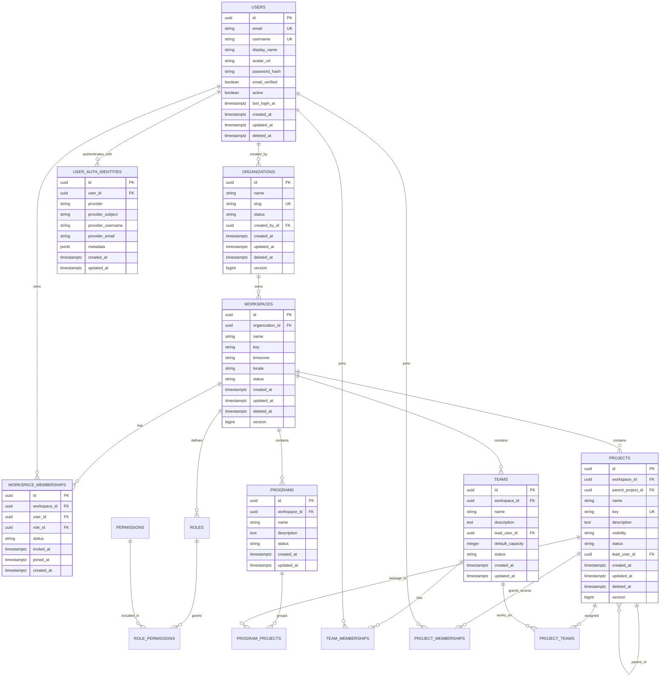
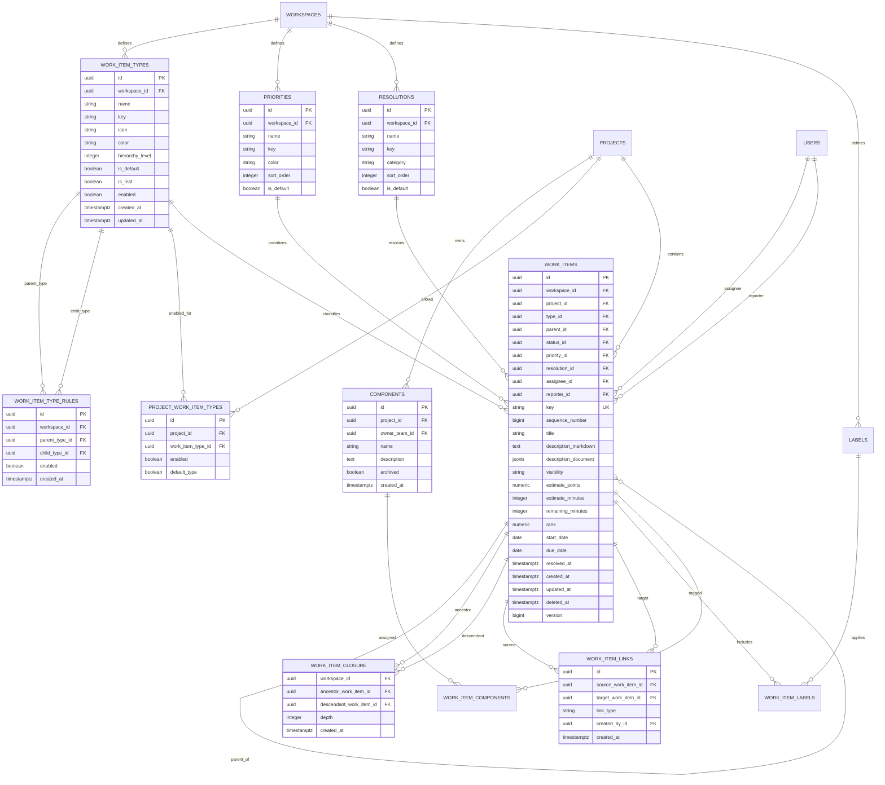

# Trasck Technical Specifications

Last reviewed: 2026-04-17

## Purpose

Trasck is a full-fledged open-source project management platform intended to compete with tools such as Jira and Rally. This document is the backend reference for the product model, database shape, hierarchy decisions, and implementation direction.

This is not an MVP spec. The goal is to design the backend foundation for the complete product from the beginning, even if individual features are implemented over time.

## Core Product Decisions

1. Trasck will separate container hierarchy from work hierarchy.
2. `Organization`, `Workspace`, `Program`, `Project`, and `Team` describe where work lives and who can access it.
3. `WorkItem` is the universal work artifact. Epics, stories, tasks, bugs, subtasks, features, initiatives, and themes are all work items with different configured types.
4. Trasck will not create separate tables such as `epics`, `stories`, `bugs`, or `tasks`.
5. `WorkItemType` and `WorkItemTypeRule` define the configurable work hierarchy.
6. `parent_id` on `work_items` defines the structural hierarchy.
7. `work_item_links` define non-hierarchical relationships such as blocks, duplicates, relates to, depends on, and clones.
8. Workflow, custom fields, screens, boards, notifications, automation, and reporting should be configurable per workspace and optionally overridden per project.
9. The backend should favor strong relational modeling for core concepts and `jsonb` only for configurable rules, field values, external payloads, and view definitions.
10. All important user-visible changes should generate activity events. Security/compliance-sensitive changes should also generate audit log entries.
11. `work_item_closure` should exist alongside `work_items.parent_id` so hierarchy rollups are fast and reliable.
12. Time tracking, resolutions, custom screens, and project-specific type availability are first-class backend concepts, not add-ons.
13. User identity is global, with separate auth identities for password and OAuth providers.
14. Public project visibility must be modeled from the start, with anonymous read disabled unless a workspace/project explicitly allows it.
15. Attachment storage is configurable per workspace.
16. Automation uses hybrid execution: local state changes can run synchronously, while slow or external actions run through queued jobs.

## Full Work Hierarchy

Trasck should ship with a full enterprise-ready hierarchy while allowing workspaces to customize it.

Default seeded hierarchy:

```text
Theme
  Initiative
    Capability
      Feature
        Epic
          Story / Task / Bug
            Subtask
```

Important notes:

- `Story`, `Task`, and `Bug` are peer types by default.
- `Subtask` is a child execution detail under story/task/bug.
- `Feature`, `Capability`, `Initiative`, and `Theme` support portfolio and roadmap planning.
- A workspace may disable or rename levels without requiring schema changes.
- A project may restrict the set of work item types it allows.
- Parent-child validity is controlled by `work_item_type_rules`, not only by numeric hierarchy levels.

Seeded hierarchy levels:

| Type | Level | Default Parent |
|---|---:|---|
| Theme | 600 | none |
| Initiative | 500 | Theme |
| Capability | 400 | Initiative |
| Feature | 300 | Capability |
| Epic | 200 | Feature |
| Story | 100 | Epic |
| Task | 100 | Epic |
| Bug | 100 | Epic |
| Subtask | 0 | Story, Task, or Bug |

## Container Hierarchy

Default container model:

```text
Organization
  Workspace
    Program
      Project
        Child Project
    Team
```

Notes:

- `Organization` is the top-level customer/account boundary.
- `Workspace` is the configuration boundary. Work item types, workflows, custom fields, automation, roles, and global settings live here.
- `Program` groups projects for portfolio reporting and planning.
- `Project` is the primary work container and owns project keys such as `TRASCK`.
- Projects may be nested through `parent_project_id`.
- `Team` models delivery teams and capacity separately from project ownership.
- Boards, releases, iterations, and roadmaps can be project-scoped or team-scoped depending on the feature.

## Backend Package Structure

Use domain-oriented packages under `com.strangequark.trasck`:

```text
com.strangequark.trasck.identity
com.strangequark.trasck.organization
com.strangequark.trasck.workspace
com.strangequark.trasck.access
com.strangequark.trasck.project
com.strangequark.trasck.team
com.strangequark.trasck.workitem
com.strangequark.trasck.workflow
com.strangequark.trasck.planning
com.strangequark.trasck.board
com.strangequark.trasck.customfield
com.strangequark.trasck.activity
com.strangequark.trasck.audit
com.strangequark.trasck.notification
com.strangequark.trasck.automation
com.strangequark.trasck.integration
com.strangequark.trasck.reporting
com.strangequark.trasck.search
```

Each package should own its controllers, services, repositories, DTOs, mappers, and domain exceptions unless a shared abstraction is clearly needed.

## Database Conventions

Use PostgreSQL as the primary database.

Recommended conventions:

- Primary keys: UUID.
- Foreign keys: explicit constraints.
- Timestamps: `created_at`, `updated_at`, and optional `deleted_at`; store UTC.
- Audit columns: `created_by_id`, `updated_by_id`, and optional `deleted_by_id` for user-created business records.
- Soft delete: use `deleted_at` for user-owned data that should be recoverable or auditable.
- Optimistic locking: use a numeric `version` column on heavily edited entities such as work items, projects, workflows, boards, and custom fields.
- Human keys: use project key plus sequence number for work items, for example `TRASCK-123`.
- JSON: prefer `jsonb` for configurable payloads, rich text document bodies, custom field values, external integration payloads, automation configs, and dashboard/view configs.
- Money/billing concepts are intentionally excluded from the first backend domain unless billing becomes a product requirement.

## ERD: Identity, Access, And Containers



## ERD: Work Items And Configurable Hierarchy



## ERD: Workflow, Boards, Sprints, Releases, And Roadmaps


## ERD: Custom Fields, Screens, Activity, And Audit

```mermaid
erDiagram
    WORKSPACES ||--o{ CUSTOM_FIELDS : defines
    CUSTOM_FIELDS ||--o{ CUSTOM_FIELD_CONTEXTS : scoped_by
    PROJECTS ||--o{ CUSTOM_FIELD_CONTEXTS : scope_project
    WORK_ITEM_TYPES ||--o{ CUSTOM_FIELD_CONTEXTS : scope_type
    WORK_ITEMS ||--o{ CUSTOM_FIELD_VALUES : has
    CUSTOM_FIELDS ||--o{ CUSTOM_FIELD_VALUES : stores
    WORKSPACES ||--o{ SCREENS : defines
    SCREENS ||--o{ SCREEN_FIELDS : contains
    SCREENS ||--o{ SCREEN_ASSIGNMENTS : assigned
    PROJECTS ||--o{ SCREEN_ASSIGNMENTS : scope_project
    WORK_ITEM_TYPES ||--o{ SCREEN_ASSIGNMENTS : scope_type
    CUSTOM_FIELDS ||--o{ SCREEN_FIELDS : displayed
    WORKSPACES ||--o{ FIELD_CONFIGURATIONS : defines
    CUSTOM_FIELDS ||--o{ FIELD_CONFIGURATIONS : configures

    WORK_ITEMS ||--o{ COMMENTS : discussed_by
    USERS ||--o{ COMMENTS : authors
    WORK_ITEMS ||--o{ WORK_LOGS : tracked_by
    USERS ||--o{ WORK_LOGS : logs
    WORKSPACES ||--o{ ATTACHMENTS : stores
    WORKSPACES ||--o{ ATTACHMENT_STORAGE_CONFIGS : configures_storage
    ATTACHMENT_STORAGE_CONFIGS ||--o{ ATTACHMENTS : stores
    WORK_ITEMS ||--o{ WORK_ITEM_ATTACHMENTS : has
    ATTACHMENTS ||--o{ WORK_ITEM_ATTACHMENTS : attached
    WORK_ITEMS ||--o{ WATCHERS : watched
    USERS ||--o{ WATCHERS : watches
    WORKSPACES ||--o{ ACTIVITY_EVENTS : records
    WORKSPACES ||--o{ AUDIT_LOG_ENTRIES : audits
    USERS ||--o{ ACTIVITY_EVENTS : actor
    USERS ||--o{ AUDIT_LOG_ENTRIES : actor

    CUSTOM_FIELDS {
        uuid id PK
        uuid workspace_id FK
        string name
        string key
        string field_type
        jsonb options
        boolean searchable
        boolean archived
        timestamptz created_at
        timestamptz updated_at
        bigint version
    }

    CUSTOM_FIELD_CONTEXTS {
        uuid id PK
        uuid custom_field_id FK
        uuid project_id FK
        uuid work_item_type_id FK
        boolean required
        jsonb default_value
        jsonb validation_config
    }

    CUSTOM_FIELD_VALUES {
        uuid id PK
        uuid work_item_id FK
        uuid custom_field_id FK
        jsonb value
        timestamptz updated_at
    }

    SCREENS {
        uuid id PK
        uuid workspace_id FK
        string name
        string screen_type
        jsonb config
    }

    SCREEN_FIELDS {
        uuid id PK
        uuid screen_id FK
        uuid custom_field_id FK
        string system_field_key
        integer position
        boolean required
    }

    SCREEN_ASSIGNMENTS {
        uuid id PK
        uuid screen_id FK
        uuid project_id FK
        uuid work_item_type_id FK
        string operation
        integer priority
    }

    COMMENTS {
        uuid id PK
        uuid work_item_id FK
        uuid author_id FK
        text body_markdown
        jsonb body_document
        string visibility
        timestamptz created_at
        timestamptz updated_at
        timestamptz deleted_at
    }

    WORK_LOGS {
        uuid id PK
        uuid work_item_id FK
        uuid user_id FK
        integer minutes_spent
        date work_date
        timestamptz started_at
        text description_markdown
        jsonb description_document
        timestamptz created_at
        timestamptz updated_at
        timestamptz deleted_at
    }

    ATTACHMENTS {
        uuid id PK
        uuid workspace_id FK
        uuid storage_config_id FK
        uuid uploader_id FK
        string filename
        string content_type
        string storage_key
        bigint size_bytes
        string checksum
        string visibility
        timestamptz created_at
    }

    ATTACHMENT_STORAGE_CONFIGS {
        uuid id PK
        uuid workspace_id FK
        string name
        string provider
        jsonb config
        boolean active
        boolean default_config
        timestamptz created_at
        timestamptz updated_at
    }

    ACTIVITY_EVENTS {
        uuid id PK
        uuid workspace_id FK
        uuid actor_id FK
        string entity_type
        uuid entity_id
        string event_type
        jsonb metadata
        timestamptz created_at
    }

    AUDIT_LOG_ENTRIES {
        uuid id PK
        uuid workspace_id FK
        uuid actor_id FK
        string action
        string target_type
        uuid target_id
        jsonb before_value
        jsonb after_value
        string ip_address
        string user_agent
        timestamptz created_at
    }
```



## ERD: Automation, Notifications, Integrations, Reporting, And Views

```mermaid
erDiagram
    WORKSPACES ||--o{ NOTIFICATION_PREFERENCES : configures
    USERS ||--o{ NOTIFICATION_PREFERENCES : owns
    USERS ||--o{ NOTIFICATIONS : receives
    WORKSPACES ||--o{ AUTOMATION_RULES : defines
    AUTOMATION_RULES ||--o{ AUTOMATION_CONDITIONS : has
    AUTOMATION_RULES ||--o{ AUTOMATION_ACTIONS : runs
    AUTOMATION_RULES ||--o{ AUTOMATION_EXECUTION_JOBS : queues
    AUTOMATION_EXECUTION_JOBS ||--o{ AUTOMATION_EXECUTION_LOGS : records
    AUTOMATION_ACTIONS ||--o{ AUTOMATION_EXECUTION_LOGS : executes
    WORKSPACES ||--o{ WEBHOOKS : defines
    WEBHOOKS ||--o{ WEBHOOK_DELIVERIES : attempts
    WORKSPACES ||--o{ EXTERNAL_INTEGRATIONS : connects
    USERS ||--o{ EXTERNAL_IDENTITIES : maps
    EXTERNAL_INTEGRATIONS ||--o{ EXTERNAL_REFERENCES : links
    WORKSPACES ||--o{ IMPORT_JOBS : runs
    IMPORT_JOBS ||--o{ IMPORT_JOB_RECORDS : contains
    WORKSPACES ||--o{ EXPORT_JOBS : runs
    WORK_ITEMS ||--o{ WORK_ITEM_STATUS_HISTORY : records
    ITERATIONS ||--o{ ITERATION_SNAPSHOTS : snapshots
    BOARDS ||--o{ CUMULATIVE_FLOW_SNAPSHOTS : snapshots
    TEAMS ||--o{ VELOCITY_SNAPSHOTS : snapshots
    WORK_ITEMS ||--o{ CYCLE_TIME_RECORDS : measures
    WORKSPACES ||--o{ SAVED_FILTERS : defines
    WORKSPACES ||--o{ DASHBOARDS : defines
    DASHBOARDS ||--o{ DASHBOARD_WIDGETS : contains
    WORKSPACES ||--o{ VIEWS : defines
    USERS ||--o{ FAVORITES : owns
    USERS ||--o{ RECENT_ITEMS : owns

    AUTOMATION_RULES {
        uuid id PK
        uuid workspace_id FK
        uuid project_id FK
        string name
        string trigger_type
        jsonb trigger_config
        boolean enabled
        timestamptz created_at
        timestamptz updated_at
    }

    AUTOMATION_CONDITIONS {
        uuid id PK
        uuid rule_id FK
        string condition_type
        jsonb config
        integer position
    }

    AUTOMATION_ACTIONS {
        uuid id PK
        uuid rule_id FK
        string action_type
        string execution_mode
        jsonb config
        integer position
    }

    AUTOMATION_EXECUTION_JOBS {
        uuid id PK
        uuid rule_id FK
        uuid workspace_id FK
        string source_entity_type
        uuid source_entity_id
        string status
        jsonb payload
        integer attempts
        timestamptz next_attempt_at
        timestamptz started_at
        timestamptz completed_at
        timestamptz failed_at
        string last_error
        timestamptz created_at
    }

    AUTOMATION_EXECUTION_LOGS {
        uuid id PK
        uuid job_id FK
        uuid action_id FK
        string status
        string message
        jsonb metadata
        timestamptz created_at
    }

    WEBHOOKS {
        uuid id PK
        uuid workspace_id FK
        string name
        string url
        string secret_hash
        jsonb event_types
        boolean enabled
    }

    EXTERNAL_INTEGRATIONS {
        uuid id PK
        uuid workspace_id FK
        string provider
        string status
        jsonb config
        timestamptz created_at
        timestamptz updated_at
    }

    IMPORT_JOBS {
        uuid id PK
        uuid workspace_id FK
        uuid requested_by_id FK
        string provider
        string status
        jsonb config
        timestamptz started_at
        timestamptz finished_at
    }

    WORK_ITEM_STATUS_HISTORY {
        uuid id PK
        uuid work_item_id FK
        uuid from_status_id FK
        uuid to_status_id FK
        uuid changed_by_id FK
        timestamptz changed_at
    }

    CYCLE_TIME_RECORDS {
        uuid id PK
        uuid work_item_id FK
        timestamptz created_at
        timestamptz started_at
        timestamptz completed_at
        integer lead_time_minutes
        integer cycle_time_minutes
    }

    SAVED_FILTERS {
        uuid id PK
        uuid workspace_id FK
        uuid owner_id FK
        string name
        jsonb query
        string visibility
    }

    DASHBOARDS {
        uuid id PK
        uuid workspace_id FK
        uuid owner_id FK
        string name
        string visibility
        jsonb layout
    }

    VIEWS {
        uuid id PK
        uuid workspace_id FK
        uuid owner_id FK
        string name
        string view_type
        jsonb config
        string visibility
    }
```



## Table Catalog

### Identity And Access

| Table | Purpose |
|---|---|
| `organizations` | Top-level customer/account boundary. |
| `workspaces` | Configuration boundary inside an organization. |
| `users` | Global user identity. |
| `user_auth_identities` | Password/OAuth identity mappings for global users. |
| `workspace_memberships` | User membership and role inside a workspace. |
| `project_memberships` | Optional project-specific access override. |
| `roles` | Named permission bundle scoped to workspace or project. |
| `permissions` | Individual capability keys such as `work_item.create`. |
| `role_permissions` | Join table for roles and permissions. |

### Containers

| Table | Purpose |
|---|---|
| `projects` | Primary work container with human key prefix. |
| `project_settings` | Per-project defaults such as workflow, estimation unit, and default board. |
| `programs` | Portfolio grouping above projects. |
| `program_projects` | Projects included in programs. |
| `teams` | Delivery teams. |
| `team_memberships` | Users assigned to teams with capacity/role metadata. |
| `project_teams` | Teams assigned to projects. |

### Work Items

| Table | Purpose |
|---|---|
| `work_item_types` | Configurable work item definitions such as Theme, Epic, Story, Bug. |
| `work_item_type_rules` | Allowed parent-child type combinations. |
| `project_work_item_types` | Project-specific enablement/defaults for work item types. |
| `work_items` | Universal table for all work artifacts. |
| `work_item_closure` | Ancestor/descendant rows for fast hierarchy rollups. |
| `work_item_links` | Non-tree relationships between work items. |
| `priorities` | Workspace-configured priorities. |
| `resolutions` | Workspace-configured resolution reasons such as Done, Duplicate, Won't Do. |
| `labels` | Workspace tags. |
| `work_item_labels` | Join table for tags. |
| `components` | Project-owned product/component areas. |
| `work_item_components` | Join table for components. |

### Workflow

| Table | Purpose |
|---|---|
| `workflows` | Named workflow definitions. |
| `workflow_statuses` | Statuses in a workflow. |
| `workflow_transitions` | Allowed status changes. |
| `workflow_assignments` | Workflow applied to project/type combinations. |
| `workflow_transition_rules` | Validators and guards. |
| `workflow_transition_actions` | Side effects such as setting resolution date or assigning a user. |

### Planning

| Table | Purpose |
|---|---|
| `boards` | Scrum/Kanban board definitions. |
| `board_columns` | Board columns and status mappings. |
| `board_swimlanes` | Board grouping configuration. |
| `iterations` | Sprints or timeboxed iterations. |
| `iteration_work_items` | Work planned into an iteration. |
| `releases` | Versions, releases, or milestones. |
| `release_work_items` | Work targeted to a release. |
| `roadmaps` | Roadmap views. |
| `roadmap_items` | Work shown on a roadmap with planned dates. |

### Customization

| Table | Purpose |
|---|---|
| `custom_fields` | Workspace-defined custom fields. |
| `custom_field_contexts` | Field scope by project and work item type. |
| `custom_field_values` | Field values per work item. |
| `screens` | Create/edit/view screen layouts. |
| `screen_fields` | Fields visible on a screen. |
| `screen_assignments` | Screen selection by project, type, and operation. |
| `field_configurations` | Required/hidden/default behavior. |

### Collaboration And Audit

| Table | Purpose |
|---|---|
| `comments` | Work item discussions. |
| `work_logs` | Time tracking entries on work items. |
| `attachment_storage_configs` | Workspace-configurable attachment storage providers. |
| `attachments` | Uploaded file metadata. |
| `work_item_attachments` | Join table for attachments. |
| `watchers` | Users watching work items. |
| `mentions` | Mentions in descriptions/comments. |
| `activity_events` | User-visible activity feed. |
| `audit_log_entries` | Compliance/security audit log. |

### Reporting

| Table | Purpose |
|---|---|
| `work_item_status_history` | Status transition history. |
| `work_item_assignment_history` | Assignment history. |
| `work_item_estimate_history` | Estimate changes. |
| `iteration_snapshots` | Sprint/iteration reporting snapshots. |
| `cumulative_flow_snapshots` | Board status-count snapshots. |
| `velocity_snapshots` | Team velocity snapshots. |
| `cycle_time_records` | Lead time and cycle time measurements. |

### Automation And Notifications

| Table | Purpose |
|---|---|
| `notification_preferences` | User notification settings. |
| `notifications` | In-app notifications. |
| `automation_rules` | Rule definitions. |
| `automation_conditions` | Rule conditions. |
| `automation_actions` | Rule actions. |
| `automation_execution_jobs` | Queued async automation work for hybrid execution. |
| `automation_execution_logs` | Per-job/per-action automation execution history. |
| `webhooks` | Outbound webhook definitions. |
| `webhook_deliveries` | Webhook delivery attempts. |

### Integrations, Search, And Views

| Table | Purpose |
|---|---|
| `external_integrations` | GitHub, GitLab, Slack, Jira import, Rally import, etc. |
| `external_identities` | Mapping between Trasck users and provider users. |
| `external_references` | Mapping between Trasck entities and external objects. |
| `import_jobs` | Jira/Rally/CSV import jobs. |
| `import_job_records` | Per-record import results. |
| `export_jobs` | Data export jobs. |
| `saved_filters` | Saved work item queries. |
| `dashboards` | User/team dashboards. |
| `dashboard_widgets` | Widgets on dashboards. |
| `views` | Saved table, board, timeline, list, and roadmap views. |
| `favorites` | Starred entities. |
| `recent_items` | Recently viewed entities. |

## Additional Column Reference

The ERDs show the main entities and the table catalog names every planned table. This section captures the important columns for tables that are not expanded in the diagrams.

### Access Columns

| Table | Important Columns |
|---|---|
| `user_auth_identities` | `id`, `user_id`, `provider`, `provider_subject`, `provider_username`, `provider_email`, `metadata`, `created_at`, `updated_at` |
| `roles` | `id`, `workspace_id`, `name`, `key`, `scope`, `description`, `system_role`, `created_at`, `updated_at` |
| `permissions` | `id`, `key`, `name`, `description`, `category` |
| `role_permissions` | `role_id`, `permission_id`, `created_at` |
| `project_memberships` | `id`, `project_id`, `user_id`, `role_id`, `status`, `created_at`, `updated_at` |

### Container Columns

| Table | Important Columns |
|---|---|
| `project_settings` | `project_id`, `default_workflow_id`, `default_board_id`, `estimation_unit`, `allow_cross_project_parents`, `config`, `updated_at` |
| `program_projects` | `program_id`, `project_id`, `position`, `created_at` |
| `team_memberships` | `id`, `team_id`, `user_id`, `role`, `capacity_percent`, `joined_at`, `left_at` |
| `project_teams` | `project_id`, `team_id`, `role`, `created_at` |

### Work Item Columns

| Table | Important Columns |
|---|---|
| `labels` | `id`, `workspace_id`, `name`, `color`, `created_at` |
| `work_item_labels` | `work_item_id`, `label_id`, `created_at` |
| `work_item_components` | `work_item_id`, `component_id`, `created_at` |
| `work_item_closure` | `workspace_id`, `ancestor_work_item_id`, `descendant_work_item_id`, `depth`, `created_at` |
| `work_item_links` | `id`, `source_work_item_id`, `target_work_item_id`, `link_type`, `created_by_id`, `created_at` |

### Workflow Columns

| Table | Important Columns |
|---|---|
| `workflow_transition_rules` | `id`, `transition_id`, `rule_type`, `config`, `error_message`, `position`, `enabled` |
| `workflow_transition_actions` | `id`, `transition_id`, `action_type`, `config`, `position`, `enabled` |

### Planning Columns

| Table | Important Columns |
|---|---|
| `board_swimlanes` | `id`, `board_id`, `name`, `swimlane_type`, `query`, `position`, `enabled` |
| `iteration_work_items` | `iteration_id`, `work_item_id`, `added_by_id`, `added_at`, `removed_at` |
| `release_work_items` | `release_id`, `work_item_id`, `added_by_id`, `added_at` |
| `roadmap_items` | `id`, `roadmap_id`, `work_item_id`, `start_date`, `end_date`, `position`, `display_config` |

### Customization Columns

| Table | Important Columns |
|---|---|
| `field_configurations` | `id`, `workspace_id`, `custom_field_id`, `project_id`, `work_item_type_id`, `required`, `hidden`, `default_value`, `validation_config` |
| `screen_assignments` | `id`, `screen_id`, `project_id`, `work_item_type_id`, `operation`, `priority` |

### Collaboration Columns

| Table | Important Columns |
|---|---|
| `watchers` | `work_item_id`, `user_id`, `created_at` |
| `mentions` | `id`, `source_type`, `source_id`, `mentioned_user_id`, `created_at` |
| `work_logs` | `id`, `work_item_id`, `user_id`, `minutes_spent`, `work_date`, `started_at`, `description_markdown`, `description_document`, `created_at`, `updated_at`, `deleted_at` |
| `attachment_storage_configs` | `id`, `workspace_id`, `name`, `provider`, `config`, `active`, `default_config`, `created_at`, `updated_at` |

### Reporting Columns

| Table | Important Columns |
|---|---|
| `work_item_assignment_history` | `id`, `work_item_id`, `from_user_id`, `to_user_id`, `changed_by_id`, `changed_at` |
| `work_item_estimate_history` | `id`, `work_item_id`, `estimate_type`, `old_value`, `new_value`, `changed_by_id`, `changed_at` |
| `iteration_snapshots` | `id`, `iteration_id`, `snapshot_date`, `committed_points`, `completed_points`, `remaining_points`, `scope_added_points`, `scope_removed_points` |
| `cumulative_flow_snapshots` | `id`, `board_id`, `snapshot_date`, `status_id`, `work_item_count`, `total_points` |
| `velocity_snapshots` | `id`, `team_id`, `iteration_id`, `committed_points`, `completed_points`, `carried_over_points` |

### Automation And Notification Columns

| Table | Important Columns |
|---|---|
| `notification_preferences` | `id`, `user_id`, `workspace_id`, `channel`, `event_type`, `enabled`, `config` |
| `notifications` | `id`, `user_id`, `actor_id`, `workspace_id`, `type`, `title`, `body`, `target_type`, `target_id`, `read_at`, `created_at` |
| `automation_execution_jobs` | `id`, `rule_id`, `workspace_id`, `source_entity_type`, `source_entity_id`, `status`, `payload`, `attempts`, `next_attempt_at`, `started_at`, `completed_at`, `failed_at`, `last_error`, `created_at` |
| `automation_execution_logs` | `id`, `job_id`, `action_id`, `status`, `message`, `metadata`, `created_at` |
| `webhook_deliveries` | `id`, `webhook_id`, `event_type`, `payload`, `status`, `response_code`, `response_body`, `attempt_count`, `next_retry_at`, `created_at` |

### Integration And View Columns

| Table | Important Columns |
|---|---|
| `external_identities` | `id`, `user_id`, `provider`, `external_user_id`, `external_username`, `created_at` |
| `external_references` | `id`, `integration_id`, `entity_type`, `entity_id`, `provider`, `external_id`, `external_url`, `metadata` |
| `import_job_records` | `id`, `import_job_id`, `source_type`, `source_id`, `target_type`, `target_id`, `status`, `error_message`, `raw_payload` |
| `export_jobs` | `id`, `workspace_id`, `requested_by_id`, `export_type`, `status`, `file_attachment_id`, `started_at`, `finished_at` |
| `dashboard_widgets` | `id`, `dashboard_id`, `widget_type`, `config`, `position_x`, `position_y`, `width`, `height` |
| `favorites` | `id`, `user_id`, `entity_type`, `entity_id`, `created_at` |
| `recent_items` | `id`, `user_id`, `entity_type`, `entity_id`, `viewed_at` |

## Key Constraints And Validation Rules

Work item rules:

- A work item must belong to exactly one workspace and one project.
- `work_items.workspace_id` must match the workspace of its project.
- `work_items.parent_id`, when present, must point to a work item in the same workspace.
- Cross-project parentage should be configurable. Default should allow it only when both projects are in the same workspace and the user has access to both projects.
- Parent-child type pairs must exist in `work_item_type_rules`.
- The work item's type must be enabled for its project in `project_work_item_types`, when project-specific type restrictions are configured.
- A work item may have one structural parent but many links.
- Prevent cycles in the `work_items.parent_id` tree.
- Maintain `work_item_closure` transactionally whenever a work item parent changes.
- Prevent duplicate `work_item_links` for the same source, target, and type unless the link type explicitly allows duplicates.
- A work item key must be unique within a workspace. Project key plus sequence number should also be unique.
- A completed work item may have a `resolution_id`; unresolved work should not.

Workflow rules:

- A work item's current `status_id` must belong to the assigned workflow for its project/type.
- Status changes should go through `workflow_transitions` unless the user has an administrative override permission.
- Transition rules can require fields, comments, resolution, approvals, or permissions.
- Terminal statuses should set `resolved_at` unless explicitly configured otherwise.

Access rules:

- Workspace membership is required for all workspace data.
- Project membership may further restrict project access when a project is private.
- Permissions are checked through roles and explicit project membership.
- Audit log writes should not be user-editable.

Customization rules:

- Custom field keys must be unique per workspace.
- Custom field values should validate against the field's type and context.
- Screen configurations must support both system fields and custom fields.

## Recommended Indexes

Core indexes:

```text
organizations(slug)
workspaces(organization_id, key)
users(email)
users(username)
workspace_memberships(workspace_id, user_id)
project_memberships(project_id, user_id)
projects(workspace_id, key)
projects(workspace_id, parent_project_id)
work_item_types(workspace_id, key)
work_item_type_rules(workspace_id, parent_type_id, child_type_id)
project_work_item_types(project_id, work_item_type_id)
work_items(workspace_id, key)
work_items(project_id, sequence_number)
work_items(project_id, type_id)
work_items(parent_id)
work_items(resolution_id)
work_items(status_id)
work_items(assignee_id)
work_items(reporter_id)
work_items(rank)
work_items(deleted_at)
work_item_closure(ancestor_work_item_id, descendant_work_item_id)
work_item_closure(descendant_work_item_id, depth)
work_item_links(source_work_item_id, link_type)
work_item_links(target_work_item_id, link_type)
workflow_assignments(project_id, work_item_type_id)
custom_field_values(work_item_id, custom_field_id)
screen_assignments(project_id, work_item_type_id, operation)
work_logs(work_item_id, work_date)
work_logs(user_id, work_date)
activity_events(workspace_id, created_at)
audit_log_entries(workspace_id, created_at)
```

Search indexes:

- Full-text index on `work_items.title`.
- Full-text or generated-vector index on searchable work item descriptions.
- GIN indexes for selected `jsonb` fields only after query patterns are known.
- Optional trigram indexes for fuzzy key/title search.

## API Design Direction

Use versioned REST APIs initially:

```text
/api/v1/organizations
/api/v1/workspaces
/api/v1/projects
/api/v1/teams
/api/v1/work-item-types
/api/v1/work-items
/api/v1/workflows
/api/v1/boards
/api/v1/iterations
/api/v1/releases
/api/v1/custom-fields
/api/v1/automation-rules
/api/v1/reports
```

Guidelines:

- Use DTOs for all API input/output.
- Do not expose JPA entities directly.
- Use pagination for list endpoints.
- Use consistent filtering and sorting conventions.
- Return work item keys and IDs in API responses.
- Prefer explicit command endpoints for workflow transitions, moving/ranking work, and bulk changes.
- Use idempotency keys for imports, webhooks, and bulk operations where appropriate.

Example work item endpoints:

```text
POST   /api/v1/work-items
GET    /api/v1/work-items/{id}
PATCH  /api/v1/work-items/{id}
POST   /api/v1/work-items/{id}/transition
POST   /api/v1/work-items/{id}/links
POST   /api/v1/work-items/{id}/comments
POST   /api/v1/work-items/{id}/attachments
POST   /api/v1/work-items/bulk
```

## Event And Audit Model

Use service-layer events for important changes:

```text
WorkItemCreated
WorkItemUpdated
WorkItemTransitioned
WorkItemLinked
CommentCreated
ProjectCreated
WorkflowChanged
MembershipChanged
AutomationRuleTriggered
IntegrationWebhookReceived
```

Activity events are for product UI. Audit log entries are for security/compliance.

Examples:

- Adding a comment creates an activity event.
- Changing a work item title creates an activity event.
- Changing a role permission creates an audit log entry.
- Deleting a project creates both an activity event and an audit log entry.

## Reporting Strategy

Reporting should be derived from canonical work item state plus history/snapshot tables.

Required reports:

- Backlog by project, team, type, priority, and assignee.
- Epic/feature progress rollups.
- Roadmap timeline by hierarchy level.
- Sprint burndown.
- Sprint commitment vs completion.
- Team velocity.
- Cumulative flow diagram.
- Cycle time and lead time.
- Aging work in progress.
- Blocked work and dependency graph.
- Release readiness.
- Scope change during iteration.

Implementation notes:

- Store status history and assignment history as facts.
- Store snapshots for expensive time-series reports.
- Recalculate rollups asynchronously where possible.
- Keep reporting data reconstructable from history when feasible.

## Automation Strategy

Automation should be configured with triggers, conditions, and actions.

Example triggers:

- Work item created.
- Work item updated.
- Status changed.
- Comment added.
- Due date approaching.
- Sprint started.
- Release completed.
- Webhook received.

Example conditions:

- Type is Bug.
- Priority is Critical.
- Assignee is empty.
- Project equals X.
- Field changed from A to B.
- Linked item is blocked.

Example actions:

- Assign user.
- Change status.
- Add label.
- Add comment.
- Send notification.
- Create linked work item.
- Call webhook.

## Import And Integration Strategy

Expected integrations:

- GitHub issues and pull requests.
- GitLab issues and merge requests.
- Slack notifications.
- Jira import.
- Rally import.
- CSV import/export.
- Generic webhooks.

Integration model:

- `external_integrations` stores provider-level configuration.
- `external_identities` maps users.
- `external_references` maps Trasck entities to external objects.
- `import_jobs` and `import_job_records` provide observable import progress and error reporting.
- Imported items should retain external IDs and URLs.

## Initial Seed Data

Every new workspace should receive:

Default work item types:

```text
Theme
Initiative
Capability
Feature
Epic
Story
Task
Bug
Subtask
```

Default type rules:

```text
Theme -> Initiative
Initiative -> Capability
Capability -> Feature
Feature -> Epic
Epic -> Story
Epic -> Task
Epic -> Bug
Story -> Subtask
Task -> Subtask
Bug -> Subtask
```

Default priorities:

```text
Lowest
Low
Medium
High
Critical
```

Default resolutions:

```text
Done
Duplicate
Won't Do
Cannot Reproduce
Moved
```

Default workflow:

```text
Open
Ready
In Progress
In Review
Blocked
Done
```

Default board columns:

```text
Backlog: Open
Ready: Ready
In Progress: In Progress, Blocked
Review: In Review
Done: Done
```

Default roles:

```text
Workspace Owner
Workspace Admin
Project Admin
Member
Viewer
```

## Implementation Order

Although this is not an MVP schema, implementation should still be sequenced so each layer has working tests and migrations.

Recommended order:

1. Add migration framework and database conventions.
2. Implement identity, organizations, workspaces, users, roles, and memberships.
3. Implement projects, teams, and project/team memberships.
4. Implement work item types, type rules, project type availability, priorities, resolutions, and workspace seed data.
5. Implement workflows, statuses, transitions, and workflow assignments.
6. Implement work items, hierarchy validation, closure-table maintenance, links, labels, and components.
7. Implement comments, watchers, work logs, attachments, activity events, and audit logs.
8. Implement boards, columns, iterations, releases, and roadmaps.
9. Implement custom fields, screens, screen assignments, and field configurations.
10. Implement reporting history and snapshots.
11. Implement notifications, automation, webhooks, and integrations.
12. Implement saved filters, dashboards, views, favorites, and recent items.

## Testing Requirements

Required backend tests:

- Entity/repository tests for core constraints.
- Service tests for work item hierarchy validation.
- Service tests for workflow transitions.
- Service tests for permission checks.
- Integration tests for create/update/list APIs.
- Migration tests when schema grows.
- Import job tests for idempotency and partial failure handling.
- Reporting calculation tests for cycle time, velocity, and cumulative flow.

High-risk cases to test early:

- Preventing parent cycles.
- Maintaining correct `work_item_closure` rows when parents change.
- Rejecting invalid parent-child work item type pairs.
- Rejecting project-disabled work item types.
- Ensuring work item status belongs to the assigned workflow.
- Preserving audit logs on sensitive changes.
- Enforcing workspace/project access.
- Keeping project sequence numbers unique under concurrent creation.

## Open Design Questions

These should be decided before or during implementation:

1. Should user identity be global across all organizations, or should each organization own isolated user accounts?
    - Answer: User identity should be global across all organizations
2. Should cross-project work item parentage be allowed by default, or only links across projects?
    - Answer: Only allow links across projects
3. Should project keys be unique globally, per workspace, or per organization?
    - Answer: Per workspace
4. Should descriptions and comments be stored as Markdown, rich-text JSON, or both?
    - Answer: Allow for both
5. Should custom field values be fully `jsonb`, typed side tables, or hybrid?
    - Answer: JSON
6. Should reporting snapshots be generated synchronously on change or asynchronously by scheduled jobs?
    - Answer: Synchronously on change
7. Should initial authentication be username/password, OAuth, or both?
    - Answer: Allow for both
8. Should Trasck support public/open-source projects with anonymous read access?
    - Answer: Yes
9. Should file attachment storage start local, S3-compatible, or configurable?
    - Answer: Configurable, we should allow users to use whatever file attachment storage they want
10. Should automation execution be synchronous, queued, or both depending on action type?
    - Answer: Hybrid depending on the action type

## Reference Summary

This spec intentionally blends proven Jira-style and Rally-style concepts:

- Jira-like configurable work item types, workflows, boards, custom fields, screens, and links.
- Rally-like workspace/project separation, portfolio hierarchy, teams, iterations, and roadmap planning.
- Trasck-specific decision: use one universal `work_items` table with data-driven hierarchy and rules.

The most important thing to preserve while implementing is flexibility:

```text
WorkItem + WorkItemType + WorkItemTypeRule + WorkflowAssignment
```

Those four concepts are the core that allow Trasck to grow into a full project management platform without rewriting the schema every time the product adds a new planning level or work type.
